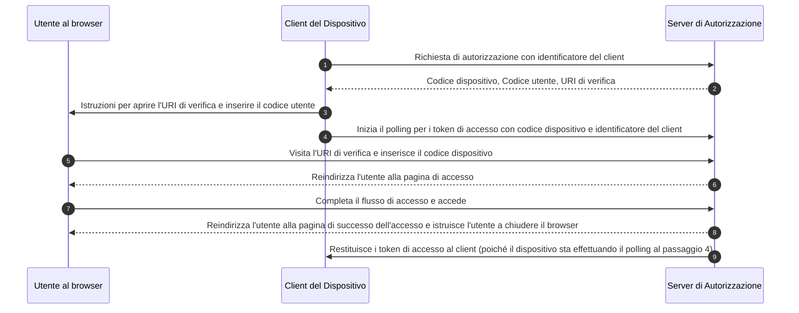

## Che cos'è il flusso del dispositivo?

Il [Flusso di Autorizzazione del Dispositivo OAuth](https://www.rfc-editor.org/rfc/rfc8628), noto anche come flusso del dispositivo, è un <Ref slug="oauth-2.0-grant" /> progettato per dispositivi con capacità di input limitate (ad esempio, smart TV, dispositivi IoT, console di gioco) o app senza interfaccia (ad esempio, strumenti CLI). Consente agli utenti di avviare <Ref slug="authorization-request">richieste di autorizzazione</Ref> su questi dispositivi e quindi completare il processo utilizzando un dispositivo con maggiore capacità di input come uno smartphone o un laptop.

## Quando utilizzare il flusso del dispositivo?

1. **Dispositivi con input limitato**
    - Accesso su Smart TV (ad esempio, app multimediali)
    - Accesso su Console di Gioco (ad esempio, sistema di gioco o app multimediali)
    - Accesso su Dispositivi di Riunione (ad esempio, app ufficiali o app per videoconferenze)
    - Accesso su Dispositivi Indossabili (ad esempio, smartwatch con input limitato)
    - Accesso a dispositivi IoT (ad esempio, stampanti, encoder video o altoparlanti)
2. **Applicazioni senza interfaccia**
    - Accesso tramite Interfaccia a Riga di Comando (ad esempio, GitHub CLI o Stripe CLI)
3. **Accesso tramite Codice QR per Applicazioni Desktop**
    - Accedi rapidamente e in modo sicuro alle applicazioni desktop scansionando un codice QR con il tuo smartphone (ad esempio, accessi a Telegram, Steam su desktop). Questo flusso di accesso tramite codice QR può essere considerato una variante del tradizionale flusso del dispositivo OAuth 2.0.

## Come appare il flusso del dispositivo per l'utente finale?

Ignorando la variante di accesso tramite codice QR, concentriamoci sul flusso standard del dispositivo OAuth 2.0. Sono coinvolti due tipi di dispositivi:

### Dispositivo di visualizzazione del codice dispositivo

Questo è il dispositivo con input limitato o l'applicazione senza interfaccia in cui l'utente deve autorizzare l'accesso. Visualizza il [codice dispositivo e l'URI di verifica](#what-does-device-flow-workflow-look-like), guidando l'utente su come procedere.

L'interfaccia utente di base è:


Per migliorare l'esperienza utente, i servizi spesso generano un codice QR per l'URL di verifica:


Per una maggiore efficienza, sostituire la risorsa del codice QR nel `verification_uri` (ad esempio, `https://example.com/device`) con `verification_uri_complete` (ad esempio, `https://example.com/device?user_code=DSHP-SNCT`), che include il codice dispositivo nell'URL, aiutando gli utenti a precompilare il codice dispositivo nei campi.

### Dispositivo di autorizzazione

Seguendo le istruzioni sul dispositivo di destinazione dell'accesso, l'utente:

1. Utilizza un altro dispositivo con accesso al browser e capacità di input per aprire l'URL di verifica.
2. Inserisce il codice dispositivo visualizzato (che potrebbe essere precompilato) e continua.
3. Se non ci sono sessioni esistenti nel browser, l'utente accederà prima al servizio.
4. Una pagina di consenso inviterà gli utenti ad autorizzare l'accesso del dispositivo.
5. Infine, verrà visualizzata una pagina di successo dopo l'autorizzazione.


Ecco alcuni URL di verifica del flusso del dispositivo di prodotti affermati per i tuoi test:

- Accedi a [Youtube su smart TV](https://www.youtube.com/watch?v=yTcuazSy5Cs): [youtube.com/activate](https://youtube.com/activate)
- Accedi a Disney+ su smart TV: [disneyplus.com/begin](https://disneyplus.com/begin)
- Accedi a [Shopify su Samsung Galaxy Watch](https://www.drmare.com/spotify-music/spotify-on-galaxy-watch.html): [spotify.com/pair](https://spotify.com/pair)
- Accedi a [Zoom su dispositivi di riunione](https://developers.zoom.us/blog/device-authorization/): [zoom.us/oauth_device](https://zoom.us/oauth_device)
- Accedi a [GitHub CLI](https://docs.github.com/en/apps/oauth-apps/building-oauth-apps/authorizing-oauth-apps#device-flow): [github.com/login/device](https://github.com/login/device)
- Utilizza [Google device flow](https://www.oauth.com/oauth2-servers/device-flow/user-flow/): https://www.google.com/device

## Come appare il flusso di lavoro del flusso del dispositivo?

Innanzitutto, dovresti comprendere i parametri della risposta di autorizzazione del dispositivo, che viene utilizzata per gestire le informazioni visualizzate sul dispositivo di visualizzazione del codice dispositivo:

| Parametro                              | Descrizione                                                                                                                                                                    |
| -------------------------------------- | ------------------------------------------------------------------------------------------------------------------------------------------------------------------------------ |
| `device_code`                          | Il codice di verifica del dispositivo.                                                                                                                                         |
| `user_code`                            | Il codice di verifica dell'utente finale.                                                                                                                                      |
| `verification_uri`                     | L'URI di verifica dell'utente finale sul server di autorizzazione. L'URI dovrebbe essere breve e facile da ricordare poiché agli utenti finali verrà chiesto di digitarlo manualmente nel loro agente utente. |
| `verification_uri_complete` (opzionale) | Un URI di verifica che include il "user_code" (o altre informazioni con la stessa funzione del "user_code"), progettato per la trasmissione non testuale.                      |
| `expires_in`                           | La durata in secondi del "device_code" e "user_code".                                                                                                                          |
| `interval`                             | La quantità minima di tempo in secondi che il client DOVREBBE attendere tra le richieste di polling all'endpoint del token. Se non viene fornito alcun valore, i client DEVONO utilizzare 5 come valore predefinito. |

```json
{
    "device_code": "GmRhmhcxhwAzkoEqiMEg_DnyEysNkuNhszIySk9eS",
    "user_code": "WDJBMJHT",
    "verification_uri": "https://custom.domain.com/device",
    "verification_uri_complete":
        "https://custom.domain.com/device?user_code=WDJB-MJHT",
    "expires_in": 900,
    "interval": 5
}
```

Quando un utente utilizza il flusso del dispositivo per l'autenticazione, include principalmente i seguenti passaggi:



1. Il client del dispositivo richiede l'autorizzazione dal server di autorizzazione con un identificatore del client (di solito l'id del client sulla piattaforma del server di autorizzazione).
2. Il server di autorizzazione risponde al client del dispositivo con codice dispositivo, codice utente e URI di verifica.
3. Il client del dispositivo visualizza l'URI di verifica e il codice utente all'utente sotto forma di testo (o un codice QR, ecc.), istruendo l'utente a visitare l'URI e inserire il codice.
4. Contemporaneamente al passaggio 3, il client del dispositivo inizia il polling per i token di accesso con codice dispositivo e identificatore del client dal server di autorizzazione e inizia ad attendere che l'utente esamini la <Ref slug="authorization-request" /> e completi l'autorizzazione dell'utente.
5. L'utente visita l'URI di verifica ospitato dal server di autorizzazione, tramite un browser in un altro dispositivo, e inserisce il codice utente.
6. Il server di autorizzazione reindirizza l'utente alla pagina di accesso e istruisce l'utente a completare l'accesso.
7. L'utente completa il flusso di accesso e accede con successo.
8. Il server di autorizzazione reindirizza l'utente alla pagina di successo dell'accesso e istruisce l'utente a chiudere il browser.
9. Contemporaneamente al passaggio 8, il server di autorizzazione restituisce i token di accesso al client del dispositivo poiché il client sta effettuando il polling dal passaggio 4.

Dopo questi processi, il client del dispositivo sarà in grado di ottenere il <Ref slug="access-token" /> per i servizi successivi.

Per ulteriori dettagli, leggi [RFC 8628 OAuth 2.0 Device Authorization Grant](https://datatracker.ietf.org/doc/html/rfc8628#autoid-3).

## Quali sono le considerazioni sulla sicurezza per il flusso del dispositivo?

Il flusso del dispositivo comporta l'interazione tra due dispositivi, esponendolo a potenziali rischi di sicurezza come l'esposizione del codice dispositivo, attacchi brute-force o attacchi man-in-the-middle (MitM).

Sebbene ottenere un codice dispositivo da solo non garantisca immediatamente l'autorizzazione (poiché l'utente deve ancora autenticarsi e autorizzare), un attaccante potrebbe tentare di ripetere una richiesta di codice dispositivo durante il suo periodo di validità. Ciò potrebbe comportare un accesso ripetuto non autorizzato. Per migliorare la sicurezza, considera le seguenti precauzioni:

- **Riduci la durata di `expires_in`:** Riduci la finestra di opportunità per gli attacchi minimizzando il periodo di validità del codice dispositivo.
- **Limita i tentativi falliti:** Restringi il numero di inserimenti di codice errati per prevenire attacchi brute-force.
- **Imponi HTTPS:** Assicurati che tutte le comunicazioni tra il dispositivo e il server di autorizzazione siano crittografate utilizzando HTTPS per prevenire attacchi man-in-the-middle.
- **Limita i codici dispositivo a uso singolo:** Restringi ogni codice dispositivo a **una singola sessione** per prevenire il suo riutilizzo da parte di parti non autorizzate.

Nota che l'uso singolo per i codici dispositivo non è un requisito integrato del flusso del dispositivo OAuth 2.0. È una pratica consigliata opzionale. Alcuni sviluppatori potrebbero progettare intenzionalmente autorizzazioni di dispositivi concorrenti con lo stesso codice (ad esempio, su centinaia di dispositivi), ma questo approccio aumenta i rischi di sicurezza e dovrebbe essere valutato attentamente.

## I provider OIDC supportano il flusso del dispositivo?

Sebbene il flusso del dispositivo sia tradizionalmente associato a OAuth, i provider di <Ref slug="openid-connect" /> possono supportarlo. OIDC offre vantaggi aggiuntivi oltre al focus principale di OAuth sull'autorizzazione. Si estende all'autenticazione, consentendo alle applicazioni di ottenere sia il <Ref slug="access-token" /> che il <Ref slug="id-token" /> in un unico flusso.

La gestione unificata dell'identità robusta di OIDC, inclusa la convalida dei token e il <Ref slug="refresh-token">refresh</Ref>, lo rende adatto per <Ref slug="authentication" /> e <Ref slug="authorization" /> sicure e affidabili tra dispositivi e applicazioni, in particolare quelli con capacità di input limitate.

<SeeAlso slugs={['oauth-2.0-grant', 'authorization-code-flow', 'implicit-flow', 'client-credentials-flow']} />

<Resources urls={['https://blog.logto.io/a-brief-introduction-to-oauth2-device-flow', 'https://datatracker.ietf.org/doc/html/rfc8628']} />