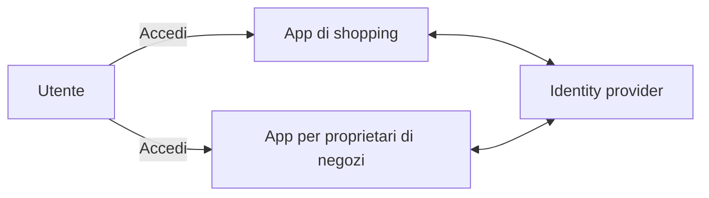
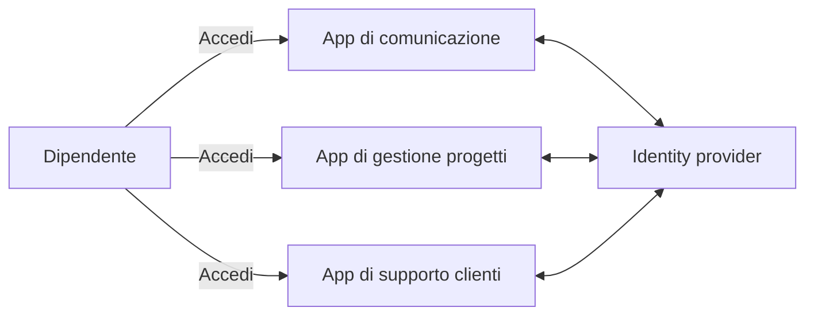
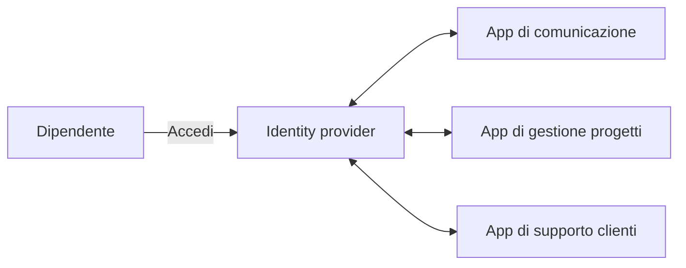
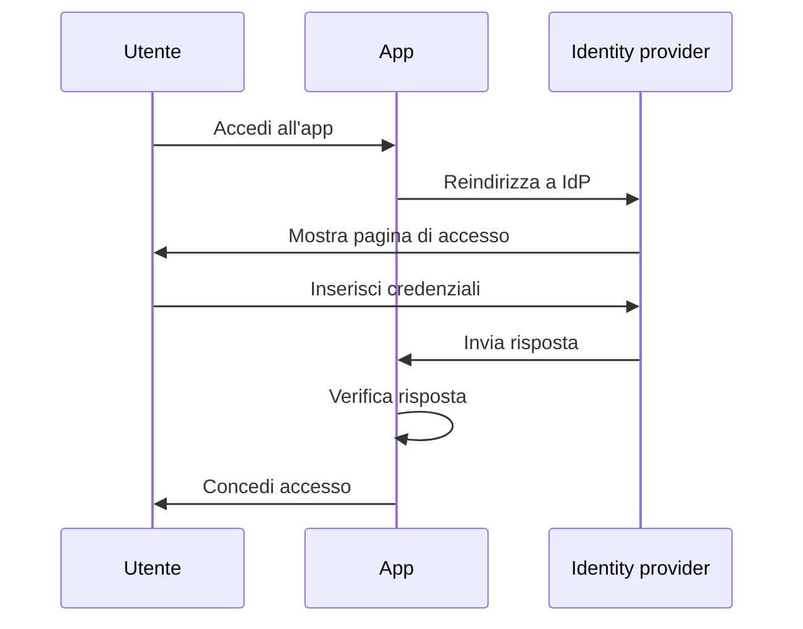
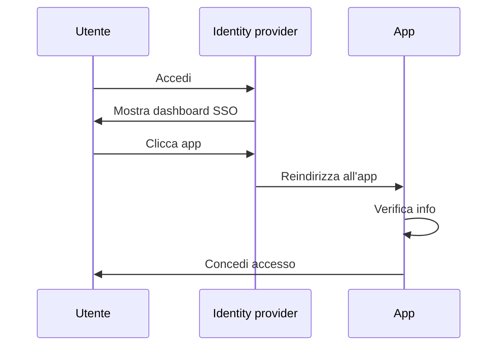
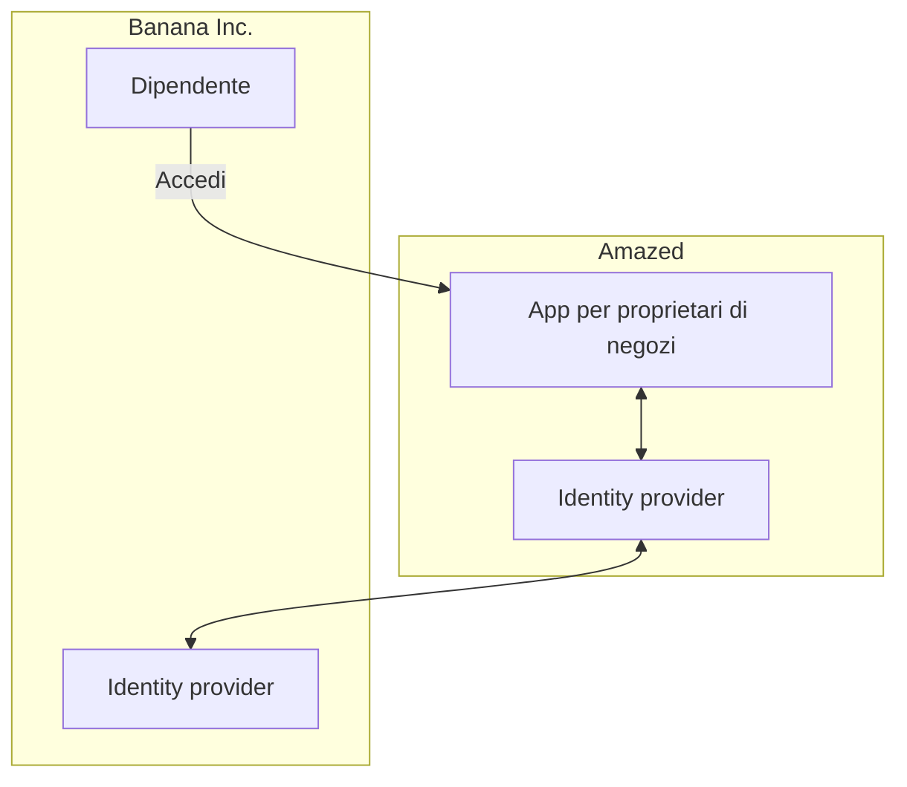

## Che cos'è l'Enterprise SSO?

Prima di approfondire la definizione, è importante chiarire la differenza tra SSO e Enterprise SSO, poiché ciò può spesso causare confusione.

- <Ref slug="single-sign-on" /> è un termine generico che si riferisce alla capacità di un utente di accedere una volta e accedere a più applicazioni o risorse senza dover accedere nuovamente.
- L'Enterprise SSO è un tipo specifico di SSO progettato per i dipendenti all'interno di un'organizzazione.

Ancora incerto? Diamo un'occhiata a un esempio:

Un sito web di shopping online chiamato _Amazed_ ha due applicazioni web: una per i clienti e una per i proprietari dei negozi. I clienti accedono all'app di shopping per acquistare prodotti, mentre i proprietari dei negozi accedono all'app per gestire i loro negozi. Entrambe le app utilizzano lo stesso identity provider per l'autenticazione. Di conseguenza, gli utenti devono accedere solo una volta per accedere a entrambe le app, fornendo un'esperienza di single sign-on.

Internamente, _Amazed_ utilizza più applicazioni per la comunicazione del team, la gestione dei progetti e il supporto clienti. Per semplificare i flussi di lavoro quotidiani, _Amazed_ implementa l'Enterprise SSO per i suoi dipendenti. Con l'Enterprise SSO, i dipendenti possono accedere a tutte le applicazioni interne con un unico login.

Tipicamente, le soluzioni di Enterprise SSO forniscono anche un dashboard centralizzato per i dipendenti per accedere a tutte le applicazioni con un clic. Questo dashboard è spesso chiamato dashboard SSO.

In breve, entrambi gli scenari sono esempi di single sign-on. La differenza è che il primo esempio è un SSO generico, mentre il secondo è un Enterprise SSO. Questi sono casi d'uso tipici per Customer IAM (Identity and Access Management) e Workforce IAM, rispettivamente.

## Come funziona l'Enterprise SSO?

L'Enterprise SSO funziona collegando più applicazioni a un identity provider centralizzato. La connessione può essere unidirezionale (dall'applicazione all'identity provider) o bidirezionale (tra l'applicazione e l'identity provider). Vari standard e protocolli, come SAML, OpenID Connect e OAuth 2.0, vengono utilizzati per queste connessioni.

Indipendentemente dal protocollo, il flusso di lavoro di base è solitamente simile:

1. L'utente accede a un'applicazione (ad esempio, l'app di comunicazione) che richiede l'autenticazione.
2. L'applicazione reindirizza l'utente all'identity provider per l'autenticazione.
3. L'utente accede all'identity provider.
4. L'identity provider invia una risposta di autenticazione all'applicazione.
5. L'applicazione verifica la risposta e concede l'accesso all'utente.

Quando l'utente accede a un'altra applicazione (ad esempio, l'app di gestione progetti) collegata allo stesso identity provider, viene automaticamente connesso senza dover inserire nuovamente le credenziali. In questo caso, il passaggio 3 viene saltato e poiché i passaggi 2, 4 e 5 avvengono in background, l'utente potrebbe non notare nemmeno il processo di autenticazione.

Questo processo è chiamato Service Provider (SP)-Initiated SSO, dove l'applicazione (SP) avvia il processo di autenticazione.

In un altro scenario, l'identity provider fornisce un dashboard centralizzato per gli utenti per accedere a tutte le applicazioni collegate. Un flusso di lavoro semplificato è:

1. L'utente accede all'identity provider.
2. L'identity provider mostra un elenco di applicazioni a cui l'utente può accedere.
3. L'utente clicca su un'applicazione (ad esempio, l'app di supporto clienti) per accedervi.
4. L'identity provider reindirizza l'utente all'applicazione con le informazioni di autenticazione.
5. L'applicazione verifica le informazioni e concede l'accesso all'utente.

Questo processo è chiamato Identity Provider (IdP)-Initiated SSO, dove l'identity provider (IdP) avvia il processo di autenticazione.

## Perché l'Enterprise SSO è importante?

### Enterprise SSO in Workforce IAM

#### Gestione centralizzata

Il principale vantaggio dell'Enterprise SSO non è solo la comodità per i dipendenti, ma anche una maggiore sicurezza e conformità per le organizzazioni. Invece di gestire più credenziali per diverse applicazioni e configurare l'autenticazione e l'autorizzazione separatamente per ciascuna, le organizzazioni possono centralizzare la gestione delle identità degli utenti, delle politiche di access control e dei log di audit.

Ad esempio, quando un dipendente lascia l'azienda, il reparto IT può disabilitare l'account del dipendente nell'identity provider, revocando immediatamente l'accesso a tutte le applicazioni. Questo è cruciale per prevenire accessi non autorizzati e violazioni dei dati, un processo noto come gestione del ciclo di vita.

#### Access control

Le soluzioni di Enterprise SSO spesso includono funzionalità di access control, come il role-based access control (RBAC) e l'attribute-based access control (ABAC). Queste funzionalità consentono alle organizzazioni di definire politiche di accesso dettagliate basate su ruoli degli utenti, attributi e altre informazioni contestuali, garantendo che i dipendenti abbiano il giusto livello di accesso alle risorse appropriate.

Per un confronto dettagliato tra RBAC e ABAC, consulta [RBAC e ABAC: I modelli di access control che dovresti conoscere](https://blog.logto.io/rbac-and-abac).

#### Sicurezza avanzata

Un altro vantaggio è la possibilità di imporre metodi di autenticazione forti, come l'autenticazione multi-fattore (MFA), l'autenticazione passwordless e l'autenticazione adattiva, su tutte le applicazioni. Questi metodi aiutano a proteggere i dati sensibili e a rispettare le normative del settore.

Per ulteriori informazioni su MFA, consulta [Esplorando MFA: Guardando l'autenticazione da una prospettiva di prodotto](https://blog.logto.io/elaborate-mfa).

### Enterprise SSO in Customer IAM

Il termine "Enterprise SSO" appare anche nelle soluzioni Customer IAM. Cosa significa in questo contesto? Rivediamo l'esempio di _Amazed_: alcuni proprietari di negozi sono costituiti come aziende. Un proprietario di negozio, _Banana Inc._, implementa l'Enterprise SSO per i suoi dipendenti. Come parte dell'accordo, _Banana Inc._ richiede a _Amazed_ di imporre l'Enterprise SSO per tutti gli indirizzi email di _Banana Inc._ (ad esempio, `*@banana.com`) quando accedono all'app per proprietari di negozi.

In questo caso, _Amazed_ deve integrare il suo identity provider con l'identity provider di _Banana Inc._ per abilitare l'Enterprise SSO per i dipendenti di _Banana Inc._. Questa integrazione, spesso effettuata tramite protocolli standard come SAML, OpenID Connect o OAuth, è comunemente chiamata connessione Enterprise SSO, connettore Enterprise SSO o federazione SSO.

Per una spiegazione approfondita del Customer IAM, consulta la serie CIAM:

- [CIAM 101: Autenticazione, Identità, SSO](https://blog.logto.io/ciam-101-intro-authn-sso)
- [CIAM 102: Autorizzazione e Role-Based Access Control](https://blog.logto.io/ciam-102-authz-and-rbac)

#### Essere pronti per l'impresa

Negli scenari B2B (business-to-business), l'Enterprise SSO è una funzionalità indispensabile per i fornitori SaaS come _Amazed_ per supportare i loro clienti aziendali. Non si tratta solo di comodità; si tratta di sicurezza e conformità per entrambe le parti. L'Enterprise SSO può imporre che tutte le identità gestite dal cliente aziendale si autentichino tramite l'identity provider aziendale, garantendo che l'azienda mantenga il controllo sui suoi utenti, dati, politiche di accesso e sicurezza.

L'Enterprise SSO è un fattore chiave per raggiungere la _prontezza aziendale_, ovvero la capacità di soddisfare le esigenze dei clienti aziendali. Tuttavia, la gestione delle identità e degli accessi, specialmente nel contesto dei clienti aziendali, è complessa e richiede un investimento significativo in tempo, risorse ed esperienza. I fornitori SaaS moderni spesso scelgono piattaforme IAM per gestire queste complessità.

<SeeAlso slugs={['single-sign-on']} />