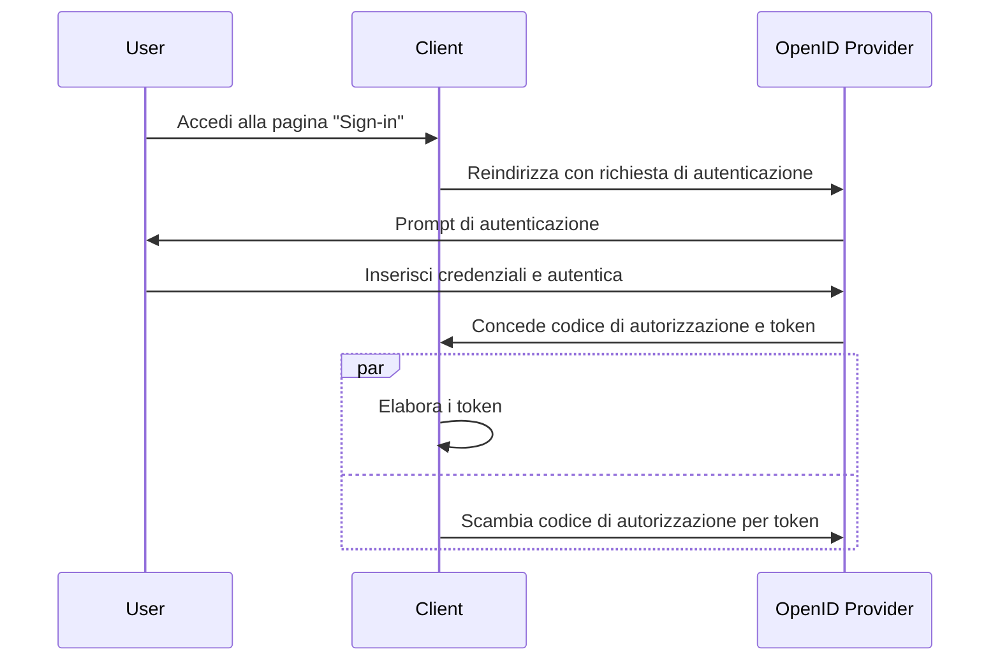

## Cos'è il flusso ibrido (hybrid flow)?

Il flusso ibrido (hybrid flow) è un processo di autenticazione che combina le caratteristiche del <Ref slug="authorization-code-flow" /> e del <Ref slug="implicit-flow" />. Vale la pena notare che il flusso ibrido non fa parte della specifica <Ref slug="oauth-2.0" />, ma è un'estensione fornita da <Ref slug="openid-connect" />.

Questo flusso è progettato per fornire un equilibrio tra sicurezza e usabilità per l'autenticazione degli utenti. Tuttavia, il flusso ibrido non è raccomandato per le nuove applicazioni a causa delle [considerazioni sulla sicurezza](#security-considerations) associate al flusso implicito. Un'alternativa popolare al flusso ibrido è utilizzare il flusso del codice di autorizzazione (authorization code flow) con <Ref slug="pkce" /> per una maggiore sicurezza.

## Come funziona il flusso ibrido (hybrid flow)?

Ecco i passaggi principali del flusso ibrido:

1. Simile ad altri flussi OIDC, il flusso ibrido inizia con il <Ref slug="client" /> che avvia una <Ref slug="authentication-request" /> al <Ref slug="openid-connect" headingId="openid-provider-op" />.

    Nota: Il client dovrebbe includere il parametro `response_type` con la combinazione di `code` e almeno uno tra `id_token` o `token`, il che significa che ci sono tre possibili combinazioni:

      - `code id_token`: Il client si aspetta un codice di autorizzazione e un ID token.
      - `code token`: Il client si aspetta un codice di autorizzazione e un access token.
      - `code id_token token`: Il client si aspetta un codice di autorizzazione, un ID token e un access token.

    Il requisito è autoesplicativo: il client si aspetta sia un codice di autorizzazione che uno o più token, che corrispondono rispettivamente al flusso del codice di autorizzazione (authorization code flow) e al flusso implicito (implicit flow).
2. L'utente si autentica sul <Ref slug="openid-connect" headingId="openid-provider-op" />.
3. Il <Ref slug="openid-connect" headingId="openid-provider-op" /> reindirizza l'utente all'applicazione client con il codice di autorizzazione e i token richiesti.
4. L'applicazione client elabora i token e può utilizzarli per accedere a risorse protette per conto dell'utente; può anche utilizzare il codice di autorizzazione per ottenere token aggiuntivi tramite la <Ref slug="token-request" />.

Ecco un diagramma di sequenza semplificato del flusso ibrido:



Ecco un esempio non normativo di una richiesta di autenticazione del flusso ibrido:

```http
GET /authorize?response_type=code%20id_token
  &client_id=YOUR_CLIENT_ID
  &redirect_uri=https%3A%2F%2Fclient.example.com%2Fcallback
  &scope=openid%20profile%20email
  &nonce=123456
  &state=abc123 HTTP/1.1
Host: your-openid-provider.com
```

### Parametri chiave in una richiesta di autenticazione del flusso ibrido

La richiesta di autenticazione del flusso ibrido include i seguenti parametri chiave:

- **`response_type`**: Il valore dovrebbe essere una combinazione di `code` e almeno uno tra `id_token` o `token`. Ad esempio, `code id_token` o `code token`.
- **`client_id`**: L'identificatore del client emesso dal <Ref slug="openid-connect" headingId="openid-provider-op" /> (authorization server).
- **`redirect_uri`**: L'URI dove il server di autorizzazione invia l'utente dopo il processo di autenticazione.
- **`scope`**: I <Ref slug="scope">scope</Ref> (permessi) richiesti per i token.
- **`resource`**: Il parametro opzionale che specifica il <Ref slug="resource-indicator" /> per le risorse richieste. Il server di autorizzazione deve supportare [RFC 8707](https://datatracker.ietf.org/doc/html/rfc8707) per utilizzare questo parametro.

Per l'elenco completo dei parametri e le loro descrizioni, vedere [Authentication using the Hybrid Flow](https://openid.net/specs/openid-connect-core-1_0.html#HybridFlowAuth).

## Considerazioni sulla sicurezza

Il flusso ibrido include il flusso implicito, noto per le sue limitazioni di sicurezza. I token sono ancora trasmessi tramite il canale frontale (browser), il che può esporli a potenziali attacchi. Il flusso implicito sarà deprecato in <Ref slug="oauth-2.1" /> a causa di queste preoccupazioni.

<Ref slug="authorization-code-flow" /> con <Ref slug="pkce" /> è l'alternativa raccomandata al flusso ibrido. Fornisce un modo più sicuro per autenticare gli utenti senza esporre i token nel canale frontale.

<SeeAlso slugs={["openid-connect", "oauth-2.1", "authorization-code-flow", "pkce", "implicit-flow"]} />

<Resources
  urls={[
    "https://blog.logto.io/implicit-flow-is-dead",
    "https://blog.logto.io/oauth-2-1",
    "https://openid.net/specs/openid-connect-core-1_0.html#HybridFlowAuth",
  ]}
/>