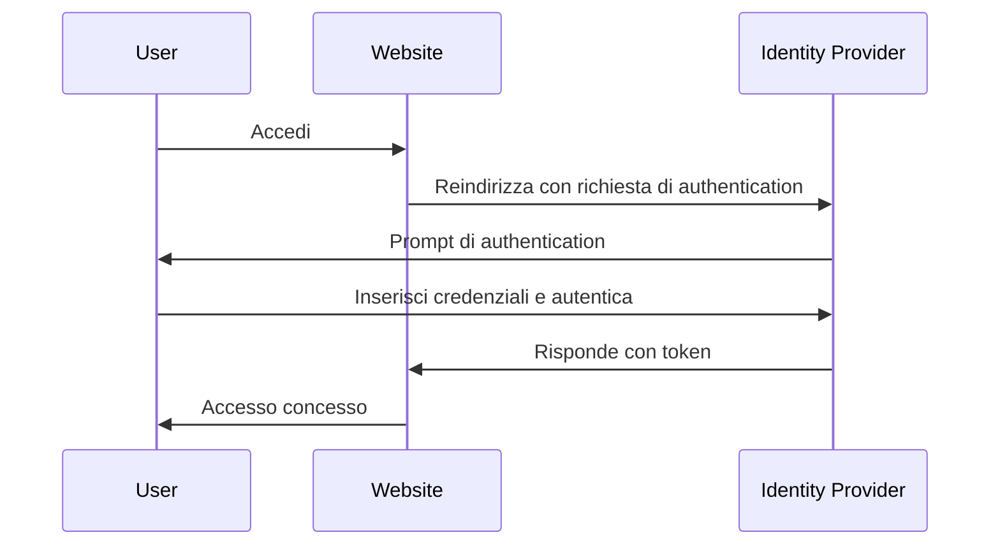

## Che cos'è la gestione delle identità e degli accessi (IAM)?

Come suggerisce la definizione, la gestione delle identità e degli accessi (IAM) è un concetto ampio che coinvolge molti aspetti della gestione delle identità digitali e della conduzione del <Ref slug="access-control" />. Analizziamo prima i termini:

- **Identità**: Una rappresentazione digitale di un utente, servizio o dispositivo. Un'identità può includere attributi come identificatori, ruoli e permessi.
- **Accesso**: La capacità di interagire con le risorse, eseguire azioni o utilizzare servizi. In sintesi, l'accesso riguarda quali azioni eseguire su determinate risorse.

### Gestione delle identità

La gestione delle identità è il processo di gestione, autenticazione e protezione delle identità digitali. Coinvolge le seguenti attività chiave:

- **Registrazione delle identità**: Creazione di nuove identità per utenti, servizi o dispositivi.
- **Autenticazione delle identità**: Verifica della proprietà di un'identità attraverso vari meccanismi come password, biometria o autenticazione multi-fattore.
- **Sicurezza delle identità**: Protezione delle identità da accessi non autorizzati, uso improprio o divulgazione.

Ogni argomento è vasto e può essere ulteriormente suddiviso in sottoargomenti come la gestione delle password, la federazione delle identità e la gestione del ciclo di vita delle identità.

### Gestione degli accessi

La gestione degli accessi (o <Ref slug="access-control" />) è il processo di controllo su chi può eseguire quali azioni su determinate risorse. Coinvolge le seguenti attività chiave:

- **Politiche di controllo degli accessi**: Definizione di regole e politiche che stabiliscono chi può accedere a quali risorse e quali azioni possono eseguire.
- **Applicazione degli accessi**: Applicazione delle politiche di controllo degli accessi attraverso meccanismi come autenticazione, autorizzazione e auditing.
- **Governance degli accessi**: Monitoraggio e gestione dei diritti di accesso per garantire la conformità alle normative e alle migliori pratiche di sicurezza.

Ogni attività svolge un ruolo importante nelle applicazioni e nei sistemi moderni per garantire che solo le identità autorizzate (utenti, servizi o dispositivi) possano accedere alle risorse in base alle politiche definite.

## Quali sono i componenti dell'IAM?

Nell'applicazione, l'IAM viene implementato utilizzando una combinazione di software, servizi e migliori pratiche. Due componenti importanti dell'IAM sono:

- **<Ref slug="identity-provider" />**: Un servizio che gestisce le identità degli utenti e l'autenticazione.
- **<Ref slug="service-provider" />**: Un servizio che si affida a un identity provider per l'autenticazione e l'autorizzazione. Nella maggior parte dei casi, è l'applicazione o il servizio che stai sviluppando.

Una chiara separazione tra identity provider e service provider aiuterà a disaccoppiare l'IAM dalla logica dell'applicazione, rendendo più facile la gestione e la scalabilità.

## Gestione delle identità e degli accessi nella pratica

Vediamo un esempio di come funziona l'IAM: quando accedi a un sito web, il processo di verifica della tua identità e di concessione dell'accesso al sito può essere considerato un processo di gestione delle identità e degli accessi.

Di solito, il processo IAM coinvolge due passaggi principali: authentication e authorization:

- <Ref slug="authentication" /> risponde alla domanda "Quale identità possiedi?"
- <Ref slug="authorization" /> risponde alla domanda "Cosa puoi fare?"

> A volte, l'autenticazione sarà interpretata come "Chi sei?" Tuttavia, quando si discute di identità digitali, è più accurato dimostrare l'autenticazione "provando la proprietà dell'identità".

Inoltre, il concetto di gestione delle identità e degli accessi è abbastanza ampio da dare origine a nuovi concetti, come WIAM (Workforce IAM) e CIAM (Customer IAM).

Sebbene WIAM e CIAM condividano la stessa base, hanno casi d'uso distinti: WIAM è tipicamente utilizzato per utenti interni, mentre CIAM è utilizzato per clienti esterni. Alcuni esempi:

- **WIAM**: La tua azienda ha un sistema di identità unificato per i dipendenti, quindi ognuno può utilizzare lo stesso account per accedere alle risorse aziendali, come abbonamenti software, servizi di cloud computing, ecc.
- **CIAM**: La tua libreria online richiede un sistema di identità utente per clienti e venditori. L'esperienza di accesso è una parte critica dell'onboarding, poiché si trova all'inizio del funnel di conversione.

Per saperne di più sul concetto di CIAM e argomenti correlati, puoi fare riferimento a [CIAM 101: Authentication, Identity, SSO](https://blog.logto.io/ciam-101-intro-authn-sso).

### Autenticazione

Ecco alcuni metodi di autenticazione comuni utilizzati nell'IAM:

- **Autenticazione basata su password**: Il metodo più comune, in cui gli utenti forniscono un nome utente e una password per dimostrare la loro identità.
- **Autenticazione <Ref slug="passwordless" />**: Un metodo che consente agli utenti di accedere senza una password, come l'utilizzo di un codice monouso inviato alla loro email o telefono. Si noti che l'autenticazione passwordless può anche riferirsi ad altri metodi, come l'autenticazione biometrica.
- **Accesso tramite social**: Un metodo che consente agli utenti di accedere utilizzando i loro account sui social media, come Google, Facebook o Twitter.
- **<Ref slug="passkey" /> (WebAuthn)**: Un metodo che consente agli utenti di accedere utilizzando una chiave di sicurezza, come una chiave USB o uno smartphone che supporta WebAuthn.
- **Autenticazione biometrica**: Un metodo che utilizza caratteristiche fisiche, come impronte digitali, riconoscimento facciale o riconoscimento vocale, per verificare l'identità di un utente.
- **Autenticazione <Ref slug="machine-to-machine" />**: Un metodo che consente a servizi o dispositivi di autenticarsi reciprocamente senza intervento umano, come l'utilizzo di API key o certificati.

Per un ulteriore livello di sicurezza, <Ref slug="mfa" /> può essere utilizzato in combinazione con questi metodi di autenticazione. MFA richiede agli utenti di fornire due o più fattori per dimostrare la loro identità, come qualcosa che sanno (password), qualcosa che hanno (chiave di sicurezza o <Ref slug="totp" />), o qualcosa che sono (dati biometrici).

### Autorizzazione

Con l'autenticazione in atto, l'autorizzazione determina quali azioni un'identità può eseguire. L'autorizzazione può basarsi su vari fattori, come il ruolo dell'identità, l'appartenenza a gruppi, i permessi, gli attributi, le politiche, ecc. Esistono diversi modelli di autorizzazione comuni:

- **<Ref slug="rbac" />**: Un modello che assegna permessi ai ruoli e poi assegna ruoli alle identità. Ad esempio, un ruolo di dipendente potrebbe avere accesso a determinate risorse, mentre un ruolo di amministratore potrebbe avere accesso a tutte le risorse.
- **<Ref slug="abac" />**: Un modello che utilizza attributi (proprietà) dell'identità, della risorsa e dell'ambiente per prendere decisioni di controllo degli accessi. Ad esempio, un'identità con l'attributo "dipartimento=ingegneria" potrebbe avere accesso alle risorse di ingegneria.
- **Controllo degli accessi basato su politiche (PBAC)**: Un modello che utilizza politiche per definire le regole di controllo degli accessi. Le politiche possono basarsi su vari fattori, come l'ora del giorno, la posizione, il tipo di dispositivo, ecc.
- **Controllo degli accessi granulare**: Un modello che fornisce un controllo più granulare sugli accessi, consentendo di impostare permessi a livello di singole risorse o azioni.

## Quali sono gli standard aperti ampiamente utilizzati per l'IAM?

Esistono diversi standard e protocolli aperti ampiamente utilizzati nell'IAM:

- **<Ref slug="oauth-2.0" />**: Un protocollo che consente alle applicazioni di accedere alle risorse per conto di un utente senza condividere le credenziali dell'utente. OAuth 2.0 è comunemente utilizzato per l'autorizzazione, come consentire a un'applicazione di terze parti di accedere ai file di Google Drive di un utente.
- **<Ref slug="openid-connect" />**: Un livello di identità costruito sopra OAuth 2.0 che consente alle applicazioni di verificare l'identità di un utente e ottenere informazioni di base sul profilo dell'utente. Il single sign-on (SSO) è un caso d'uso comune per OpenID Connect. Combinare OAuth 2.0 e OpenID Connect è una pratica comune per l'IAM moderno.
- **<Ref slug="saml" />**: Uno standard basato su XML per lo scambio di dati di autenticazione e autorizzazione tra identity provider e service provider. SAML è comunemente utilizzato per l'SSO in ambienti aziendali.
- **SCIM (System for Cross-domain Identity Management)**: Uno standard per automatizzare lo scambio di informazioni sull'identità degli utenti tra identity provider e service provider. SCIM è comunemente utilizzato per il provisioning e il deprovisioning degli utenti nelle applicazioni basate su cloud.

## Quali sono le considerazioni chiave per la progettazione dell'IAM?

Quando si progetta un sistema IAM, ci sono diverse considerazioni chiave da tenere a mente:

- **Sicurezza**: La sicurezza è fondamentale nell'IAM. Assicurati che i metodi di autenticazione seguano le migliori pratiche, come l'uso di hashing delle password forte, l'applicazione dell'MFA e la protezione contro attacchi comuni come phishing e forza bruta.
- **Privacy**: Rispetta la privacy degli utenti raccogliendo solo le informazioni necessarie e ottenendo il consenso degli utenti quando necessario.
- **Scalabilità**: Rendi il sistema IAM scalabile per gestire un gran numero di utenti e applicazioni. Considera l'uso di identity provider basati su cloud per la scalabilità.
- **Interoperabilità**: Un vantaggio dell'uso di standard aperti è che consente l'interoperabilità tra diversi sistemi. Ad esempio, la maggior parte dei provider di identità popolari come Google, Facebook e Microsoft supportano OAuth 2.0 e OpenID Connect.
- **Esperienza utente**: L'esperienza utente per l'autenticazione e l'autorizzazione influisce notevolmente sulla conversione e sulla fidelizzazione degli utenti. Bilanciare la sicurezza con la facilità d'uso è un'arte nell'IAM.

<SeeAlso slugs={['openid-connect', 'oauth-2.0', 'single-sign-on', 'enterprise-sso']} />

<Resources
  urls={[
    "https://blog.logto.io/ciam-101-intro-authn-sso",
    "https://blog.logto.io/ciam-102-authz-and-rbac"
  ]}
/>