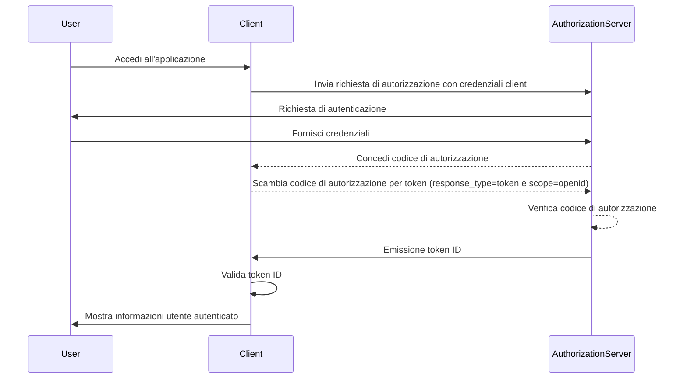

## Che cos'è un token ID?

Un token ID è un tipo specifico di token di sicurezza che contiene informazioni sull'utente autenticato, consegnato all'applicazione client dopo un <Ref slug="authentication" /> riuscito. Il token ID è la caratteristica chiave che distingue <Ref slug="openid-connect" /> da <Ref slug="oauth-2.0" />. Mentre OAuth 2.0 si concentra esclusivamente sull'autorizzazione, OIDC si basa su di esso per aggiungere l'autenticazione dell'utente introducendo il token ID.

Nel processo di autenticazione OIDC, un'applicazione client (parte affidabile) avvia l'autenticazione reindirizzando l'utente a un authorization server (server di autorizzazione). Dopo un'autenticazione riuscita, il server risponde con un token ID, tra gli altri token come il <Ref slug="access-token" />. Il token ID è tipicamente codificato come un <Ref slug="jwt" /> e include claim chiave come l'identificatore dell'utente (sub), l'issuer (emittente) (iss), audience (pubblico) (aud) e altre informazioni specifiche dell'utente.

La funzione principale del token ID è verificare l'identità dell'utente e trasmettere queste informazioni all'applicazione client. Questo consente all'applicazione di autenticare l'utente senza gestire direttamente le credenziali. Poiché il client riceve il token ID solo dopo che l'utente è stato autenticato dal authorization server (server di autorizzazione), il token ID può essere utilizzato come un modo sicuro per verificare l'identità dell'utente.

## Come funziona il token ID?

L'applicazione client avvia il processo di autenticazione reindirizzando l'utente al authorization server (server di autorizzazione). L'utente si autentica con il server, che quindi emette un token ID insieme ad altri token come il token di accesso. Il token ID viene restituito all'applicazione client, che può quindi utilizzarlo per verificare l'identità dell'utente.

Poiché OIDC è un protocollo popolare e standardizzato, molte librerie e framework forniscono supporto integrato per la gestione dei token ID. Questo rende i token ID facili da integrare nelle applicazioni client e ampiamente utilizzati negli scenari di <Ref slug="single-sign-on" /> e identità federata.

## Claim in un token ID

Un token ID è un JWT che contiene un insieme di <Ref slug="claim" /> sull'utente autenticato. Questi claim includono sia claim standard JWT definiti nella [specifica JWT](https://datatracker.ietf.org/doc/html/rfc7519#section-4), sia claim specifici OIDC utilizzati per trasmettere informazioni sull'identità dell'utente.

Claim standard del token JWT:

- **iss (Issuer)**: OBBLIGATORIO. Il claim issuer identifica l'emittente del token ID. Questo è tipicamente l'URL del authorization server (server di autorizzazione) che ha emesso il token.
- **sub (Subject)**: OBBLIGATORIO. Il claim subject identifica l'utente a cui si riferisce il token ID. Questo è tipicamente un identificatore univoco per l'utente.
- **aud (Audience)**: OBBLIGATORIO. Il claim audience identifica l'<Ref slug="audience" /> per il token ID. Questo è tipicamente l'applicazione client che ha richiesto il token.
- **exp (Expiration time)**: OBBLIGATORIO. Il claim expiration time identifica il momento in cui il token scade. Dopo questo momento, il token non dovrebbe essere accettato per l'elaborazione.
- **iat (Issued at)**: OBBLIGATORIO. Il claim issued at identifica il momento in cui il token è stato emesso.
- **auth_time (Authentication time)**: OPZIONALE. Il claim authentication time identifica il momento in cui l'utente è stato autenticato. Questo claim è presente solo se l'utente è stato autenticato durante la sessione corrente.
- **nonce**: OPZIONALE. Il claim nonce viene utilizzato per associare una sessione client con un token ID. È tipicamente utilizzato per prevenire attacchi di replay.

Claim standard delle informazioni utente OIDC:

- **name**: Il nome completo dell'utente.
- **given_name**: Il nome di battesimo dell'utente.
- **family_name**: Il cognome dell'utente.
- **middle_name**: Il secondo nome dell'utente.
- **nickname**: Il soprannome dell'utente o altro nome breve.
- **preferred_username**: Il nome utente preferito dell'utente.
- **profile**: Un URL che punta alla pagina del profilo dell'utente.
- **picture**: Un URL che punta all'immagine del profilo dell'utente.
- **website**: Un URL che punta al sito web dell'utente.
- **email**: L'indirizzo email dell'utente.
- **email_verified**: Un valore booleano che indica se l'indirizzo email dell'utente è stato verificato.
- **gender**: Il genere dell'utente.
- **birthdate**: La data di nascita dell'utente. Rappresentata come una stringa nel formato YYYY-MM-DD.
- **zoneinfo**: Il fuso orario dell'utente. Stringa dal [Database dei fusi orari IANA](https://www.iana.org/time-zones).
- **locale**: La localizzazione dell'utente. Rappresenta la lingua e la regione preferite dall'utente per la formattazione di date, orari e numeri.
- **phone_number**: Il numero di telefono dell'utente.
- **phone_number_verified**: Un valore booleano che indica se il numero di telefono dell'utente è stato verificato.
- **address**: L'indirizzo postale dell'utente. Il valore è un oggetto JSON che contiene le informazioni sull'indirizzo dell'utente.
- **updated_at**: Il momento in cui le informazioni dell'utente sono state aggiornate l'ultima volta.

Questi claim forniscono un modo standardizzato per trasmettere informazioni sull'identità dell'utente nel token ID. Mentre la specifica definisce solo un insieme di claim standard, anche claim personalizzati possono essere inclusi nel token ID per trasmettere ulteriori informazioni specifiche dell'utente secondo necessità.

## Validazione del token ID

Quando l'applicazione client riceve un token ID, deve validare il token per garantire la sua autenticità e integrità. Il processo di validazione tipicamente coinvolge i seguenti passaggi:

1. **Verifica della firma**: Il client deve verificare la firma del token ID utilizzando la chiave pubblica del authorization server (server di autorizzazione). Questo assicura che il token non sia stato manomesso e sia stato emesso dalla parte prevista.
2. **Controllo dell'issuer**: Il client dovrebbe verificare che il claim `iss` nel token ID corrisponda all'URL del authorization server (server di autorizzazione) che ha emesso il token. Questo aiuta a prevenire attacchi di sostituzione del token.
3. **Controllo dell'audience**: Il client dovrebbe verificare che il claim `aud` nel token ID corrisponda al `client_id` dell'applicazione client. Questo assicura che il token sia stato emesso per l'applicazione client.
4. **Controllo del tempo di scadenza**: Il client dovrebbe verificare che il claim `exp` nel token ID non sia passato. Se il token è scaduto, non dovrebbe essere accettato. Le implementazioni possono fornire un margine per tenere conto della differenza di orario.
5. **Controllo del nonce**: Se il client ha incluso un parametro `nonce` nella richiesta di autenticazione, dovrebbe verificare che il claim `nonce` nel token ID corrisponda al valore del parametro `nonce`. Questo aiuta a prevenire attacchi di replay.

## Token ID vs token di accesso

Sebbene entrambi i token ID e i token di accesso siano ampiamente utilizzati in OIDC, servono a scopi diversi e hanno caratteristiche distinte:

|              | Token ID                                                                               | Token di accesso                                                                                                             |
| ------------ | -------------------------------------------------------------------------------------- | ---------------------------------------------------------------------------------------------------------------------------- |
| **Scopo**    | Verifica l'identità dell'utente e trasmette informazioni utente all'applicazione client. | Fornisce accesso a risorse protette per conto dell'utente.                                                                   |
| **Formato**  | Tipicamente un JWT che contiene claim di identità dell'utente.                         | Può essere un JWT o un <Ref slug="opaque-token" />.                                                                          |
| **Audience** | Destinato all'applicazione client che ha richiesto il token.                           | Destinato al resource server (server di risorse) che ospita le risorse protette.                                             |
| **Durata**   | Token a breve durata che è tipicamente valido per pochi minuti. Uso singolo.           | Token a durata più lunga che è valido per un periodo più lungo (es. ore). Può essere riutilizzato più volte entro il periodo di validità. |
| **Contenuti**| Contiene informazioni sull'identità dell'utente come nome, email e altri dati specifici dell'utente. | Contiene informazioni sui permessi dell'utente (scope) a risorse specifiche.                                                 |

## Migliori pratiche per l'uso dei token ID

Quando si lavora con i token ID in OIDC, è importante seguire le migliori pratiche per garantire la sicurezza e l'integrità del processo di autenticazione. Alcune delle migliori pratiche chiave includono:

1. **Valida i token ID**: Valida sempre il token ID ricevuto dal authorization server (server di autorizzazione) per garantire la sua autenticità e integrità. Questo aiuta a prevenire attacchi di sostituzione del token e accessi non autorizzati.
2. **Usa canali sicuri**: Assicurati che i token ID siano trasmessi su canali sicuri (es. HTTPS) per prevenire intercettazioni e manomissioni.
3. **Proteggi le informazioni sensibili**: Poiché i JWT sono tipicamente codificati ma non crittografati, il che rende il contenuto trasparente. Evita di includere informazioni sensibili nel payload del token ID per prevenire l'esposizione di dati sensibili in caso di perdita del token.
4. **Non per l'autorizzazione**: I token ID sono destinati all'autenticazione dell'utente e non dovrebbero essere utilizzati per scopi di autorizzazione. Usa i token di accesso per l'autorizzazione per accedere a risorse protette.
5. **Uso singolo**: I token ID sono generalmente destinati a un uso singolo. Una volta che un'applicazione client ha validato un token ID, non dovrebbe essere riutilizzato per richieste successive o per la conservazione dello stato della sessione. Per mantenere lo stato della sessione utente, le applicazioni client dovrebbero impiegare meccanismi come il <Ref slug="refresh-token" /> e le richieste di scambio di token. (I refresh token sono token opachi a lunga durata che possono essere utilizzati per ottenere nuovi token di accesso e token ID quando scadono.)

<SeeAlso slugs={["openid-connect", "jwt", "signing-key", "access-token"]} />