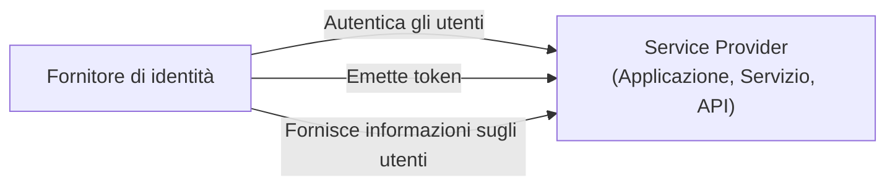
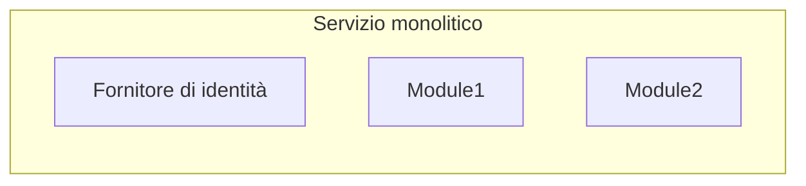
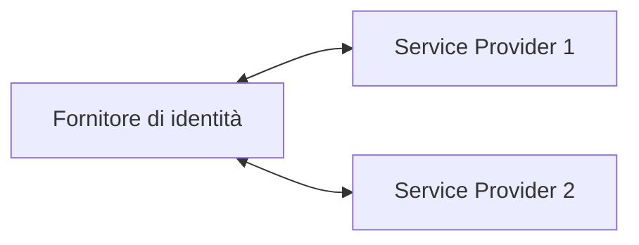

## Cos'è un fornitore di identità (Identity provider, IdP)?

Nel regno di <Ref slug="iam" />, un fornitore di identità (Identity provider, IdP) è il servizio centrale per la gestione delle identità. È responsabile dell'autenticazione degli utenti, dell'emissione di token di identità e della fornitura di informazioni sugli utenti ai <Ref slug="service-provider">service provider</Ref> (ad esempio, applicazioni, servizi, API).

Oltre all'<Ref slug="authentication" />, i fornitori di identità moderni sono anche responsabili dell'<Ref slug="authorization" /> (applicazione delle politiche di <Ref slug="access-control" />) e del supporto di funzionalità avanzate come il <Ref slug="single-sign-on" /> e la <Ref slug="multi-tenancy" />.

## Standard del fornitore di identità

A causa della natura della gestione delle identità e della necessità di interoperabilità, sarebbe impraticabile e inefficiente costruire fornitori di identità senza standard. Ecco alcuni scenari tipici:

- Due fornitori di identità devono comunicare tra loro per scambiare informazioni sugli utenti (ad esempio, login sociale).
- Un'applicazione deve autenticare gli utenti utilizzando più fornitori di identità (ad esempio, identità federata).
- Un fornitore di identità deve supportare più tipi di client (ad esempio, web, mobile, IoT).

Per affrontare questi scenari, l'industria ha sviluppato diversi standard popolari per i fornitori di identità:

- <Ref slug="oauth-2.0" />: Un framework di autorizzazione ampiamente utilizzato che consente alle applicazioni di ottenere accesso per conto di utenti o servizi.
- <Ref slug="openid-connect" />: Un livello di identità costruito sopra OAuth 2.0 che fornisce autenticazione e informazioni sugli utenti.
- <Ref slug="saml" />: Uno standard per lo scambio di dati di autenticazione e autorizzazione tra domini di sicurezza.

Per le nuove applicazioni, OpenID Connect (OIDC) è lo standard raccomandato da utilizzare sia per costruire un fornitore di identità che per integrarsi con fornitori di identità esistenti.

## Architettura del fornitore di identità

Il termine "fornitore di identità" non specifica una particolare architettura o implementazione. Vale a dire, un fornitore di identità può anche essere un'applicazione monolitica, un microservizio o un servizio cloud.

A causa della complessità e della criticità della gestione delle identità, le applicazioni moderne tendono a utilizzare fornitori di identità specializzati che sono servizi autonomi o soluzioni di fornitori.

## Funzionalità del fornitore di identità

I fornitori di identità moderni offrono una vasta gamma di funzionalità per supportare vari casi d'uso e requisiti. Ecco alcune funzionalità comuni:

- <Ref slug="authentication" />: Verifica l'identità degli utenti utilizzando vari metodi (ad esempio, nome utente/password, login sociale, <Ref slug="mfa" />).
- <Ref slug="authorization" />: Applica politiche di access control e gestisce i permessi degli utenti (ad esempio, <Ref slug="rbac" />, <Ref slug="abac" />).
- **Gestione degli utenti**: Crea, aggiorna ed elimina account e profili utente; fornisce dati utente ai <Ref slug="service-provider">service provider</Ref>.
- **Gestione dei token**: Emette e gestisce token di identità (ad esempio, ID token, access token, refresh token).
- <Ref slug="single-sign-on" />: Consente agli utenti di autenticarsi una volta e accedere a più applicazioni.
- <Ref slug="multi-tenancy" />: Supporta più organizzazioni o tenant con dati utente e configurazioni isolate.

<SeeAlso slugs={["service-provider", "iam", "openid-connect", "oauth-2.0"]} />

<Resources
  urls={[
    "https://blog.logto.io/secure-cloud-apps-with-oauth-and-openid-connect",
    "https://blog.logto.io/incorporate-identity-solution",
    "https://blog.logto.io/centralized-identity-system"
  ]}
/>