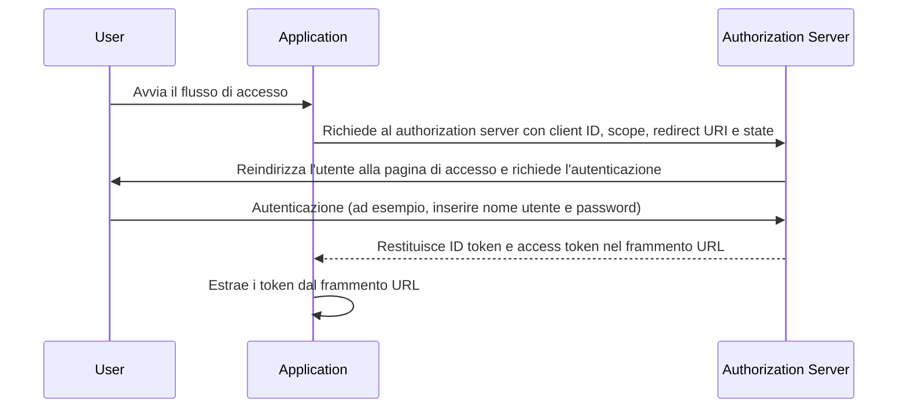

## Che cos'è il flusso implicito (implicit flow)

Il flusso implicito (implicit flow) di OIDC (OpenID Connect) è un processo di autenticazione utilizzato principalmente dalle applicazioni client implementate in un browser utilizzando un linguaggio di scripting, ad esempio le applicazioni a pagina singola (SPA). Consente alle applicazioni client di ottenere direttamente ID token e access token dal authorization server senza eseguire l'autenticazione del client.

## Come funziona il flusso implicito (implicit flow)?

I passaggi principali del flusso implicito (implicit flow) sono i seguenti:

1. **Invio della richiesta di autenticazione (authentication request)**: L'utente avvia il flusso facendo tipicamente clic su un link o un pulsante nell'applicazione per accedere. L'applicazione invia una richiesta di autenticazione (authentication request) al endpoint di autorizzazione del authorization server. Il authorization server convalida i parametri e reindirizza l'utente per autenticarsi sulla pagina di accesso del authorization server.
2. **Autenticazione dell'utente**: L'utente si autentica sul authorization server (ad esempio, inserendo nome utente e password).
3. **Risposta del authorization server**: Il authorization server restituisce un ID token e, se richiesto, un access token all'applicazione client come frammento URL.
4. **Elaborazione dei token da parte del client**: L'applicazione client estrae i token dal frammento URL.



### Richiesta di autenticazione (Authentication request)

I parametri della richiesta sono i seguenti:
- **client_id**: OBBLIGATORIO. Identificatore client OAuth 2.0 valido, disponibile in Logto come application ID (o app ID).
- **scope**: OBBLIGATORIO. Questo valore specifica un insieme di risorse che l'utente richiede dal authorization server. Ad esempio, `openid profile email`
- **response_type**: OBBLIGATORIO. Il valore è `id_token` o `id_token token`. Nessun access token viene restituito quando il valore è `id_token`.
- **redirect_uri**: OBBLIGATORIO. L'URI a cui verrà inviata la risposta di autenticazione e dovrebbe corrispondere esattamente al redirect URI che il client ha preregistrato presso il <Ref slug="openid-connect" headingId="openid-provider-op" />. Ad esempio, `Sign-in redirect URI` nella Logto Admin Console.
- **nonce**: OBBLIGATORIO. Una stringa casuale utilizzata per mitigare gli attacchi di replay, che viene passata senza modifiche dalla richiesta di autenticazione al ID token claim.

### Esempio di una richiesta di autenticazione

```bash
curl -X GET "https://authorization-server.com/auth" \
  -d "response_type=id_token token" \
  -d "client_id=YOUR_APPLICATION_ID" \
  -d "redirect_uri=https://yourapp.com/callback" \
  -d "scope=openid profile email" \
  -d "nonce=RANDOM_STRING"
```

## Limitazioni

Il flusso implicito (implicit flow) è stato sviluppato in un periodo in cui i browser non adottavano ampiamente il Cross-Origin Resource Sharing (CORS). Pertanto, l'invio di richieste POST al authorization server ospitato su un dominio diverso è vietato.

A causa di questa limitazione, il authorization server restituisce direttamente i token nel frammento URL, il che può esporli all'utente finale e alle applicazioni che hanno accesso al User Agent dell'utente finale.

Inoltre, l'autenticazione del client non viene eseguita nel flusso implicito (implicit flow), il che significa che qualsiasi applicazione può fingere di essere quel client che richiede l'autenticazione, poiché il client ID è sempre esposto nelle applicazioni basate su browser.

A causa delle limitazioni sopra menzionate, il flusso implicito (implicit flow) è generalmente considerato meno sicuro rispetto al Authorization Code Flow.

## Alternative al flusso implicito (implicit flow)

Date le limitazioni di sicurezza del flusso implicito (implicit flow), spesso vengono raccomandati altri flussi:
- **Authorization Code Flow**: Questo flusso prevede un passaggio aggiuntivo in cui il client scambia un authorization code per i token, fornendo un ulteriore livello di sicurezza.
- **PKCE (Proof Key for Code Exchange)**: Un'estensione del Authorization Code Flow che aggiunge un ulteriore livello di sicurezza utilizzando un code verifier e un code challenge.

<SeeAlso slugs={['device-flow', 'authorization-code-flow', 'client-credentials-flow']} />

<Resources
  urls={[
    "https://blog.logto.io/implicit-flow-is-dead",
    {
      url: "https://tools.ietf.org/html/rfc6749#section-4.2",
      result: {
        ogTitle: "The OAuth 2.0 Authorization Framework: Implicit Grant",
        ogDescription: "Il tipo di concessione implicita viene utilizzato per ottenere access token (non supporta l'emissione di refresh token) ed è ottimizzato per i client pubblici noti per operare un particolare redirect URI. Questi client sono tipicamente implementati in un browser utilizzando un linguaggio di scripting come JavaScript."
      }
    },
    "https://openid.net/specs/openid-connect-core-1_0.html",
  ]}
/>