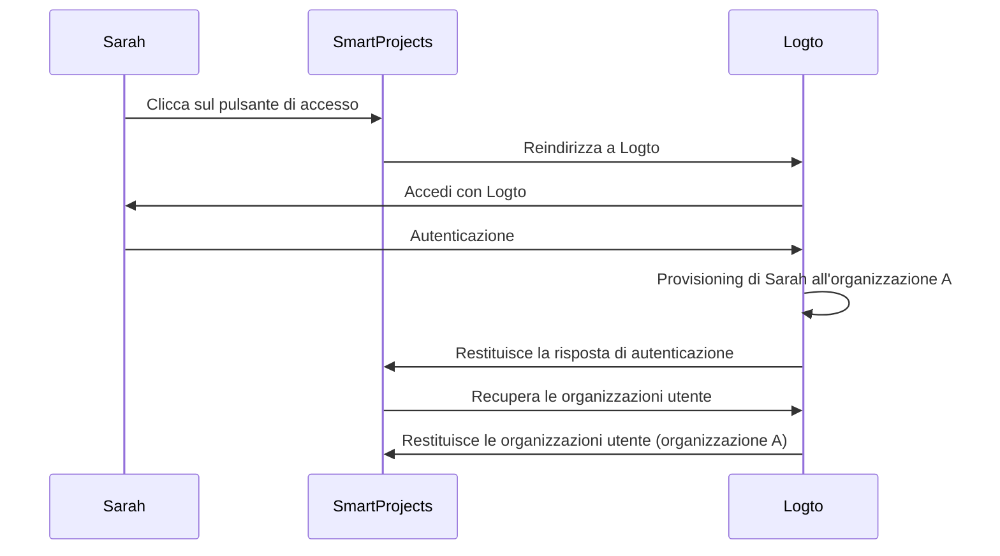
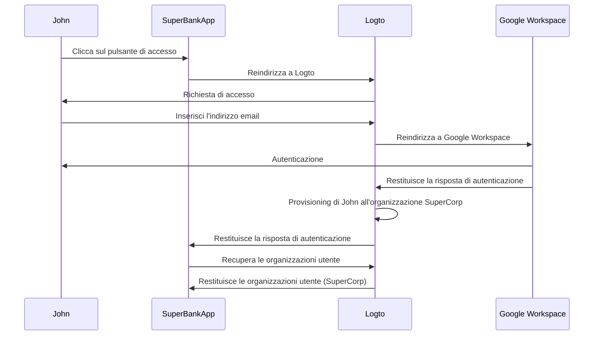

## Cos'è il provisioning just-in-time?

Il provisioning just-in-time (JIT) è un processo utilizzato in <Ref slug="iam" /> in cui gli account utente vengono forniti in base all'identità dell'utente e alla configurazione del sistema al volo quando l'utente tenta di accedere per la prima volta.

## Quali sono i casi d'uso per il provisioning just-in-time?

Questi casi sono comuni quando si costruisce un'app B2B che coinvolge un'architettura multi-tenant, Enterprise SSO o richiede funzionalità di onboarding del team. Ecco alcuni scenari di esempio che tu o il tuo cliente potreste incontrare.

### Onboarding dei dipendenti

Immagina che uno dei tuoi clienti, *SuperFantasy*, stia vivendo frequenti assunzioni o una rapida crescita e possa utilizzare il provisioning JIT per configurare rapidamente gli account utente per i nuovi dipendenti. *SuperFantasy* utilizza Logto per la gestione delle identità e degli accessi e SmartProjects per la gestione dei progetti. Quando un nuovo dipendente, Sarah, accede a SmartProjects per la prima volta, il suo account viene automaticamente creato e configurato in base alle sue credenziali Logto.

Secondo il diagramma sopra, quando Sarah accede a SmartProjects per la prima volta, il suo account viene automaticamente fornito all'organizzazione A in Logto. Questo processo garantisce che Sarah abbia l'accesso necessario a SmartProjects senza richiedere l'intervento manuale del team IT.

### Onboarding dei clienti aziendali

Immagina un altro cliente, *SuperBank*, un'istituzione finanziaria che fornisce servizi bancari online ai suoi clienti. *SuperBank* utilizza Logto per la gestione delle identità e degli accessi e SuperBankApp per i servizi bancari online. *SuperBank* ha recentemente firmato un contratto con un nuovo cliente aziendale, *SuperCorp*, per fornire servizi bancari online ai suoi dipendenti.

*SuperCorp* utilizza Google Workspace per i suoi account dipendenti. SuperBankApp deve garantire che quando un dipendente di *SuperCorp* accede per la prima volta, il suo account venga automaticamente aggiunto all'organizzazione *SuperCorp* in Logto.

Nel diagramma sopra, quando John accede a SuperBankApp per la prima volta, il suo account viene automaticamente fornito all'organizzazione SuperCorp in Logto in base alla sua identità di Google Workspace.

## È specifico per SAML e Enterprise SSO?

Il provisioning just-in-time (JIT) è spesso associato a <Ref slug="enterprise-sso" /> nell'autenticazione SAML, ma non è esclusivo di <Ref slug="saml" />. Il provisioning JIT può essere utilizzato anche con altri protocolli di autenticazione come <Ref slug="oauth-2.0" /> e <Ref slug="openid-connect" />, e non richiede sempre una configurazione di <Ref slug="enterprise-sso" />.

Ad esempio, il provisioning JIT basato su email può essere utilizzato quando il tuo <Ref slug="identity-provider" /> supporta questa funzionalità. In questo caso, l'indirizzo email dell'utente è l'unico attributo richiesto per il provisioning, indipendentemente dal protocollo di autenticazione o dalla configurazione SSO.

## Si applica ai nuovi utenti o agli utenti esistenti dell'app?

Il provisioning just-in-time (JIT) si riferisce generalmente al primo tentativo di accesso a un'app. Tuttavia, diversi prodotti percepiscono questa funzionalità in modo diverso. Alcuni utilizzano il provisioning JIT solo per la creazione di identità e account, mentre altri includono anche aggiornamenti degli account just-in-time, come il riprovisionamento e la sincronizzazione degli attributi.

Ad esempio, il provisioning JIT SAML consente di concedere e revocare le appartenenze ai gruppi come parte del provisioning. Può anche aggiornare gli utenti forniti per mantenere i loro attributi nel negozio del <Ref slug="service-provider" /> sincronizzati con gli attributi del negozio utente del <Ref slug="identity-provider" />.

Se vuoi considerare lo scenario di accesso successivo degli utenti esistenti, assicurati di avere un sistema di provisioning robusto insieme al tuo sistema JIT. Ad esempio:

- **Risoluzione dei conflitti**: Il tuo sistema dovrebbe avere una strategia per gestire i conflitti se un account esiste già con informazioni diverse da quelle fornite dall'IdP durante il processo JIT. Questo potrebbe richiedere un controllo dettagliato delle politiche della tua organizzazione e della configurazione dell'IdP.
- **Tracce di audit**: È importante mantenere registri sia delle nuove creazioni di account che degli aggiornamenti degli account esistenti attraverso i processi JIT per motivi di sicurezza e conformità.
- **Prestazioni**: Sebbene il provisioning JIT avvenga rapidamente, considera l'impatto potenziale sui tempi di accesso, specialmente per gli utenti esistenti se stai aggiornando le loro informazioni a ogni accesso.
- **Coerenza dei dati**: Assicurati che il tuo processo di provisioning JIT mantenga la coerenza dei dati, specialmente quando aggiorni gli account utente esistenti.

## Qual è la differenza tra JIT e System for Cross-domain Identity Management (SCIM)?

SCIM è un protocollo standard aperto progettato per semplificare e automatizzare la gestione delle identità degli utenti attraverso diversi sistemi e domini. È comunemente utilizzato negli scenari di sincronizzazione delle directory.

La principale differenza tra JIT e SCIM è che JIT si riferisce spesso al primo tentativo di accesso a un'app (o onboarding di nuovi utenti), ed è un termine ampio che descrive il processo di provisioning dinamico degli account utente; mentre SCIM è un protocollo specifico per la gestione del ciclo di vita degli utenti attraverso i sistemi e non è limitato al primo accesso.

Inoltre, JIT manca di un'implementazione standardizzata attraverso i sistemi, mentre SCIM è un protocollo standardizzato definito [RFC 7644](https://datatracker.ietf.org/doc/html/rfc7644) per la gestione delle identità.

Alcune organizzazioni più grandi utilizzano SCIM per il provisioning degli account, integrandolo con i propri sistemi. Questo può essere molto complesso e variare caso per caso. Per la maggior parte dei casi d'uso, il provisioning JIT è un approccio più semplice e diretto.

<Resources urls={['https://blog.logto.io/jit-provisioning', 'https://datatracker.ietf.org/doc/html/rfc7644']} />