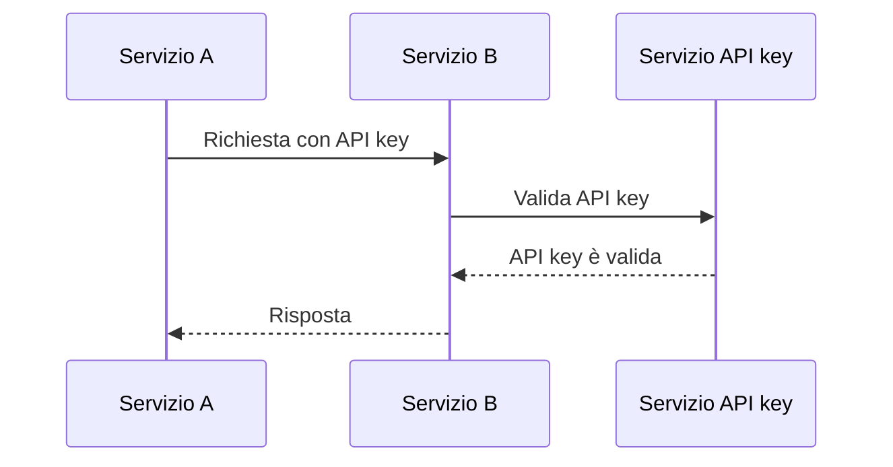
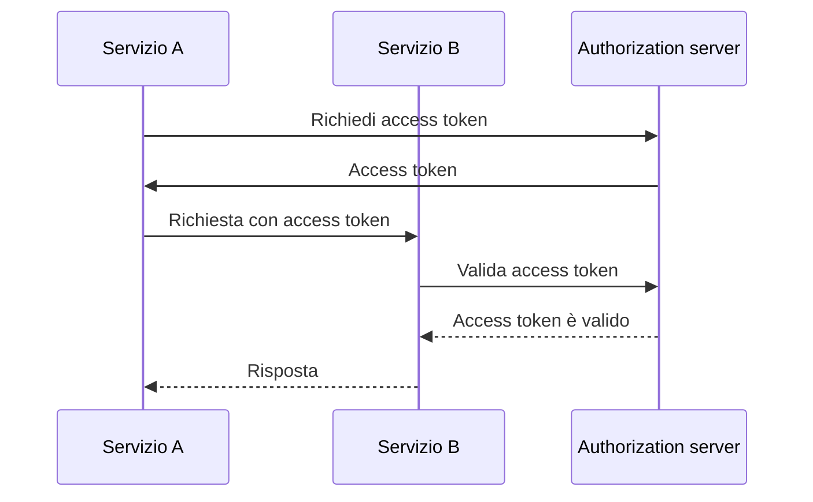
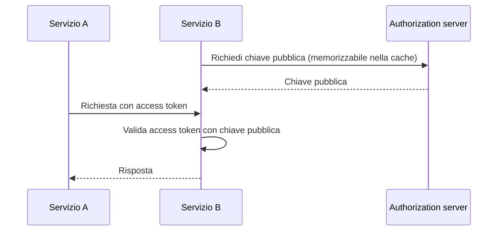

## Che cos'è la comunicazione machine-to-machine?

La comunicazione machine-to-machine (M2M) si riferisce allo scambio automatizzato di dati tra dispositivi senza intervento umano. Nel contesto di autenticazione (authentication) e autorizzazione (authorization), la comunicazione M2M spesso coinvolge un'applicazione client che necessita di accedere a risorse, dove l'applicazione client è una macchina (servizio) o una macchina che agisce per conto di un utente.

## Perché dobbiamo gestire la comunicazione machine-to-machine?

Quando hai solo un servizio senza alcuna dipendenza, probabilmente non ha bisogno di comunicare con altri servizi. Man mano che il tuo sistema cresce, o vuoi integrarti con un sistema di gestione delle identità e degli accessi (IAM), devi gestire la comunicazione machine-to-machine.

Tuttavia, sembra ancora semplice: tutto ciò che devi fare è identificare il servizio e autenticarlo. Ma in realtà, ci sono diverse sfide che devi affrontare:

### 1. Autenticazione (Authentication)

Come autentichi il servizio? Non puoi usare un nome utente e una password, poiché non c'è un umano per inserirli. Devi usare un meccanismo diverso, come API key, certificati client o OAuth client credentials.

### 2. Autorizzazione (Authorization)

Una volta autenticato il servizio, come determini cosa può fare il servizio? Devi definire i permessi e i ruoli per il servizio, simile a come li definisci per gli utenti. L'ultima cosa che vuoi è codificare i permessi nel tuo codice.

### 3. Sicurezza

Come garantisci che la comunicazione tra i servizi sia sicura? Le credenziali verranno aggiornate regolarmente? Come monitori e controlli la comunicazione?

### 4. Scalabilità

Man mano che il numero di servizi cresce, come gestisci l'autenticazione (authentication) e l'autorizzazione (authorization) per ciascun servizio?

## Gli approcci comuni alla comunicazione machine-to-machine

Tenendo a mente le sfide, ci sono diversi approcci comuni nel settore:

### 1. API keys

<Ref slug="api-key">API keys</Ref> sono un modo semplice per autenticare i servizi. Ogni servizio può avere una o più API key, che vengono utilizzate per l'autenticazione (e talvolta l'autorizzazione). Potresti vedere alcuni servizi che ti chiedono di fornire un'API key nell'intestazione della richiesta, come `X-API-Key: your-api-key`.

Un esempio non normativo di come funzionano le API key:

Vantaggi:

- Semplice da implementare e utilizzare.
- Con generazione casuale sicura e abbastanza lunga, le API key sono difficili da indovinare.
- La validazione è dinamica, il che significa che puoi revocare un'API key in qualsiasi momento.

Svantaggi:

- Richiede comunicazione di rete per validare l'API key.
- Non è autonoma, il che significa che è richiesto un servizio per l'introspezione.
- L'altro servizio ha lo stesso livello di accesso del servizio che possiede l'API key (potrebbe essere parzialmente mitigato utilizzando un API gateway).
- È difficile gestire un gran numero di API key tra i servizi.

### 2. OAuth client credentials

OAuth (o OIDC, poiché OpenID Connect si basa su OAuth 2.0) <Ref slug="client-credentials-flow" /> è un modo più avanzato per autenticare i servizi. Si basa sul framework OAuth 2.0, ampiamente utilizzato per l'autenticazione (authentication) e l'autorizzazione (authorization) degli utenti. Con OAuth client credentials, un servizio può ottenere un access token presentando il suo client ID e client secret al authorization server.

Un esempio non normativo di come funzionano le OAuth client credentials:

Di solito, l'access token è un JSON Web Token (JWT), che contiene informazioni sul servizio e i suoi permessi. Quindi l'altro servizio può validare l'access token senza comunicare con il authorization server (purché abbia la chiave pubblica per verificare la firma JWT). Il flusso di lavoro diventa:

Per ulteriori informazioni sui JSON Web Token, vedi <Ref slug="jwt" />.

Vantaggi (con JWT):

- Autonomo, il che significa che l'altro servizio può immediatamente conoscere le informazioni necessarie come i permessi senza ulteriore comunicazione di rete.
- L'access token può essere di breve durata, riducendo il rischio di uso improprio.
- L'altro servizio non ha bisogno di conoscere il client secret, solo la chiave pubblica per verificare la firma JWT.
- L'access token può essere utilizzato per controllare le azioni del servizio (ad esempio, quale servizio ha accesso a quale risorsa).
- È più facile gestire un gran numero di servizi, poiché stabilisce un chiaro confine tra servizi e permessi.

Svantaggi:

- Un po' più complesso da implementare e utilizzare rispetto alle API key.
- Se l'altro servizio esegue solo la validazione offline, potrebbe non sapere se l'access token è stato revocato.

### 3. Mutual TLS

Mutual TLS (mTLS) è un modo per autenticare i servizi utilizzando certificati client. Con mTLS, ogni servizio possiede un certificato client con una chiave privata, e l'altro servizio verifica il certificato utilizzando la chiave pubblica. Tuttavia, mTLS si concentra sul livello TLS, il che significa che da solo di solito non si adatta all'autenticazione (authentication) e autorizzazione (authorization) a livello applicativo.

Per casi d'uso avanzati, mTLS può essere combinato con access token vincolati a certificato per proteggere ulteriormente la comunicazione. Vedi [RFC 8705: OAuth 2.0 Mutual-TLS Client Authentication and Certificate-Bound Access Tokens](https://datatracker.ietf.org/doc/html/rfc8705) per ulteriori informazioni.

Vantaggi:

- Autenticazione forte, poiché si basa sulla crittografia a chiave pubblica.
- La comunicazione è crittografata e sicura per impostazione predefinita.
- Il certificato client può essere utilizzato per identificare il servizio, simile a come funziona un JWT.

Svantaggi:

- Più complesso da implementare e gestire rispetto alle API key e OAuth client credentials.
- Il certificato client deve essere aggiornato regolarmente.
- È richiesta una maggiore conoscenza tecnica per gestire correttamente i certificati client.
- L'altro servizio potrebbe non supportare mTLS, il che significa che devi avere un meccanismo di fallback.

<SeeAlso slugs={["api-key", "client-credentials-flow", "jwt"]} />