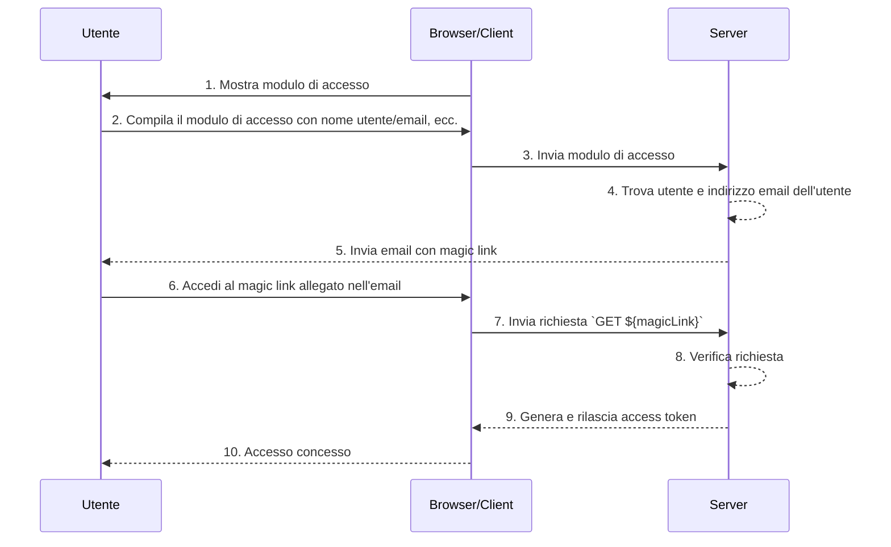

## Cosa sono i magic link?

Un magic link è un link monouso inviato all'utente durante il processo di autenticazione (authentication).

Accedendo a questo link, l'utente completa il flusso di autorizzazione (authorization code flow) necessario per accedere alla risorsa desiderata e ottiene l'accesso appropriato alle risorse. Successivamente, il magic link diventa invalido.

## Qual è la differenza tra magic link e password monouso (OTP)?

Supponiamo che l'utente utilizzi l'email per ricevere un magic link o un <Ref slug='otp' />.

In molti casi, gli utenti utilizzano l'email per ricevere un OTP per verificare il login o come fattore di verifica aggiuntivo per <Ref slug='mfa' />. Qual è la differenza tra l'utilizzo di un magic link via email e un OTP via email?

Con l'OTP, l'utente deve controllare la propria email, ricordare l'OTP e poi inserirlo nel processo di login/verifica. Questo richiede all'utente di passare ripetutamente e manualmente tra diverse app o pagine.

Utilizzando un magic link via email, l'utente deve solo aprire l'email contenente il magic link nella propria app di posta elettronica e cliccare sul link. Questo offre un'esperienza utente più semplice.

Inoltre, l'utilizzo di un magic link consente di includere informazioni oltre a un token monouso nel link, come informazioni relative alla sessione per il login. Questo può migliorare sia la sicurezza che l'esperienza utente.

## Come funziona il magic link?

In questo diagramma di sequenza, illustriamo come un utente accede e ottiene l'accesso alle risorse appropriate utilizzando un magic link.

In questo diagramma di sequenza, assumiamo che il magic link venga inviato via email. Tuttavia, ci sono altri metodi possibili per inviare un magic link, come inviarlo tramite messaggio di testo a un telefono cellulare. Queste alternative non saranno trattate qui poiché i flussi sono quasi gli stessi.

1. **Mostra modulo di accesso**
Il browser/client avvia il processo di autenticazione (authentication) mostrando all'utente un modulo di accesso.
2. **L'utente compila il modulo di accesso**
L'utente inserisce il proprio identificativo, come nome utente, indirizzo email o numero di telefono, nel modulo di accesso.
Le informazioni fornite devono essere sufficienti per aiutare il sistema a identificare un utente unico. Ad esempio, nella maggior parte dei sistemi, i nomi utente utilizzati per accedere sono unici. In tali sistemi, gli utenti devono solo fornire il proprio nome utente per aiutare il sistema a identificare in modo univoco l'account a cui vogliono accedere.
3. **Invia modulo di accesso**
Il browser/client invia il modulo al server, contenente le informazioni dell'utente descritte nel passaggio 2.
4. **Trova utente e email**
Il server elabora la richiesta individuando l'utente unico nel database e recuperando l'indirizzo email associato all'utente.
5. **Invia email con magic link**
Il server invia un'email all'indirizzo email dell'utente. Questa email contiene un magic link per l'autenticazione (authentication).
6. **L'utente accede al magic link**
L'utente riceve l'email e clicca sul magic link fornito al suo interno.
7. **Invia richiesta GET con magic link**
Il browser/client invia una richiesta `GET` al server, utilizzando l'URL del magic link.
8. **Verifica richiesta**
Il server verifica la richiesta per assicurarsi che il magic link sia valido, non utilizzato e non scaduto.
9. **Genera e rilascia access token**
Una volta verificata la richiesta, il server genera un access token e lo rilascia al browser/client.
10. **Concedi accesso**
Il browser/client riceve l'access token e consente all'utente di accedere alla risorsa richiesta.

## Qual è il vantaggio dei magic link?

I magic link migliorano l'architettura di sicurezza dei sistemi di autenticazione (authentication) impiegando un modello di interazione basato su token. Ogni link è unicamente criptato e include tipicamente un timestamp di scadenza. Data la loro natura effimera, anche se un magic link viene intercettato o trapelato, la sua breve finestra di validità limita l'opportunità di sfruttamento malevolo.

Inoltre, poiché l'utilizzo dei magic link richiede un metodo di ricezione controllato dall'utente, come un indirizzo email o un numero di telefono fidato, fornisce un metodo di verifica aggiuntivo oltre al nome utente e alla password, offrendo una sicurezza extra per l'account. E poiché i magic link eliminano la necessità di inserire credenziali, la sicurezza dell'account degli utenti è meglio protetta e il processo è più conveniente.