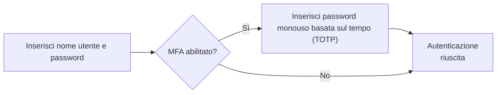

## Che cos'è l'autenticazione multi-fattore (MFA)?

L'autenticazione multi-fattore (MFA) migliora la sicurezza richiedendo agli utenti di fornire più forme di identificazione per verificare la loro identità. Aggiunge un ulteriore livello di sicurezza al processo di <Ref slug="authentication" />, rendendo più difficile per gli attaccanti ottenere accessi non autorizzati.

Ecco un esempio di MFA:

### La definizione di "fattore"

Nell'esempio sopra, ci sono due fattori:

1. Nome utente e password
2. <Ref slug="totp" /> da un'app mobile

Ogni fattore rappresenta una diversa categoria di credenziali che possono essere utilizzate per autenticare un utente (dimostrare chi sei). In pratica, i fattori possono essere categorizzati in tre tipi principali:

|            | Cosa significa     | Fattori di verifica                                                                   |
| ---------- | ------------------ | ------------------------------------------------------------------------------------- |
| Conoscenza | Qualcosa che sai   | Password, Codice di verifica email, Codice di backup                                  |
| Possesso   | Qualcosa che hai   | Codice di verifica SMS, OTP dell'app Authenticator, OTP hardware (chiave di sicurezza), Smart card |
| Inerenza   | Qualcosa che sei   | Biometria come impronte digitali, riconoscimento facciale                             |

Una configurazione comune di MFA prevede la combinazione di due fattori di categorie diverse, come una password (conoscenza) e un <Ref slug="totp" /> da un'app authenticator (possesso).

### Perché è importante la MFA?

> Non esiste una sicurezza perfetta, solo livelli variabili di insicurezza. —Salman Rushdie

L'importanza della MFA è evidente nei numeri: la MFA riduce il rischio di compromissione del 99,22% sull'intera popolazione e del 98,56% nei casi di credenziali trapelate[^1]. Con l'aiuto della MFA, è possibile intraprendere azioni più critiche con fiducia, come accedere a dati sensibili ed eseguire transazioni finanziarie. È un modo semplice ma efficace per offrire un livello di sicurezza molto più elevato rispetto alla sola password o all'autenticazione a fattore singolo.

## MFA nelle applicazioni moderne

Come suggerisce il nome, la MFA può coinvolgere più di due fattori. Man mano che aumenta il numero di fattori, aumenta anche il livello di sicurezza e la complessità del processo di autenticazione, che potrebbe essere meno user-friendly. Mentre il <Ref slug="totp" /> è una scelta popolare negli ultimi anni, nuove tecnologie come il <Ref slug="passkey" /> stanno emergendo per fornire un'esperienza MFA ancora più sicura e user-friendly.

Ad esempio, le applicazioni moderne possono utilizzare l'API <Ref slug="webauthn" /> per implementare la MFA con passkey, che sono credenziali resistenti al phishing protette dalla crittografia a chiave pubblica. Aziende come Apple hanno integrato le passkey con l'autenticazione biometrica (Touch ID, Face ID) per aggiungere nativamente il fattore di inerenza al processo MFA, aumentando la sicurezza e la comodità per l'utente.

Facciamo un rapido confronto per una migliore comprensione. Supponiamo di avere un utente che ha:

1. Un'app authenticator installata sul telefono per generare codici TOTP.
2. Una passkey integrata con l'autenticazione biometrica del dispositivo.

Quando accedono a un sito web con MFA abilitata sul loro laptop, i due processi sarebbero simili a questi:

```mermaid
graph TD
  subgraph TOTP
    A[Inserisci nome utente e password]
    A -->|MFA abilitato| B[Richiesta di codice TOTP]
    B --> C[Apri l'app authenticator]
    C --> D[Trova il TOTP per il sito web]
    D --> E[Inserisci il codice TOTP]
    E --> F[Autenticazione<br/>riuscita]
  end

  subgraph WebAuthn
    G[Inserisci nome utente e password]
    G -->|MFA abilitato| H[Richiesta di autenticazione biometrica]
    H --> I["Autenticati con biometria (es. Touch ID)"]
    I --> J[Autenticazione<br/>riuscita]
  end
```

È chiaro che il processo WebAuthn richiede meno passaggi e molto meno tempo per gli utenti. Inoltre, aziende come Apple supportano la sincronizzazione delle passkey tra dispositivi (es. iPhone, iPad, Mac) per rendere il processo MFA più fluido mantenendo un alto livello di sicurezza.

## Considerazioni sulla sicurezza

Quando si implementa la MFA, alcune considerazioni sulla sicurezza dovrebbero essere prese in considerazione:

- Usa una combinazione di fattori di categorie diverse per garantire un livello di sicurezza più elevato. Ad esempio, combinando una password (conoscenza) con un codice TOTP (possesso).
- Evita di usare SMS come fattore MFA a causa della sua suscettibilità agli attacchi di SIM swapping.
- Le opzioni di recupero non dovrebbero bypassare la MFA. Ad esempio, se un utente perde la sua app authenticator, dovrebbe essere richiesto di utilizzare un codice di backup o un altro fattore MFA per riottenere l'accesso.
- Imporre periodi di cooldown tra i tentativi di MFA falliti per prevenire attacchi di forza bruta.

[^1]: [Quanto è efficace l'autenticazione multifattore nel dissuadere gli attacchi informatici?](https://query.prod.cms.rt.microsoft.com/cms/api/am/binary/RW166lD)

<SeeAlso slugs={["totp", "webauthn", "passkey"]} />

<Resources
  urls={[
    "https://blog.logto.io/elaborate-mfa",
    "https://blog.logto.io/web-authn-and-passkey-101",
    "https://blog.logto.io/webauthn-base-knowledge",
  ]}
/>