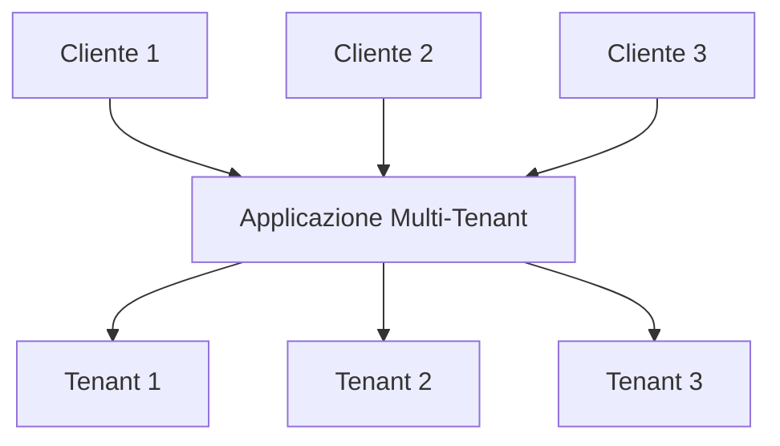
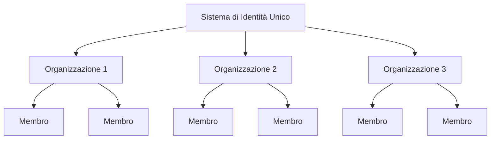

## Che cos'è il multi-tenancy?

Il software multi-tenancy è un software in cui un'unica istanza di software viene eseguita su un server e serve più tenant. I sistemi progettati in questo modo sono "condivisi" (piuttosto che "dedicati" o "isolati").

Un tenant è un gruppo di utenti che condividono un accesso comune con privilegi specifici all'istanza del software.

Ad esempio, i sistemi CRM (Customer Relationship Management) spesso utilizzano un'architettura multi-tenant per fornire lo stesso servizio a tutti i clienti.

Un principio chiave del multi-tenancy è la "condivisione". Questo non significa che **ogni** parte della soluzione sia condivisa; significa che almeno **alcuni** componenti sono riutilizzati tra più tenant. Comprendere questo concetto più ampio può aiutarti a soddisfare meglio le esigenze dei tuoi clienti.

## Quali sono i casi d'uso per i prodotti multi-tenant?

Le app multi-tenant sono comunemente utilizzate nei prodotti software-as-a-service (SaaS) come strumenti di produttività, software di collaborazione, ecc. In questo contesto, ogni "tenant" di solito rappresenta un cliente aziendale, con più utenti (tipicamente dipendenti). In diversi prodotti, può essere indicato come tenant, workspace o progetto, a seconda del contesto. Una singola azienda potrebbe anche avere più tenant per rappresentare diverse divisioni o organizzazioni.

In casi più complessi, come le applicazioni B2B oltre il SaaS, le app multi-tenant forniscono una piattaforma condivisa per vari team, clienti aziendali e aziende partner per accedere ai tuoi servizi.

## Perché dovresti impiegare il multi-tenancy in un prodotto SaaS

### Scalare con il multi-tenancy

Per le aziende enterprise, il multi-tenancy è la chiave per soddisfare efficacemente i loro requisiti di disponibilità, gestione delle risorse, gestione dei costi e sicurezza dei dati. A livello tecnico, adottare un approccio multi-tenant semplifica i tuoi processi di sviluppo, minimizza le sfide tecniche e promuove un'espansione senza soluzione di continuità.

### Creare un'esperienza unificata

Esaminando le radici dei prodotti SaaS, è simile a un edificio che ospita vari appartamenti. Tutti i tenant condividono servizi comuni come acqua, elettricità e gas, ma mantengono un controllo indipendente sulla gestione del proprio spazio e delle proprie risorse. Questo approccio semplifica la gestione della proprietà.

### Garantire la sicurezza attraverso l'isolamento dei tenant

In un'architettura multi-tenancy, il termine "tenant" viene introdotto per creare confini che separano e proteggono le risorse e i dati di diversi tenant all'interno di un'istanza condivisa. Questo assicura che i dati e le operazioni di ciascun tenant rimangano distinti e sicuri, anche se utilizzano le stesse risorse sottostanti.

## Come ottenere l'isolamento dei tenant in un'architettura multi-tenancy?

Quando si discute di applicazioni multi-tenant, è sempre necessario ottenere l'**isolamento dei tenant**. Questo significa mantenere i dati e le risorse di diversi tenant separati e sicuri all'interno di un sistema condiviso (ad esempio, un'infrastruttura cloud o un'applicazione multi-tenant). Questo previene qualsiasi tentativo non autorizzato di accedere alle risorse di un altro tenant.

### L'isolamento dei tenant si allinea con il concetto di "condivisione" del multi-tenancy

Questo perché l'isolamento dei tenant non è necessariamente una costruzione a livello di risorsa infrastrutturale. Nel regno del multi-tenancy e dell'isolamento, alcuni vedono l'isolamento come una divisione rigorosa tra risorse infrastrutturali effettive. Questo di solito porta a un modello in cui ogni tenant ha database separati, istanze di calcolo, account o cloud privati. In scenari di risorse condivise, come le app multi-tenant, il modo per ottenere l'isolamento può essere una costruzione logica.

### L'autenticazione e l'autorizzazione non sono uguali a "isolamento"

Utilizzare l'autenticazione e l'autorizzazione per controllare l'accesso al tuo ambiente SaaS è importante, ma non garantisce "isolamento". L'isolamento significa mantenere utenti o set di dati diversi separati in modo che i dati o le azioni di un utente non possano interferire o essere accessibili da un altro.

Ad esempio, anche se hai impostato l'autenticazione e l'autorizzazione, dove gli utenti accedono e ricevono un token che definisce i loro permessi, questo migliora la sicurezza ma non garantisce che gli utenti siano completamente isolati l'uno dall'altro. Un altro contesto dovrebbe essere introdotto per ottenere "isolamento".

### Usa "organizzazione" come contesto per rappresentare il tenant del prodotto SaaS, per ottenere l'isolamento dei tenant

L'autenticazione e l'autorizzazione da sole non impediranno a un utente con il ruolo giusto di accedere alle risorse di un altro tenant. Per limitare l'accesso, dobbiamo aggiungere un contesto "tenant", come un ID tenant, un ID organizzazione o un ID workspace. Questi identificatori agiscono come muri, porte e serrature, mantenendo i tenant separati.

Il termine "organizzazione" è comunemente usato per l'isolamento dei tenant. Molti <Ref slug="identity-provider" /> includono una funzione "organizzazione" per aiutare a isolare i tenant mantenendo un sistema di identità unificato. L'utente all'interno dell'organizzazione è chiamato "membro".

## Come vengono gestite le identità nelle app multi-tenant?

La prima domanda chiave è pensare se parti della tua azienda o prodotto richiedono sistemi di identità separati. Questo guiderà il design del tuo sistema. Ecco due esempi:

1. Un sistema di identità: Una singola persona può avere due identità all'interno dello stesso sistema di identità. Ad esempio, Sarah potrebbe avere un'email personale registrata e utilizzare anche un'email aziendale collegata tramite <Ref slug="enterprise-sso" />.
2. Sistemi di identità multipli: Gli utenti possono anche avere due identità distinte in sistemi di identità separati per prodotti completamente non correlati.

Nella maggior parte delle app multi-tenant, le identità sono generalmente gestite in un unico pool, mentre le risorse di ciascun tenant sono mantenute separate.

## Considerazioni per pianificare e costruire app multi-tenant

1. Concentrati sul tuo modello: B2B o B2C.
2. Chi gestirà i compiti di gestione delle identità: sviluppatori, amministratori del tuo cliente o clienti finali?
3. Per B2B, i tuoi clienti devono gestire le identità della loro organizzazione?
4. Identifica quali permessi (<Ref slug="scope" />) e <Ref slug="role" /> devono essere definiti per l'organizzazione e quali no.
5. Il tuo cliente richiede <Ref slug="enterprise-sso" />?
6. Considera l'aggiunta di funzionalità di collaborazione, come gli inviti.

<Resources
  urls={[
    "https://blog.logto.io/implement-multi-tenancy",
    "https://blog.logto.io/multi-tenant-ultimate-guide",
    "https://blog.logto.io/case-study-multi-tenancy",
    "https://blog.logto.io/multi-tenancy-explained",
    "https://blog.logto.io/are-multi-tenant-apps-equal-saas",
    "https://blog.logto.io/tenancy-models",
    "https://blog.logto.io/do-you-need-multiple-tenants-identity-model",
  ]}
/>