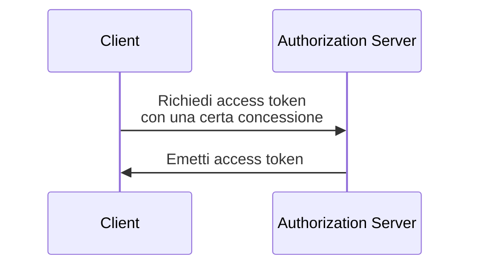

## Che cos'è una concessione OAuth 2.0 (OAuth 2.0 grant)?

Una concessione OAuth 2.0 (OAuth 2.0 grant) è un processo di autorizzazione che consente a un <Ref slug="client" /> di richiedere un <Ref slug="access-token" /> da un <Ref slug="authorization-server" />. Potresti anche sentire altri termini relativi a questo concetto, quindi chiarifichiamoli prima di approfondire:

- **Concessione OAuth 2.0 (OAuth 2.0 grant)**: Conosciuta anche come "tipo di concessione OAuth 2.0", "flusso OAuth 2.0" o "concessione di autorizzazione OAuth 2.0". Nella maggior parte dei contesti, questi termini si riferiscono allo stesso concetto.
- <Ref slug="authorization-server" />: Il server che emette access token al client. In OpenID Connect (OIDC), l'authorization server è lo stesso del <Ref slug="openid-connect" headingId="openid-provider-op" />.
- <Ref slug="authorization-request" />: La richiesta effettuata dal client all'authorization server per ottenere un access token. In OpenID Connect (OIDC), è anche indicata come <Ref slug="authentication-request" />.

Per chiarezza, utilizzeremo i termini iniziali elencati sopra in modo coerente in tutto questo articolo.

Il processo ad alto livello di una concessione OAuth 2.0 (OAuth 2.0 grant) è piuttosto semplice:

Dopo che il client riceve l'access token, può usarlo per accedere a risorse protette (ad esempio, API) per conto di un utente o di se stesso.

Nota che, a seconda della concessione specifica, il client e l'authorization server possono scambiarsi ulteriori informazioni e coinvolgere più passaggi nel processo. Ad esempio, la <Ref slug="authorization-code-flow">concessione del codice di autorizzazione</Ref> coinvolge l'autenticazione e l'autorizzazione dell'utente, la generazione del codice e lo scambio di token.

## Diverse concessioni OAuth 2.0 (OAuth 2.0 grants)

La specifica di base di OAuth 2.0 definisce quattro concessioni che i client possono utilizzare per ottenere access token:

1. <Ref slug="authorization-code-flow">Concessione del codice di autorizzazione</Ref>: La concessione più sicura e raccomandata per la maggior parte delle applicazioni. È obbligatorio utilizzare <Ref slug="pkce" /> per tutti i client in <Ref slug="oauth-2.1" />.
2. <Ref slug="implicit-flow">Concessione implicita</Ref>: Una concessione semplificata che è deprecata in OAuth 2.1 a causa di problemi di sicurezza.
3. [Concessione delle credenziali della password del proprietario della risorsa (ROPC)](https://datatracker.ietf.org/doc/html/rfc6749#section-4.3): Una concessione in cui le credenziali dell'utente vengono scambiate direttamente per un access token. Non è raccomandata per la maggior parte delle applicazioni a causa dei rischi per la sicurezza.
4. <Ref slug="client-credentials-flow">Concessione delle credenziali del client</Ref>: Una concessione utilizzata da <Ref slug="client" headingId="confidential-clients" /> per ottenere un access token senza il coinvolgimento dell'utente.

Man mano che l'industria evolve, le concessioni implicite e ROPC vengono [deprecate](https://blog.logto.io/oauth-2-1) a favore di flussi più sicuri e standardizzati. Per le nuove applicazioni, le scelte sono semplici:

- Per l'autenticazione e l'autorizzazione dell'utente, utilizzare la concessione del codice di autorizzazione con PKCE.
- Per la comunicazione <Ref slug="machine-to-machine" />, utilizzare la concessione delle credenziali del client.

### Altre concessioni OAuth 2.0 (OAuth 2.0 grants)

Oltre alle quattro concessioni di base, ci sono altre estensioni che definiscono nuove concessioni per casi d'uso specifici. Ad esempio:

- La <Ref slug="device-flow">concessione di autorizzazione del dispositivo</Ref> è una concessione progettata per dispositivi con capacità di input limitate, come smart TV e dispositivi IoT.
- Il <Ref slug="hybrid-flow">flusso ibrido</Ref> è una concessione OpenID Connect che combina la concessione del codice di autorizzazione con la concessione implicita.

## Concessioni in OpenID Connect (OIDC)

In <Ref slug="openid-connect" />, il concetto di concessioni è esteso per includere <Ref slug="id-token">ID token</Ref> che rappresentano informazioni sull'identità dell'utente oltre agli access token. OIDC estende due concessioni OAuth 2.0 (codice di autorizzazione e implicita) per includere ID token e introduce una nuova concessione chiamata <Ref slug="hybrid-flow">flusso ibrido</Ref> che combina entrambi.

> Come OAuth 2.0, è consigliato utilizzare solo la concessione del codice di autorizzazione con PKCE in OIDC per l'autenticazione e l'autorizzazione dell'utente.

Nel frattempo, poiché OIDC è costruito sopra OAuth 2.0, altre concessioni come la concessione delle credenziali del client possono ancora essere utilizzate sullo stesso authorization server, purché il server le supporti.

<SeeAlso slugs={["pkce", "oauth-2.1", "authorization-code-flow", "implicit-flow", "client-credentials-flow", "device-flow"]} />

<Resources
  urls={[
    "https://blog.logto.io/implicit-flow-is-dead",
    "https://datatracker.ietf.org/doc/html/rfc6749",
    "https://openid.net/specs/openid-connect-core-1_0.html"
  ]}
/>
