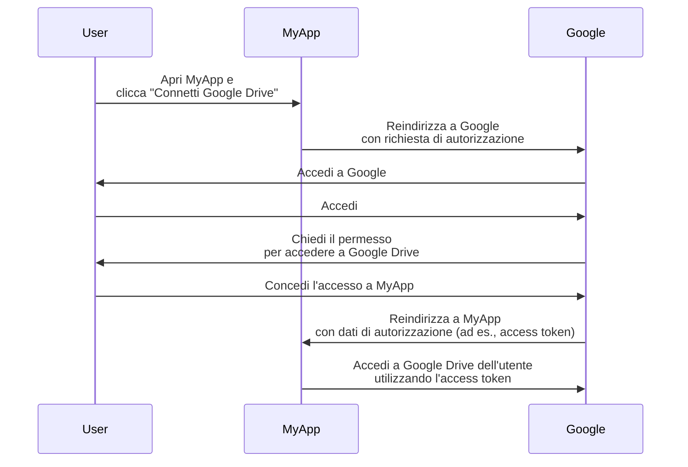
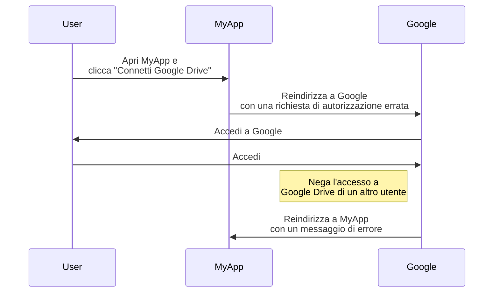
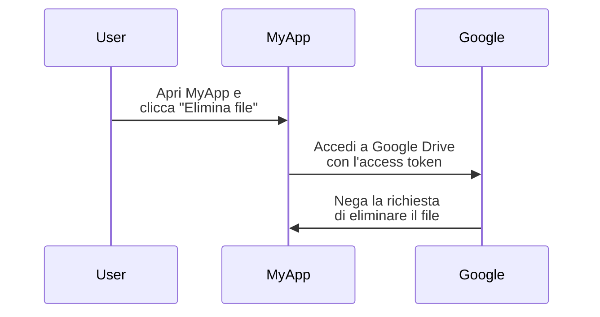

## Cos'è OAuth 2.0?

OAuth 2.0 è lo standard de facto per l'autorizzazione ed è ampiamente utilizzato sul web. Consente a un'applicazione di ottenere in modo sicuro un accesso limitato a risorse protette su un'altra applicazione, come il profilo o i dati di un utente, senza esporre credenziali come le password.

Vediamo un esempio reale per capire meglio. Hai un'applicazione web MyApp che vuole accedere a Google Drive dell'utente. Invece di chiedere all'utente di condividere le proprie credenziali di Google Drive, MyApp può utilizzare OAuth 2.0 per richiedere l'accesso a Google Drive per conto dell'utente. Ecco un flusso semplificato:

In questo flusso, MyApp non vede mai le credenziali di Google Drive dell'utente. Invece, riceve un <Ref slug="access-token" /> da Google che gli consente di accedere a Google Drive per conto dell'utente.

### Componenti chiave di OAuth 2.0

Per l'esempio sopra, MyApp è il <Ref slug="client" />, Google è sia il <Ref slug="authorization-server" /> che il <Ref slug="resource-server" />, e l'utente è il <Ref slug="resource-owner" />. Il flusso coinvolge tutti i componenti chiave di OAuth 2.0:

- **Client**: L'applicazione che vuole accedere alle risorse protette. "Client" e "applicazione" sono spesso usati in modo intercambiabile.
- **Resource owner**: L'utente che possiede le risorse protette. Il resource owner può concedere (autorizzare) o negare l'accesso al client.
- **Authorization server**: Il server che esegue l'autorizzazione (di solito con autenticazione) e rilascia access token al client.
- **Resource server**: Il server che ospita le risorse protette. Verifica l'access token e serve le risorse protette al client.

## OAuth 2.0 grants (flussi)

<Ref slug="oauth-2.0-grant">Grant</Ref> costituisce la base di OAuth 2.0 e definisce come il client può ottenere un access token dal authorization server. La specifica base di OAuth 2.0 definisce quattro grants:

- <Ref slug="authorization-code-flow">Authorization code grant</Ref>
- <Ref slug="implicit-flow">Implicit grant</Ref>
- [Resource owner password credentials (ROPC) grant](https://datatracker.ietf.org/doc/html/rfc6749#section-4.3)
- <Ref slug="client-credentials-flow">Client credentials grant</Ref>

Senza entrare nei dettagli di ciascun grant, possiamo aspettarci che questi grants rientrino in due categorie:

- **Authorization grants**: Utilizzati quando il client deve accedere alle risorse per conto di un utente, cioè è richiesta l'autorizzazione dell'utente.
- **Client credentials grant**: Utilizzati quando il client deve accedere alle risorse per conto proprio. Questo grant è adatto per la comunicazione <Ref slug="machine-to-machine" />.

### Authorization grants

Indipendentemente dal tipo di grant, gli authorization grants hanno i seguenti passaggi comuni:

1. Il client avvia una <Ref slug="authorization-request" /> al authorization server.
2. Il authorization server autentica l'utente (resource owner) e chiede il permesso di accedere alle risorse.
3. L'utente concede il permesso al client.
4. Il authorization server rilascia un access token al client.
5. Il client utilizza l'access token per accedere alle risorse protette sul <Ref slug="resource-server" />.

Si noti che i passaggi e i parametri esatti possono variare a seconda del tipo di grant. Ad esempio, il <Ref slug="authorization-code-flow">authorization code grant</Ref> coinvolge più passaggi come la generazione e lo scambio di codici.

### Client credentials grant

Il <Ref slug="client-credentials-flow">client credentials grant</Ref> è molto più semplice e non coinvolge l'autorizzazione dell'utente. Ecco un flusso semplificato:

1. Il client invia una <Ref slug="token-request" /> al authorization server.
2. Il authorization server autentica il client e rilascia un access token.
3. Il client utilizza l'access token per accedere alle risorse protette sul <Ref slug="resource-server" />.

---

Per discussioni approfondite sui grants di OAuth 2.0, vedere <Ref slug="oauth-2.0-grant" /> e gli articoli specifici sui grants.

## Access control con OAuth 2.0

OAuth 2.0 definisce il parametro <Ref slug="scope" /> per specificare le autorizzazioni che il client sta richiedendo. Il authorization server può ignorare completamente o parzialmente gli scope richiesti e concedere l'accesso in base alle proprie politiche di access control.

Tuttavia, OAuth 2.0 lascia al authorization server la propria discrezione su come applicare il <Ref slug="access-control" />. Ciò significa che il authorization server può decidere a quali risorse il soggetto (utente o client) può accedere e quali azioni può eseguire su tali risorse.

Utilizziamo ancora l'esempio di Google Drive. MyApp può avviare una richiesta di autorizzazione per accedere per errore a Google Drive di un altro utente. In questo caso, il authorization server di Google dovrebbe negare la richiesta perché l'utente non ha le autorizzazioni necessarie per accedere a Google Drive di un altro utente.

Un altro caso è quando MyApp riceve un access token da Google che gli consente di leggere i file da Google Drive dell'utente. Tuttavia, MyApp tenta di eliminare un file invece di leggerlo. Il resource server (Google) dovrebbe negare la richiesta.

Entrambi i casi dimostrano perché è necessario il <Ref slug="access-control" /> quando si implementa OAuth 2.0. Il <Ref slug="authorization-server" /> e il <Ref slug="resource-server" /> dovrebbero lavorare insieme per applicare le politiche di access control e proteggere le risorse.

### Modelli di access control

Per gestire correttamente l'access control, si consiglia di utilizzare i modelli standard di access control come <Ref slug="rbac" /> e <Ref slug="abac" />. Questi modelli si sono dimostrati efficaci nel settore e forniscono la scalabilità per i requisiti futuri.

## OAuth 2.1

<Ref slug="oauth-2.1" /> è un aggiornamento proposto alla specifica OAuth 2.0 che mira a migliorare la sicurezza e l'usabilità secondo l'esperienza del settore nel corso degli anni. Sebbene OAuth 2.1 non sia ancora finalizzato, possiamo comunque apprendere le modifiche proposte e capire come potrebbero influenzare le attuali implementazioni di OAuth 2.0. OAuth 2.1 può essere considerato una formalizzazione delle migliori pratiche e raccomandazioni di sicurezza che sono state ampiamente adottate nel settore.

## OAuth 2.0 e OpenID Connect (OIDC)

OAuth 2.0 definisce solo il processo di autorizzazione e non copre l'autenticazione o l'identità dell'utente. Per questo motivo, è stato introdotto <Ref slug="openid-connect" /> come livello di identità sopra OAuth 2.0. OIDC estende OAuth 2.0 per fornire l'autenticazione dell'utente e le informazioni di identità sotto forma di <Ref slug="id-token" />.

OpenID Connect estende due grants di OAuth 2.0 (authorization code e implicit) per includere ID token e introduce un nuovo grant chiamato <Ref slug="hybrid-flow">hybrid flow</Ref> che combina entrambi.

Ciò significa che tutte le tue conoscenze e pratiche di OAuth 2.0 possono essere applicate direttamente a OIDC; tutte le estensioni di OAuth 2.0 come <Ref slug="pkce" /> e <Ref slug="resource-indicator" /> possono essere utilizzate anche in OIDC.

<SeeAlso slugs={["oauth-2.0-grant", "oauth-2.1", "openid-connect"]} />

<Resources
  urls={[
    "https://blog.logto.io/secure-cloud-apps-with-oauth-and-openid-connect",
    "https://blog.logto.io/oauth-2-1",
    "https://datatracker.ietf.org/doc/html/rfc6749",
    "https://datatracker.ietf.org/doc/draft-ietf-oauth-v2-1/",
  ]}
/>
