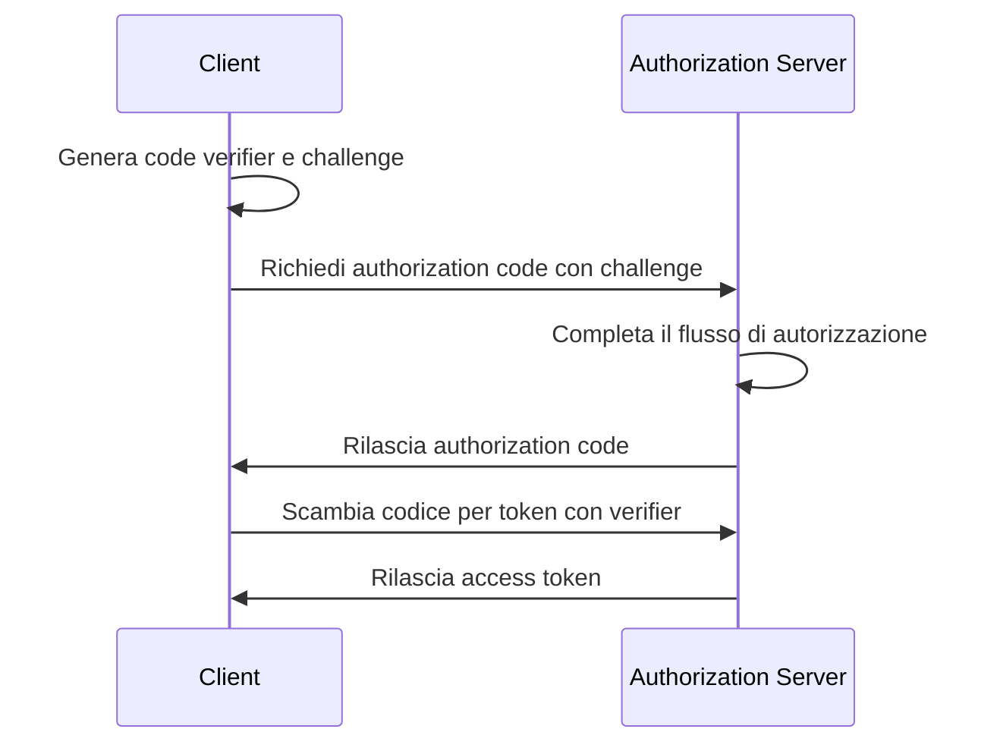

## Che cos'è OAuth 2.1?

OAuth 2.1 è un aggiornamento proposto al framework di autorizzazione <Ref slug="oauth-2.0" />. Comprende una serie di modifiche e raccomandazioni alla specifica esistente di OAuth 2.0 che consolidano le best practice e i miglioramenti della sicurezza che sono stati ampiamente adottati nel settore nel corso degli anni.

Gli aggiornamenti principali di OAuth 2.1 sono:

1. Deprecare il <Ref slug="implicit-flow">implicit grant</Ref> e il [Resource Owner Password Credentials (ROPC) grant](https://datatracker.ietf.org/doc/html/rfc6749#section-4.3) a causa di problemi di sicurezza.
2. Imporre l'uso di <Ref slug="pkce" /> per tutti i client, inclusi i <Ref slug="client" headingId="confidential-clients">client riservati (privati)</Ref>.
3. Corrispondenza esatta degli <Ref slug="redirect-uri">URI di reindirizzamento</Ref>.
4. Definizione chiara dei tipi di <Ref slug="client">client</Ref> (client pubblici e riservati).
5. Requisiti di sicurezza per i <Ref slug="refresh-token">refresh token</Ref>.

## Deprecazione dell'implicit grant

L'implicit grant è stato progettato per applicazioni a pagina singola (SPA) e applicazioni basate su browser che non possono memorizzare in modo sicuro i segreti dei client. Tuttavia, i suoi rischi per la sicurezza hanno portato alla sua deprecazione: il grant restituisce l'access token nel canale frontale (frammento URL), che può essere esposto agli attaccanti tramite la cronologia del browser e gli header referrer.

OAuth 2.1 raccomanda di utilizzare il <Ref slug="authorization-code-flow">authorization code grant</Ref> con <Ref slug="pkce" /> per le applicazioni basate su browser.

## Deprecazione del ROPC grant

Il ROPC grant consente al client di scambiare direttamente le credenziali dell'utente per un access token. È stato progettato per applicazioni legacy che non possono supportare l'authorization code flow. Tuttavia, il grant presenta rischi per la sicurezza:

- Espone le credenziali dell'utente al client.
- Bypassa la schermata di consenso del authorization server.
- Limita la capacità del authorization server di applicare altre misure di sicurezza, come <Ref slug="mfa" />.

OAuth 2.1 raccomanda di utilizzare il <Ref slug="authorization-code-flow">authorization code grant</Ref> con <Ref slug="pkce" /> per l'autenticazione e l'autorizzazione dell'utente.

## Applicazione di PKCE per tutti i client

<Ref slug="pkce" /> è un'estensione di sicurezza per l'authorization code flow che mitiga il rischio di attacchi di intercettazione del authorization code. Coinvolge il client nella generazione di un code verifier e di un code challenge, e il authorization server verifica la challenge durante lo scambio del token.

Ecco un diagramma di sequenza semplificato del authorization code flow con PKCE:

Inizialmente era raccomandato per i <Ref slug="client" headingId="public-clients">client pubblici</Ref> di utilizzare PKCE, ma OAuth 2.1 estende questa raccomandazione a un requisito obbligatorio per tutti i client, inclusi i <Ref slug="client" headingId="confidential-clients">client riservati (privati)</Ref>.

## Corrispondenza esatta degli URI di reindirizzamento

Gli <Ref slug="redirect-uri">URI di reindirizzamento</Ref> sono utilizzati dal client per ricevere risposte di autorizzazione dal authorization server. OAuth 2.1 introduce un nuovo requisito secondo cui l'URI di reindirizzamento utilizzato nella richiesta di autorizzazione deve corrispondere esattamente all'URI di reindirizzamento registrato dal client con il <Ref slug="authorization-server" />, inclusi schema, host e percorso.

In alcune implementazioni di OAuth 2.0, la corrispondenza degli URI di reindirizzamento era permissiva, consentendo corrispondenze parziali o caratteri jolly. Tuttavia, questa flessibilità può introdurre rischi per la sicurezza, come le vulnerabilità di reindirizzamento aperto.

## Definizione chiara dei tipi di client

OAuth 2.0 non definisce esplicitamente i tipi di client. Potresti vedere varie categorizzazioni nel settore, come per livello di accesso (pubblico vs. riservato) o per tipo di applicazione (web app vs. mobile app). Per il framework OAuth, non importa come il client è implementato (poiché si tratta più degli attributi aziendali del client), ma il livello di accesso fa la differenza nei requisiti di sicurezza.

Pertanto, OAuth 2.1 introduce una definizione chiara dei tipi di client:

- <Ref slug="client" headingId="public-clients" />: Client che NON POSSONO mantenere la riservatezza delle proprie credenziali (ad es., SPA, app mobili).
- <Ref slug="client" headingId="confidential-clients" />: Client che POSSONO mantenere la riservatezza delle proprie credenziali (ad es., web app lato server, app desktop native).

## Requisiti di sicurezza per i refresh token

I <Ref slug="refresh-token">refresh token</Ref> sono token a lunga durata utilizzati dal client per ottenere nuovi access token senza interazione dell'utente. Nel frattempo, sono anche obiettivi di alto valore per gli attaccanti. Poiché i client pubblici non possono memorizzare in modo sicuro le credenziali, OAuth 2.1 specifica che il <Ref slug="authorization-server" /> dovrebbe utilizzare uno dei seguenti metodi per proteggere i refresh token:

- Rilasciare <Ref slug="refresh-token" headingId="sender-constrained-refresh-tokens">refresh token vincolati al mittente</Ref>.
- Utilizzare la <Ref slug="refresh-token" headingId="refresh-token-rotation">rotazione dei refresh token</Ref> per limitare l'usabilità e la durata dei refresh token.

## OAuth 2.1 e OpenID Connect (OIDC)

Poiché <Ref slug="openid-connect" /> è costruito sopra OAuth 2.0, le modifiche introdotte in OAuth 2.1 si applicano anche a OIDC. Ad esempio, tutti i client OIDC dovrebbero utilizzare l'authorization code flow con PKCE per l'autenticazione e l'autorizzazione dell'utente.

<SeeAlso slugs={["oauth-2.0", "authorization-code-flow", "pkce", "implicit-flow", "openid-connect"]} />

<Resources
  urls={[
    "https://datatracker.ietf.org/doc/draft-ietf-oauth-v2-1/",
    "https://blog.logto.io/oauth-2-1",
  ]}
/>
