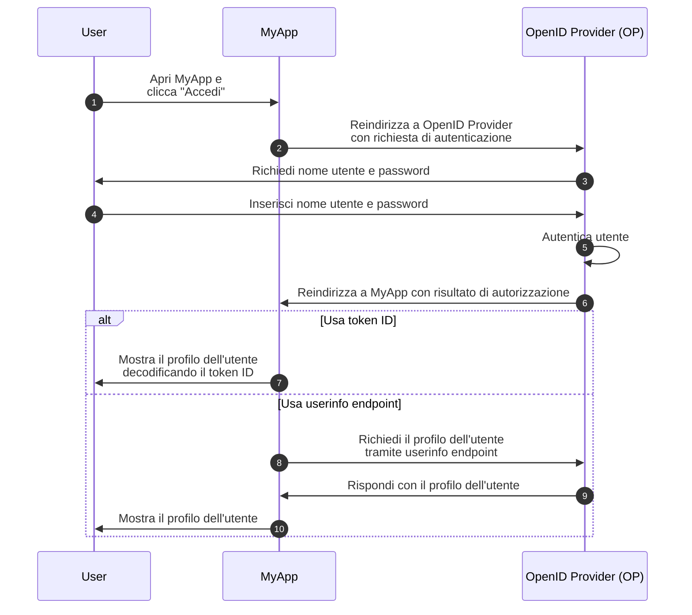
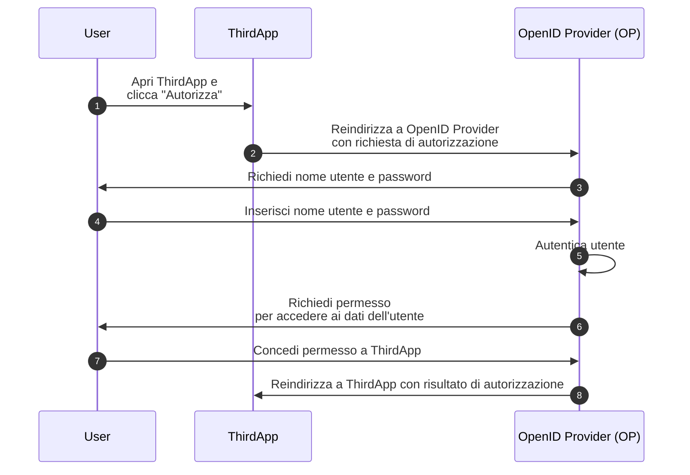

## Che cos'è OpenID Connect (OIDC)?

OpenID Connect (OIDC) aggiunge le capacità di autenticazione a <Ref slug="oauth-2.0" />, un framework di autorizzazione, introducendo un livello di identità sopra di esso. OIDC consente ai client di autenticare gli utenti e ottenere informazioni sull'identità sotto forma di <Ref slug="id-token">token ID</Ref> e risposte <Ref slug="userinfo-endpoint" />.

Diamo un'occhiata a un esempio. Supponiamo che tu abbia un'applicazione web chiamata MyApp e che gli utenti possano accedere utilizzando nome utente e password; dopo aver effettuato l'accesso, possono accedere alle loro informazioni di profilo. Ecco un flusso semplificato:



Alcuni termini potrebbero essere nuovi per te, quindi chiarifichiamoli:

### OpenID Provider (OP)

Un OpenID Provider (OP) è un <Ref slug="identity-provider" /> che implementa la specifica OIDC e OAuth 2.0. Vale a dire, un OP è anche un <Ref slug="authorization-server" /> OAuth 2.0.

Gli OP sono responsabili dell'autenticazione degli utenti e dell'emissione di token ID e access token ai client.

### Token

- I <Ref slug="id-token">token ID</Ref> sono <Ref slug="jwt">JSON Web Token</Ref> utilizzati per rappresentare le informazioni sull'identità dell'utente, come nome, email e immagine del profilo.
- Gli <Ref slug="access-token">access token</Ref> sono utilizzati per accedere a risorse protette per conto dell'utente (come in OAuth 2.0), ad esempio, l'userinfo endpoint.

### Richiesta e risultato di autenticazione

- La <Ref slug="authentication-request" /> è una richiesta effettuata dal client all'OP per autenticare l'utente. Include parametri per specificare determinati requisiti e influenzerà il processo di autenticazione.
- A seconda della richiesta di autenticazione, il risultato dell'autenticazione può variare. Per ora, basta sapere che il risultato trasporta le informazioni necessarie per il client per identificare l'utente.

### Userinfo endpoint

<Ref slug="userinfo-endpoint" /> è un endpoint specifico di OIDC che consente ai client di recuperare informazioni sul profilo utente. È un'alternativa all'uso dei token ID poiché l'userinfo endpoint fornisce tipicamente informazioni utente più dettagliate rispetto al token ID.

OIDC lascia all'OpenID Provider (OP) la decisione su quali informazioni includere nel token ID e nella risposta userinfo. Quindi, prima di analizzare il token ID o chiamare l'userinfo endpoint, dovresti controllare la documentazione dell'OP per capire quali informazioni sono disponibili.

## Differenze terminologiche tra OAuth 2.0 e OIDC

Poiché OIDC è costruito sopra OAuth 2.0, molti termini sono condivisi tra le due specifiche. Tuttavia, mentre OAuth 2.0 si concentra sull'autorizzazione, OIDC introduce autenticazione e identità, rendendo alcuni termini inadatti nel contesto di OIDC. Ecco alcune differenze notevoli:

| OAuth 2.0             | OpenID Connect (OIDC)  |
|-----------------------|------------------------|
| Authorization server  | OpenID Provider (OP)   |
| Authorization request | Authentication request |
| Grant                 | Flow                   |

In sostanza, i termini sopra possono riferirsi allo stesso soggetto, ma hanno significati diversi nel contesto di OAuth 2.0 e OIDC:

- **OpenID Provider (OP)** è un <Ref slug="authorization-server" /> OAuth 2.0 che ha la capacità di autenticare gli utenti ed emettere token ID.
- **<Ref slug="authentication-request" />** è una <Ref slug="authorization-request" /> OAuth 2.0 che utilizza parametri specifici di OIDC per richiedere l'autenticazione dell'utente finale e ottenere un token ID.
- **Flow** è un termine più generale utilizzato in OIDC per descrivere il processo di autenticazione e autorizzazione dell'utente, che può coinvolgere più passaggi e interazioni piuttosto che un singolo ciclo di richiesta-risposta. È essenzialmente lo stesso di un <Ref slug="oauth-2.0-grant" />.

## Flussi OIDC

Come mostra l'esempio sopra, i flussi OIDC sono avviati dal client (ad esempio, MyApp) con una richiesta di autenticazione all'OP. La richiesta di autenticazione specifica il flusso da utilizzare, che può essere uno dei seguenti:

- **<Ref slug="authorization-code-flow" />**: Il flusso più sicuro e raccomandato per l'autenticazione e l'autorizzazione dell'utente. <Ref slug="pkce" /> è imposto per tutti i client in <Ref slug="oauth-2.1" />.
- **<Ref slug="implicit-flow" />**: Un flusso semplificato che è deprecato in OAuth 2.1 a causa di problemi di sicurezza.
- **<Ref slug="hybrid-flow" />**: Un flusso OIDC che combina il flusso del codice di autorizzazione con il flusso implicito. Non è raccomandato per nuove applicazioni a causa di problemi di sicurezza.

Il flusso del codice di autorizzazione e il flusso implicito sono estesi da OAuth 2.0 per includere i token ID, mentre il flusso ibrido è un flusso specifico di OIDC che combina entrambi. Clicca sui link sopra per saperne di più su ciascun flusso.

## Scope e claim OIDC

Come OAuth 2.0, OIDC utilizza i valori di <Ref slug="scope" /> per specificare le autorizzazioni richieste dal client. Poiché i <Ref slug="id-token">token ID</Ref> sono <Ref slug="jwt">JSON Web Token</Ref>, possono includere <Ref slug="claim">claim</Ref> (coppie nome-valore) che rappresentano le informazioni sull'identità dell'utente secondo gli scope richiesti nella <Ref slug="authentication-request" />. Tali claim sono anche restituiti nella risposta <Ref slug="userinfo-endpoint" />.

OIDC definisce diversi scope standard e claim corrispondenti che i client possono richiedere nella richiesta di autenticazione:

- **openid**: Indica che il client è un client OIDC e richiede un token ID.
- **profile**: Richiede l'accesso ai claim di profilo predefiniti dell'utente, che sono: `name`, `family_name`, `given_name`, `middle_name`, `nickname`, `preferred_username`, `profile`, `picture`, `website`, `gender`, `birthdate`, `zoneinfo`, `locale`, e `updated_at`.
- **email**: Richiede l'accesso ai claim `email` e `email_verified` dell'utente.
- **address**: Richiede l'accesso al claim `address` dell'utente.
- **phone**: Richiede l'accesso ai claim `phone_number` e `phone_number_verified` dell'utente.
- **offline_access**: Richiede un refresh token per consentire al client di ottenere nuovi access token senza interazione dell'utente.

Consulta [Standard Claims](https://openid.net/specs/openid-connect-core-1_0.html#StandardClaims) e [Requesting Claims using Scope Values](https://openid.net/specs/openid-connect-core-1_0.html#ScopeClaims) nella specifica OIDC per ulteriori informazioni su scope e claim. Consulta anche <Ref slug="offline-access" /> per una spiegazione dettagliata dello scope `offline_access`.

> [!Nota]
> Gli OpenID Provider (OP) possono supportare scope e claim aggiuntivi oltre a quelli standard. Controlla la documentazione dell'OP per ulteriori dettagli.

## Autorizzazione in OIDC

Se hai familiarità con OAuth 2.0, potresti notare che l'esempio sopra non coinvolge alcun processo di <Ref slug="authorization" />. L'esempio ha omesso la parte del consenso dell'utente perché abbiamo supposto che MyApp sia un'applicazione di prima parte che non coinvolge l'accesso di terze parti ai dati dell'utente. L'autorizzazione è ancora applicata dall'OP, ma non è mostrata esplicitamente nel flusso.

La parte del consenso dell'utente è richiesta quando un client di terze parti (ad esempio, un'applicazione che non è di proprietà dell'OP) richiede l'accesso ai dati dell'utente. In tali casi, l'OP chiederà all'utente di concedere il permesso al client prima di emettere il token ID o l'access token. Supponiamo che ci sia un'applicazione di terze parti chiamata ThirdApp che vuole accedere ai dati dell'utente:



Una volta completato il processo di autorizzazione e ThirdApp riceve il risultato dell'autorizzazione (di solito un <Ref slug="access-token" />), può accedere ai dati dell'utente dal <Ref slug="resource-server" />.

Consulta <Ref slug="oauth-2.0" /> per ulteriori informazioni su OAuth 2.0 e i flussi di autorizzazione.

### Scope

Simile a OAuth 2.0, OIDC utilizza i valori di <Ref slug="scope" /> per specificare le autorizzazioni richieste dal client. Abbiamo coperto gli scope e i claim standard in [OIDC scope e claim](#oidc-scopes-and-claims). Vale la pena notare che questi scope e claim dovrebbero essere trattati come valori riservati in OIDC, il che significa che NON dovresti usarli per scopi specifici del business.

In pratica, il tuo OpenID Provider (OP) può supportare scope e claim personalizzati per le tue esigenze aziendali. Consulta la documentazione dell'OP per ulteriori informazioni su scope e claim personalizzati. Se non definisci scope e claim personalizzati, l'OP può ignorarli direttamente o restituire una risposta di errore.

### Indicatori di risorsa

Poiché il framework come OIDC e l'OP possono riservare determinati scope e claim per scopi specifici, di solito l'OP raccomanda di utilizzare un prefisso o uno spazio dei nomi per evitare conflitti con i valori riservati quando si definiscono scope e claim personalizzati. Ad esempio, puoi anteporre ai tuoi scope personalizzati `myapp:` per indicare che sono specifici per la tua applicazione.

```json
{
  "scope": "myapp:custom_scope"
}
```

Tuttavia, questo non può garantire che i tuoi scope e claim personalizzati non confliggeranno con i futuri valori riservati, e potrebbe gonfiare la dimensione del token. Un'estensione OAuth 2.0 chiamata <Ref slug="resource-indicator">indicatori di risorsa</Ref> fornisce un modo più flessibile e scalabile per raggiungere lo stesso obiettivo. Gli indicatori di risorsa sono URI che rappresentano le risorse richieste e possono essere i veri endpoint API per riflettere le risorse del mondo reale. Ad esempio, puoi usare `https://api.myapp.com` come indicatore di risorsa per rappresentare le risorse API che il tuo client vuole accedere.

Ancora una volta, poiché OIDC è costruito sopra OAuth 2.0, puoi usare gli indicatori di risorsa nelle richieste di autenticazione OIDC quando è stato configurato correttamente. Ecco un esempio non normativo di una richiesta di autenticazione con un indicatore di risorsa:

```http
GET /authorize?response_type=code
  &client_id=YOUR_CLIENT_ID
  &redirect_uri=https%3A%2F%2Fclient.example.com%2Fcallback
  &scope=openid%20profile
  &resource=https%3A%2F%2Fapi.example.com HTTP/1.1
Host: your-openid-provider.com
```

Per usare gli indicatori di risorsa, devi prima confermare che il tuo OP supporta questa estensione (RFC 8707). Se supportato, dovresti registrare un URI indicatore di risorsa con l'OP e usarlo nel parametro `resource` della richiesta di autenticazione.

Consulta <Ref slug="resource-indicator" /> per informazioni dettagliate sugli indicatori di risorsa.

## Considerazioni sulla sicurezza di OIDC

### Comunicazione sicura

Tutte le comunicazioni tra il client, l'OP e il resource server dovrebbero essere protette utilizzando HTTPS per prevenire qualsiasi intercettazione o manomissione dei dati.

### Scegli flussi sicuri

Quando implementi OIDC, è consigliato usare:

- <Ref slug="authorization-code-flow" /> con <Ref slug="pkce" /> per l'autenticazione e l'autorizzazione dell'utente (imposto in <Ref slug="oauth-2.1" />).
- <Ref slug="client-credentials-flow" /> per la comunicazione machine-to-machine.

Il flusso implicito e il flusso ibrido sono deprecati a causa di problemi di sicurezza, quindi evita di usarli per nuove applicazioni e considera di migrare le applicazioni esistenti a flussi più sicuri.

### Validazione del token ID

Quando ricevi un token ID dall'OP, il client dovrebbe validare il token per garantire la sua integrità e autenticità. Il processo di validazione dovrebbe INCLUDERE ALMENO i seguenti controlli:

- **Issuer (Issuer)**: Il claim `iss` dovrebbe corrispondere all'URL dell'issuer dell'OP.
- **Audience (Audience)**: Il claim `aud` dovrebbe corrispondere all'ID del client.
- **Expiration (Scadenza)**: Il claim `exp` dovrebbe essere nel futuro.
- **Signature (Firma)**: Il token dovrebbe essere firmato dalla <Ref slug="signing-key" /> dell'OP.

### Uso degli access token

Gli access token sono utilizzati per accedere a risorse protette per conto dell'utente. I client dovrebbero trattare gli access token come informazioni sensibili e seguire queste migliori pratiche:

- **Token storage (Archiviazione del token)**: Archivia gli access token in modo sicuro ed evita di esporli a parti non autorizzate.
- **Token expiration (Scadenza del token)**: Gli access token dovrebbero impostare un tempo di scadenza breve (ad esempio, 1 ora) per ridurre il rischio di accesso non autorizzato se il token viene compromesso.
- **Token revocation (Revoca del token)**: Implementa meccanismi di revoca del token per invalidare gli access token quando necessario.

### Consenso dell'utente

Quando un client di terze parti richiede l'accesso ai dati dell'utente, l'OP dovrebbe garantire che l'utente sia consapevole delle autorizzazioni richieste e conceda il consenso. Il processo di consenso dell'utente dovrebbe essere trasparente e fornire informazioni chiare sui dati a cui si accede e su come verranno utilizzati.

<SeeAlso slugs={["oauth-2.0", "authorization-code-flow", "implicit-flow", "hybrid-flow", "pkce", "resource-indicator"]} />

<Resources
  urls={[
    "https://blog.logto.io/secure-cloud-apps-with-oauth-and-openid-connect",
    "https://openid.net/specs/openid-connect-core-1_0.html",
  ]}
/>