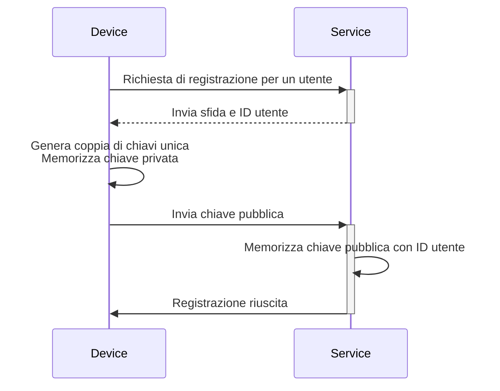
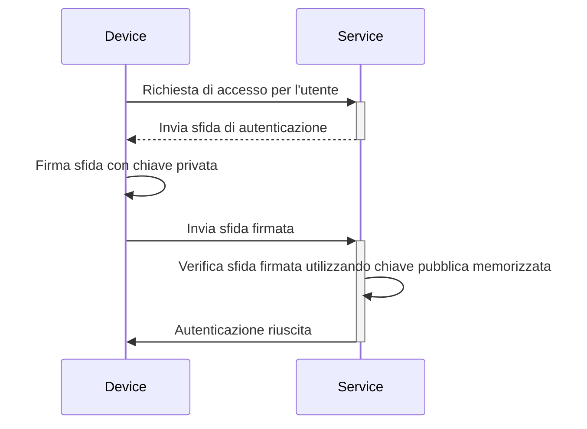

## Che cos'è il passkey?

**Passkey** è un'alternativa sicura e conveniente basata su [FIDO](https://fidoalliance.org/) alle password tradizionali. Utilizzano la crittografia avanzata per proteggere i tuoi account dagli attacchi di [phishing](https://en.wikipedia.org/wiki/Phishing).

- **Unico per ogni servizio**: Quando ti registri per un servizio, il tuo dispositivo crea un passkey unico collegato al dominio specifico di quel servizio.
- **Collegato al dispositivo:** I passkey sono tipicamente collegati a un dispositivo, come un telefono, un laptop, un identificatore biometrico o chiavi di sicurezza hardware.
- **Coppia di chiavi pubblica-privata:** Il dispositivo conserva la chiave privata, mentre la chiave pubblica viene condivisa con il servizio. Queste coppie di chiavi crittografiche sono chiamate passkey. (Citato da [FIDO](https://fidoalliance.org/how-fido-works/))
- **Metodi di autenticazione multipli:** Puoi utilizzare una scansione delle impronte digitali, il riconoscimento facciale, il PIN del dispositivo, la scansione del codice QR o le chiavi di sicurezza per autenticarti con un passkey.
- **Sincronizzazione tra dispositivi**: I passkey possono essere sincronizzati tra dispositivi utilizzando l'archiviazione cloud sicura (ad esempio, Apple iCloud Keychain o Google Password Manager), permettendoti di accedere da qualsiasi dispositivo supportato.

## Come appare il flusso di lavoro del passkey?

Ecco un esempio reale per aiutarti a capire meglio. Hai un servizio web MyApp che vuole implementare l'accesso con Passkey invece dell'accesso basato su password. Gli utenti selezionano il dispositivo attuale con la scansione delle impronte digitali come metodo di autenticazione Passkey.

I **passkey** funzionano utilizzando la crittografia a chiave pubblica per fornire credenziali sicure.

- **Registrazione del passkey**
    - Quando ti registri per un servizio, il tuo dispositivo genera una coppia di chiavi crittografiche unica collegata a quel servizio.
    - La **chiave privata** rimane sul tuo dispositivo, mentre la **chiave pubblica** viene condivisa con il servizio.

- **Autenticazione del passkey**
    - Quando tenti di accedere, il servizio invia una **sfida** al tuo dispositivo.
    - Il tuo dispositivo utilizza la **chiave privata** per generare una **firma** crittografica basata sulla sfida.
    - La **firma** viene inviata al servizio, che la verifica utilizzando la **chiave pubblica**.
    - Se la firma è valida, l'autenticazione ha successo.

Leggi <Ref slug="webauthn" />, un'API per implementare i passkey, per apprendere i dettagli.

## Come appare il flusso utente finale del passkey?

I passkey offrono flessibilità con due tipi di autenticatore per l'uso sia locale che cloud, e gli utenti possono abilitare uno o entrambi per il servizio.

- **Autenticatore della piattaforma (Autenticatore interno):** Collegato a un sistema operativo specifico del dispositivo (ad esempio, telefono, laptop), utilizzando biometria o codice di accesso del dispositivo per autorizzare. È rapido e conveniente.
    - Esempi: iCloud Keychain su dispositivi Apple (verifica tramite Touch ID, Face ID o codice di accesso del dispositivo), Windows Hello, Google Password Manager su Android.
- **Autenticatore itinerante (Autenticatore esterno):** Dispositivi o software portatili, ad esempio, chiavi di sicurezza, smartphone. Possono essere utilizzati su più dispositivi ma potrebbero richiedere passaggi aggiuntivi come la scansione del codice QR o l'accoppiamento NFC/Bluetooth.
    - Esempi: YubiKey e account basati su cloud su smartphone. Gli autenticatori mobili spesso richiedono la scansione del codice QR per collegarsi ai dispositivi desktop, e l'autenticazione tra dispositivi deve connettersi tramite Bluetooth, NFC o USB per garantire che l'autenticatore sia nelle vicinanze.

## Quando utilizzare il passkey?

I passkey sono un fattore di autenticazione moderno che può essere utilizzato come primo o secondo fattore.

- **Accesso con passkey:** I passkey offrono un metodo di autenticazione senza password più veloce e sicuro rispetto alla password tradizionale.
    - Le applicazioni moderne presentano tipicamente un pulsante "Accedi con passkey" sulla pagina di accesso, invitando gli utenti a selezionare proattivamente questa opzione.
    - Inoltre, la pagina di accesso può automaticamente visualizzare un pop-up di accesso con passkey se riconosce che l'utente sta accedendo dallo stesso dispositivo e browser in cui il loro passkey è registrato.
- **Passkey MFA:** I passkey possono anche servire come secondo fattore per MFA.
    - Quando un utente tenta di accedere, inserisce prima la propria email e password (o altri primi fattori), dopodiché il servizio li invita a completare la verifica in due passaggi utilizzando un passkey.
    - Se ci sono sessioni esistenti nel browser, il servizio può invitare direttamente gli utenti ad accedere con il loro passkey senza richiedere loro di inserire nuovamente la password. Questo processo, noto come completamento di MFA, poiché il passkey è un alto livello di sicurezza legandosi al dispositivo attuale e verificando gli utenti tramite biometria, PIN o altri metodi hardware.
- **Verifica di sicurezza**: In ambienti ad alta sicurezza, i passkey sono spesso utilizzati per verificare nuovamente l'identità dell'utente. Ad esempio, quando si accede a informazioni finanziarie sensibili o si eseguono operazioni critiche (bancarie, governative, sistemi aziendali).

### Perché i passkey sono il metodo di autenticazione più sicuro?

I passkey sono uno dei modi più sicuri per i clienti comuni di accedere perché utilizzano la **crittografia a chiave pubblica**. A differenza delle password o dei codici monouso (TOTPs), la tua chiave privata non lascia mai il tuo dispositivo. Anche se un attaccante ruba la chiave pubblica che è liberamente disponibile, non può falsificare un tentativo di accesso valido.

Ecco un confronto per illustrare perché i passkey sono significativamente più sicuri:

| Attacchi | Passkey | Software TOTP (Autenticatore) |
| --- | --- | --- |
| **Attacchi di phishing** | Altamente resistente al phishing, poiché la chiave privata non lascia mai il dispositivo o viene inserita manualmente da nessuna parte, rendendo più difficile rubarla. | Vulnerabile al phishing, poiché il Software TOTP viene visualizzato sullo schermo, quindi gli attaccanti possono ingannarti facendoti rivelare su un sito web falso. |
| **Attacchi man-in-the-middle (MitM)** | Forte protezione contro MitM, poiché i protocolli crittografici robusti fanno sì che le chiavi private rimangano solo sul tuo dispositivo. | Vulnerabile a MitM, poiché i TOTPs possono essere intercettati da un attaccante MitM che potrebbe quindi usarli per accedere come te. |
| **Attacchi di replay** | Forte protezione contro l'attacco di replay, poiché ogni richiesta di passkey è unica, rendendo inutile per un attaccante catturarla e riprodurla in seguito. | Possibile attacco di replay, poiché i TOTP cambiano periodicamente, ma se intercettati prima della scadenza, potrebbero essere riutilizzati per accessi non autorizzati. |

<SeeAlso slugs={["webauthn", "authentication", "authorization"]} />

<Resources
  urls={[
    "https://fidoalliance.org/passkeys/",
    "https://webauthn.io/"
  ]}
/>