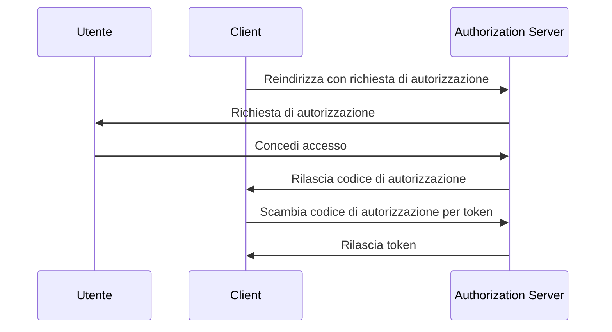

## Cos'è il Proof Key for Code Exchange (PKCE)?

Proof Key for Code Exchange (PKCE) funge da estensione di sicurezza per <Ref slug="authorization-code-flow" /> in <Ref slug="oauth-2.0" />. È progettato per proteggere i codici di autorizzazione dall'intercettazione e dall'uso improprio, specialmente nei client pubblici dove il segreto del client non è sicuro.

Da <Ref slug="oauth-2.1" />, PKCE è applicato a tutti i tipi di client, inclusi <Ref slug="client" headingId="public-clients" /> e <Ref slug="client" headingId="confidential-clients">client riservati (privati)</Ref>.

## Come funziona PKCE?

PKCE introduce alcuni passaggi aggiuntivi nel authorization code flow per garantire che il <Ref slug="client" /> che scambia il codice di autorizzazione sia lo stesso client che ha avviato il flusso.

> [!Nota]
> PKCE è applicabile anche ai flussi di <Ref slug="openid-connect" /> che si basano sul authorization code flow. Per semplicità, ci concentreremo sull'implementazione di OAuth 2.0.

Rivediamo rapidamente il authorization code flow standard prima di approfondire PKCE:



Ora, vediamo come PKCE migliora il authorization code flow.

### 1. Preparazione della richiesta di autorizzazione

#### 1.1. Il client genera un code verifier

Prima di avviare la <Ref slug="authorization-request" />, il client dovrebbe generare una stringa casuale chiamata **code verifier**. La stringa dovrebbe essere una stringa crittografica casuale URL-safe ad alta entropia con una lunghezza minima di 43 caratteri e una lunghezza massima di 128 caratteri.

Ecco un esempio di generazione di un code verifier in JavaScript:

```javascript
// `js-base64` è una libreria universale che può essere utilizzata sia in Node.js che nei browser
import { fromUint8Array } from 'js-base64';

// Il secondo argomento `true` indica che l'output dovrebbe essere URL-safe
const codeVerifier = fromUint8Array(crypto.getRandomValues(new Uint8Array(64)), true);
```

#### 1.2. Il client crea un code challenge

Il client dovrebbe hashare il **code verifier** utilizzando una funzione di hash crittografica, come SHA-256, e codificare l'hash in una stringa Base64 URL-safe. La stringa risultante è chiamata **code challenge**.

Ecco un esempio di creazione di un code challenge in JavaScript:

```javascript
// `js-base64` è una libreria universale che può essere utilizzata sia in Node.js che nei browser
import { fromUint8Array } from 'js-base64';

const encodedCodeVerifier = new TextEncoder().encode(codeVerifier);
const codeChallenge = new Uint8Array(await crypto.subtle.digest('SHA-256', encodedCodeVerifier));

// Il secondo argomento `true` indica che l'output dovrebbe essere URL-safe
return fromUint8Array(codeChallenge, true);
```

#### 1.3. Il client include il code challenge nella richiesta di autorizzazione

Quando il client avvia la richiesta di autorizzazione, include i parametri `code_challenge` e `code_challenge_method` nella richiesta. Il parametro `code_challenge` contiene il **code challenge** generato nel passaggio precedente, e il parametro `code_challenge_method` specifica l'algoritmo di hashing utilizzato per creare il **code challenge** (ad esempio, `S256` per SHA-256).

I valori supportati per `code_challenge_method` sono `plain` e `S256`, dove `plain` indica che il **code challenge** è inviato così com'è senza alcun hashing. Di solito, `S256` è raccomandato per una maggiore sicurezza.

Ecco un esempio non normativo di una richiesta di autorizzazione con PKCE:

```http
GET /authorize?response_type=code
  &client_id=YOUR_CLIENT_ID
  &redirect_uri=https%3A%2F%2Fclient.example.com%2Fcallback
  &scope=openid%20profile
  &code_challenge=YOUR_CODE_CHALLENGE
  &code_challenge_method=S256
  &state=abc123
  &nonce=123456 HTTP/1.1
```

### 2. Scambio del codice di autorizzazione per i token

Il client dovrebbe salvare il **code verifier** per un uso successivo e procedere con il authorization flow come di consueto. Una volta che il client riceve il codice di autorizzazione, dovrebbe inviare la <Ref slug="token-request" /> con il **code verifier** al authorization server.

Ecco un esempio non normativo di una richiesta di token con PKCE:

```http
POST /token HTTP/1.1
Host: your-authorization-server.com
Content-Type: application/x-www-form-urlencoded

grant_type=authorization_code
  &code=YOUR_AUTHORIZATION_CODE
  &redirect_uri=https%3A%2F%2Fclient.example.com%2Fcallback
  &client_id=YOUR_CLIENT_ID
  &code_verifier=YOUR_CODE_VERIFIER
```

Il authorization server verificherà il **code challenge** rispetto al **code verifier** per garantire che il client sia la stessa entità che ha avviato il flusso. Se la verifica fallisce, il authorization server rifiuterà la richiesta di token.

## Come PKCE migliora la sicurezza

Il principale vantaggio di sicurezza di PKCE è che previene gli attacchi di intercettazione del codice di autorizzazione, che possono verificarsi nei client pubblici. Ad esempio, se un attaccante intercetta il codice di autorizzazione, non può scambiarlo per token senza il **code verifier**. PKCE garantisce che solo il client che ha avviato il flusso possa completare lo scambio di token.

<SeeAlso slugs={['oauth-2.1', 'authorization-code-flow']} />

<Resources
  urls={[
    "https://blog.logto.io/how-pkce-protects-the-authorization-code-flow-for-native-apps",
    "https://datatracker.ietf.org/doc/html/rfc7636",
  ]}
/>