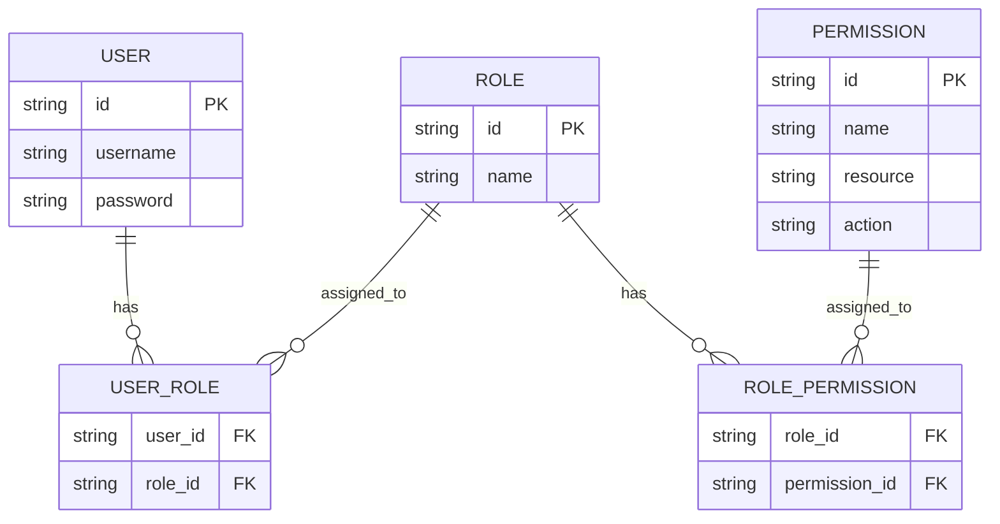
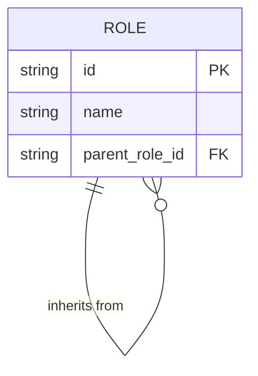
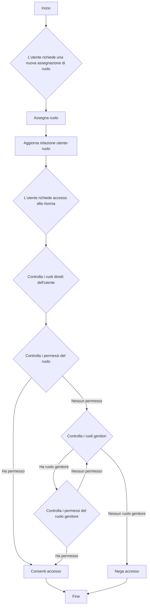
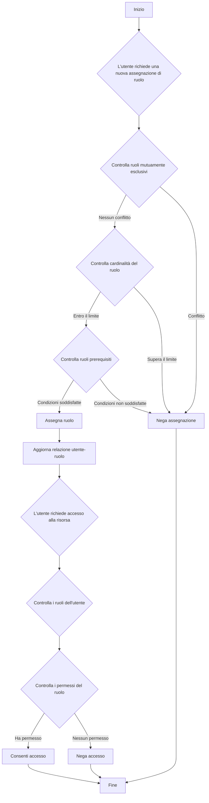

## Cos'è il controllo degli accessi basato sui ruoli (RBAC)?

Il controllo degli accessi basato sui ruoli (RBAC) è un modello di controllo degli accessi ampiamente adottato che introduce il concetto di "ruoli" per separare gli utenti dai permessi, risultando in un sistema di gestione dei permessi flessibile ed efficiente.

L'idea centrale dietro RBAC è semplice ma potente: invece di assegnare direttamente i permessi agli utenti, i permessi vengono assegnati ai ruoli, che vengono poi assegnati agli utenti. Questo metodo indiretto di allocazione dei permessi semplifica notevolmente il processo di gestione dei diritti di accesso.

## Quali sono i concetti chiave in RBAC?

Il modello RBAC ruota attorno a quattro elementi principali:

1. Utenti: Individui all'interno del sistema, tipicamente persone reali.
2. Ruoli: Rappresentazioni di funzioni lavorative o responsabilità all'interno di un'organizzazione.
3. Permessi: Autorizzazioni a eseguire operazioni specifiche su risorse particolari.
4. Sessioni: Ambienti dinamici in cui gli utenti attivano determinati ruoli.

Il flusso di lavoro di base di RBAC può essere riassunto come segue:
1. Definire i ruoli in base alla struttura organizzativa o ai requisiti aziendali.
2. Assegnare i permessi appropriati a ciascun ruolo.
3. Assegnare uno o più ruoli agli utenti in base alle loro responsabilità.
4. Quando un utente tenta di accedere a una risorsa, il sistema verifica se i ruoli assegnati hanno i permessi necessari.

## Come viene comunemente utilizzato RBAC nelle applicazioni del mondo reale?

Quando si utilizza RBAC in un'applicazione aziendale tipica, puoi iniziare rispondendo alle seguenti tre domande di base:

1. Quali risorse devono essere protette nel sistema?
2. Quali operazioni devono essere controllate su queste risorse?
3. In scenari del mondo reale, quali ruoli sono responsabili dell'esecuzione di queste risorse e operazioni?

Prendiamo come esempio un sistema di e-commerce.

Puoi prima identificare le risorse che devono essere protette:

- Prodotto
- Ordine

Quindi, puoi determinare quali operazioni devono essere controllate su queste risorse, cioè definire i permessi per queste risorse:

- Prodotto
  - `read:product`
  - `create:product`
  - `delete:product`
- Ordine
  - `read:order`
  - `create:order`
  - `delete:order`

Con i permessi sopra, puoi ora definire il seguente modello di gestione dei permessi basato sui ruoli in scenari del mondo reale:

- Amministratore del prodotto
  - Prodotto
    - `read:product`
    - `create:product`
    - `delete:product`
- Amministratore dell'ordine
  - Ordine
    - `read:order`
    - `create:order`
    - `delete:order`

Infine, assegna i ruoli agli utenti in base alle loro responsabilità:

- Alice: Amministratore del prodotto
- Bob: Amministratore dell'ordine

Quando un utente accede a una risorsa, il sistema verificherà se i ruoli assegnati all'utente hanno i permessi necessari.

Ad esempio, quando Alice tenta di leggere le informazioni sui prodotti, il sistema recupera prima le informazioni sul suo ruolo e scopre che ha il ruolo di amministratore del prodotto.

Quindi, il sistema interroga i permessi associati a quel ruolo, che includono `read:product`, `create:product` e `delete:product`.

Il sistema verifica quindi se il permesso richiesto `read:product` esiste nella sua lista di permessi.

Poiché questo permesso esiste, il sistema consente ad Alice di accedere all'elenco dei prodotti. Se il permesso richiesto non è nella lista, il sistema nega la richiesta di accesso.

## Perché non dovresti usare i ruoli direttamente per il controllo degli accessi

Un errore comune nell'implementazione di RBAC è l'uso diretto dei ruoli per il controllo degli accessi:

```typescript
// ❌ Approccio problematico
if (user.hasRole('product_admin')) {
  await deleteProduct(productId);
}
```

Sebbene questo approccio sembri semplice, crea problemi man mano che il tuo sistema cresce. Ad esempio:
- Quando il team di marketing deve aggiornare le descrizioni dei prodotti, dovrai modificare il codice per controllare i ruoli di marketing.
- Quando vuoi che alcuni manager di prodotto possano solo pubblicare ma non eliminare prodotti, dovrai creare nuovi controlli di ruolo per le operazioni correlate.
- Quando un nuovo team di contenuti ha bisogno di accesso parziale ai prodotti, dovrai nuovamente aggiornare il tuo codice.

Invece, dovresti sempre controllare permessi specifici:

```typescript
// ✅ Approccio consigliato
if (user.hasPermission('delete:product')) {
  await deleteProduct(productId);
}
```

Questo approccio basato sui permessi offre diversi vantaggi:

1. Controllo dei permessi a grana fine: i permessi possono mappare con precisione operazioni specifiche sulle risorse:

- Creare prodotto: `create:product`
- Aggiornare prodotto: `update:product`
- Eliminare prodotto: `delete:product`
- Pubblicare prodotto: `publish:product`

2. Configurazione flessibile dei ruoli: i permessi possono essere liberamente combinati in ruoli senza modifiche al codice:

```typescript
const roles = {
  product_admin: ['create:product', 'update:product', 'delete:product', 'publish:product'],
  content_editor: ['update:product'],
  publisher: ['publish:product']  // Nuovi ruoli possono essere facilmente aggiunti
};
```

Questo design rende il tuo sistema adattabile alla crescita aziendale:
- Aggiungere nuovi ruoli richiede solo la configurazione dei permessi
- Regolare i permessi dei ruoli viene fatto tramite configurazione
- Le nuove funzionalità richiedono solo nuove voci di permesso

Ricorda: i ruoli dovrebbero essere solo contenitori di permessi, non la base per le decisioni di controllo degli accessi. Questo design consente a RBAC di fornire il massimo valore.

## Modelli RBAC e la loro evoluzione

### RBAC0: La base

RBAC0 è il modello di base che definisce i concetti fondamentali di utenti, ruoli, permessi e sessioni. Serve come base per tutti gli altri modelli RBAC.

Caratteristiche principali:
- Associazione utente-ruolo: Relazione molti-a-molti
- Associazione ruolo-permesso: Relazione molti-a-molti



Questo diagramma illustra la struttura di base di RBAC0, mostrando le relazioni tra utenti, ruoli e permessi.

Operazioni chiave:
1. Assegnazione di ruoli agli utenti
2. Assegnazione di permessi ai ruoli
3. Verifica se un utente ha un permesso specifico

Sebbene RBAC0 fornisca un solido punto di partenza, ha alcune limitazioni:
1. Esplosione dei ruoli: Con l'aumentare della complessità del sistema, il numero di ruoli può crescere rapidamente.
2. Ridondanza dei permessi: Ruoli diversi possono richiedere set simili di permessi, portando a duplicazioni.
3. Mancanza di gerarchia: Non può rappresentare relazioni di ereditarietà tra ruoli.

### RBAC1: Introduzione delle gerarchie di ruoli

RBAC1 si basa su RBAC0 aggiungendo il concetto di ereditarietà dei ruoli.

```plaintext
RBAC1 = RBAC0 + Ereditarietà dei Ruoli
```

Caratteristiche principali:
- Gerarchia dei ruoli: I ruoli possono avere ruoli genitori
- Ereditarietà dei permessi: I ruoli figli ereditano tutti i permessi dai loro ruoli genitori



Questo diagramma mostra come i ruoli possono ereditare da altri ruoli in RBAC1.

Operazioni chiave:



Questo diagramma di flusso illustra il processo di assegnazione dei ruoli e verifica dei permessi in RBAC1, inclusa l'aspetto dell'ereditarietà dei ruoli.

RBAC1 offre diversi vantaggi:
1. Numero ridotto di ruoli: Meno ruoli di base possono essere creati tramite ereditarietà
2. Gestione semplificata dei permessi: Più facile riflettere le gerarchie organizzative

Tuttavia, RBAC1 ha ancora alcune limitazioni:
1. Mancanza di meccanismi di vincolo: Impossibile impedire agli utenti di detenere contemporaneamente ruoli potenzialmente in conflitto
2. Considerazioni sulle prestazioni: I controlli dei permessi possono richiedere di attraversare l'intera gerarchia dei ruoli

### RBAC2: Implementazione dei vincoli

RBAC2 si basa anche su RBAC0 ma introduce il concetto di vincoli.

```plaintext
RBAC2 = RBAC0 + Vincoli
```

Caratteristiche principali:
1. Ruoli mutuamente esclusivi: Gli utenti non possono essere assegnati a questi ruoli contemporaneamente
2. Cardinalità dei ruoli: Limita il numero di utenti che possono essere assegnati a un particolare ruolo
3. Ruoli prerequisiti: Gli utenti devono avere un ruolo specifico prima di essere assegnati a un altro



Questo diagramma di flusso dimostra il processo di assegnazione dei ruoli e controllo degli accessi in RBAC2, incorporando i vari vincoli.

RBAC2 migliora la sicurezza impedendo un'eccessiva concentrazione di permessi e consente un controllo degli accessi più preciso. Tuttavia, aumenta la complessità del sistema e può influire sulle prestazioni a causa della necessità di controllare più condizioni di vincolo per ciascuna assegnazione di ruolo.

### RBAC3: Il modello completo

RBAC3 combina le caratteristiche di RBAC1 e RBAC2, offrendo sia l'ereditarietà dei ruoli che i meccanismi di vincolo:

```plaintext
RBAC3 = RBAC0 + Ereditarietà dei Ruoli + Vincoli
```

Questo modello completo fornisce la massima flessibilità ma presenta anche sfide nell'implementazione e nell'ottimizzazione delle prestazioni.

## Quali sono i vantaggi di RBAC (controllo degli accessi basato sui ruoli)?

1. Gestione semplificata dei permessi: L'autorizzazione di massa tramite ruoli riduce la complessità della gestione dei permessi individuali degli utenti.
2. Sicurezza migliorata: Un controllo più preciso sui permessi degli utenti riduce i rischi di sicurezza.
3. Riduzione dei costi amministrativi: La modifica dei permessi dei ruoli influisce automaticamente su tutti gli utenti associati.
4. Allineamento con la logica aziendale: I ruoli spesso corrispondono a strutture organizzative o processi aziendali, rendendoli più facili da comprendere e gestire.
5. Supporto per la separazione dei compiti: Le responsabilità critiche possono essere separate tramite vincoli come ruoli mutuamente esclusivi.

## Quali sono le considerazioni pratiche per l'implementazione?

Quando si implementa RBAC in scenari del mondo reale, gli sviluppatori dovrebbero considerare questi aspetti chiave:

1. Progettazione del database: Utilizzare database relazionali per memorizzare e interrogare efficacemente le strutture RBAC.
2. Ottimizzazione delle prestazioni: Implementare strategie di caching e ottimizzare i controlli dei permessi, specialmente per modelli RBAC3 complessi.
3. Integrazione API e frontend: Progettare API chiare per la gestione di utenti, ruoli e permessi, e considerare come utilizzare RBAC nelle applicazioni frontend.
4. Sicurezza e auditing: Garantire la sicurezza del sistema RBAC stesso e implementare funzioni di logging e auditing dettagliate.
5. Scalabilità: Progettare con in mente espansioni future, come supportare regole di permesso più complesse o integrare con altri sistemi.
6. Esperienza utente: Progettare interfacce intuitive per gli amministratori di sistema per configurare e mantenere facilmente la struttura RBAC.

<SeeAlso slugs={['abac', 'access-control']} />

<Resources
  urls={[
    "https://blog.logto.io/rbac-and-abac",
    "https://blog.logto.io/mastering-rbac",
    "https://blog.logto.io/organization-and-role-based-access-control",
    "https://docs.logto.io/docs/recipes/rbac/",
    "https://en.wikipedia.org/wiki/Role-based_access_control"
  ]}
/>