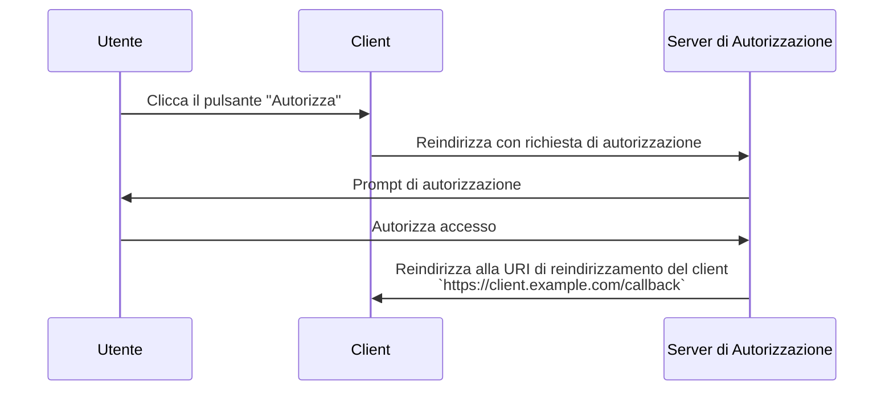

## Cos'è una URI di reindirizzamento?

Una URI di reindirizzamento, nota anche come URL di callback o URL di reindirizzamento, è una URI che indica dove il <Ref slug="authorization-server" /> dovrebbe reindirizzare l'user-agent dopo che la <Ref slug="authorization-request" /> è completata.

> Gli Universal Resource Identifier (URI) sono spesso confusi con gli URL (Uniform Resource Locator). Per ulteriori informazioni, consulta [Unveiling URI, URL, and URN](https://blog.logto.io/unveiling-uri-url-and-urn).

Diamo un'occhiata a un esempio di una richiesta di autorizzazione che include una URI di reindirizzamento:

```http
GET /authorize?response_type=code
  &client_id=YOUR_CLIENT_ID
  &redirect_uri=https%3A%2F%2Fclient.example.com%2Fcallback
  &scope=openid%20profile%20email
  &state=abc123
  &nonce=123456 HTTP/1.1
```

In questo esempio, il valore grezzo del parametro `redirect_uri` è `https%3A%2F%2Fclient.example.com%2Fcallback`, che è codificato in URL. Il valore effettivo è `https://client.example.com/callback`.

## Come funziona una URI di reindirizzamento?

> Nel contesto di <Ref slug="openid-connect" />, il flusso di lavoro per la <Ref slug="authorization-request" /> di OAuth 2.0 e il <Ref slug="authorization-server" /> si applica in modo simile. La URI di reindirizzamento funziona allo stesso modo in cui fa in OAuth 2.0, sia per la <Ref slug="authentication-request" /> che per <Ref slug="openid-connect" headingId="openid-provider-op" />.

Supponiamo che il <Ref slug="client" /> avvii la richiesta di autorizzazione dall'URL `https://client.example.com`. Dopo che l'utente completa il processo di autorizzazione, il server di autorizzazione reindirizzerà l'user-agent (browser) a `https://client.example.com/callback`.



È chiaro che la URI di reindirizzamento è essenziale affinché il server di autorizzazione possa reindirizzare l'user-agent quando il processo di autorizzazione è completo. Inoltre, la URI di reindirizzamento è utilizzata anche per ricevere il codice di autorizzazione o i token, a seconda del flusso.

Ecco un esempio non normativo di come potrebbe apparire il reindirizzamento effettivo in un <Ref slug="authorization-code-flow" />:

```http
HTTP/1.1 302 Found
Location: https://client.example.com/callback?code=AUTHORIZATION_CODE&state=abc123
```

Nota che i parametri URL `code` e `state` che sono aggiunti dal server di autorizzazione sono inclusi nella URI di reindirizzamento. Il client deve estrarre i parametri `code` e `state` dall'URL per continuare il processo di autorizzazione.

## Perché abbiamo bisogno di una URI di reindirizzamento?

Come possiamo vedere nell'esempio sopra, il server di autorizzazione deve sapere dove reindirizzare dopo una richiesta di autorizzazione riuscita. È particolarmente utile quando ci sono più client (cioè, <Ref slug="single-sign-on" />), e ogni client ha una diversa URI di reindirizzamento.

Con il <Ref slug="authorization-code-flow" />, la URI di reindirizzamento è utilizzata anche per passare il codice di autorizzazione al client, invece di usare il canale frontale (browser) per evitare di esporre i token a potenziali attacchi.

Era possibile utilizzare il [Resource Owner Password Credentials (ROPC) grant](https://datatracker.ietf.org/doc/html/rfc6749#section-4.3) per ottenere token per l'utente senza una URI di reindirizzamento. Tuttavia, è deprecato in <Ref slug="oauth-2.1" /> a causa di problemi di sicurezza.

## Considerazioni sulla sicurezza

La URI di reindirizzamento è un parametro critico ed è un obiettivo comune per gli attaccanti. Ecco alcune considerazioni sulla sicurezza da tenere a mente:

- **Whitelist delle URI di reindirizzamento**: Il client dovrebbe accettare solo URI di reindirizzamento che sono registrate con il server di autorizzazione. Questo previene che gli attaccanti reindirizzino gli utenti a siti malevoli.
- **Usa HTTPS**: Usa sempre HTTPS per la URI di reindirizzamento per proteggere la comunicazione tra il client e il server di autorizzazione.
- **Corrispondenza esatta**: La URI di reindirizzamento dovrebbe corrispondere esattamente con la URI registrata. I server di autorizzazione possono imporre regole di corrispondenza rigorose che disabilitano modelli di corrispondenza ampi.
- **Parametro di stato**: Usa il parametro `state` per prevenire attacchi <Ref slug="csrf" />. Il client dovrebbe validare il parametro `state` per assicurarsi che corrisponda al valore inviato nella richiesta di autorizzazione.

<SeeAlso slugs={["csrf", "oauth-2.1", "authorization-code-flow"]} />

<Resources
  urls={[
    "https://blog.logto.io/oauth-2-1",
    "https://blog.logto.io/csrf",
    "https://blog.logto.io/redirect-uri-in-authorization-code-flow",
  ]}
/>