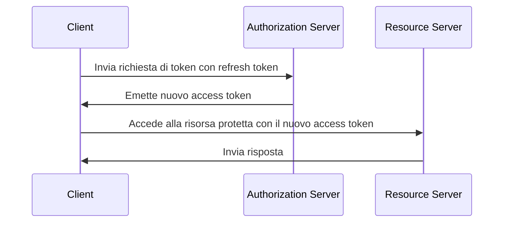

## Cos'è un token di aggiornamento (Refresh token)?

Un token di aggiornamento (refresh token) è una credenziale a lunga durata, tipicamente una stringa casuale, utilizzata per ottenere nuovi <Ref slug="access-token">access token</Ref> senza richiedere all'utente di autenticarsi nuovamente. Nel contesto di OAuth 2.0 e OpenID Connect (OIDC), i <Ref slug="authorization-server">authorization server</Ref> possono emettere refresh token ai client (applicazioni) quando il client richiede <Ref slug="offline-access" />.

Mentre l'[OAuth 2.0 RFC](https://datatracker.ietf.org/doc/html/rfc6749#section-1.5) definisce il ciclo di vita ad alto livello di un refresh token, i dettagli di implementazione possono variare tra authorization server e client. Li esploreremo nelle sezioni successive.

## Come funziona un token di aggiornamento (Refresh token)?

Un refresh token viene tipicamente emesso insieme a un access token quando il client richiede <Ref slug="offline-access" />. La norma del settore per richiedere l'accesso offline è includere lo scope `offline_access` nella <Ref slug="authorization-request" />, mentre <Ref slug="openid-connect" /> definisce ufficialmente lo scope `offline_access` per questo scopo (disponibile nella <Ref slug="authentication-request" />).

Ecco un esempio non normativo di una authorization request che include lo scope `offline_access`:

```http
GET /authorize?response_type=code
  &client_id=YOUR_CLIENT_ID
  &redirect_uri=https%3A%2F%2Fclient.example.com%2Fcallback
  &scope=openid%20profile%20email%20offline_access
  &state=abc123
  &nonce=123456 HTTP/1.1
```

Una volta che il client riceve il refresh token, può usarlo per richiedere nuovi access token quando l'attuale access token scade. Ecco un esempio semplificato usando un refresh token:



Come illustra il diagramma di sequenza, l'uso di un refresh token deve essere supportato sia dal client che dall'authorization server:

- Il client dovrebbe memorizzare il refresh token in modo sicuro e usarlo nella <Ref slug="token-request" /> per ottenere un nuovo access token.
- L'authorization server dovrebbe validare il refresh token ed emettere un nuovo access token quando il client presenta un refresh token valido.

Il refresh token non è destinato a essere condiviso con il <Ref slug="resource-server" />. Gli access token sono gli unici token che il resource server dovrebbe controllare per l'autorizzazione.

Ecco un esempio non normativo di una richiesta di token usando un refresh token:

```http
POST /token HTTP/1.1
Host: your-authorization-server.com
Content-Type: application/x-www-form-urlencoded

grant_type=refresh_token
  &refresh_token=YOUR_REFRESH_TOKEN
  &client_id=YOUR_CLIENT_ID
  &client_secret=YOUR_CLIENT_SECRET
  &scope=openid%20profile%20email
```

## Considerazioni sulla sicurezza ||security-considerations||

Poiché i refresh token sono a lunga durata (ad esempio, giorni, settimane) e possono essere utilizzati per ottenere nuovi access token senza interazione dell'utente, rappresentano un rischio di sicurezza maggiore rispetto agli access token (ad esempio, minuti, ore). L'uso dei refresh token dovrebbe essere attentamente considerato e implementato per mitigare potenziali minacce alla sicurezza. Ecco alcune best practice da considerare:

### Archiviazione sicura

Memorizza in modo sicuro i refresh token sul lato client per prevenire accessi non autorizzati. Tali meccanismi di archiviazione includono:

- **Cookie HTTP-only**: Memorizza i token in cookie HTTP-only per impedire al JavaScript lato client di accedervi.
- **Archiviazione crittografata**: Usa archiviazioni sicure come Keychain (iOS) o KeyStore (Android) su dispositivi mobili, o database crittografati su applicazioni web.

### Rotazione del refresh token ||refresh-token-rotation||

Sebbene i refresh token possano essere a lunga durata, ruotarli periodicamente o in base a determinate condizioni (ad esempio, dopo uno scambio di token riuscito) può ridurre significativamente il rischio di accessi non autorizzati. La strategia di rotazione esatta può variare in base ai requisiti di sicurezza dell'applicazione e alle capacità dell'authorization server.

Ecco due comuni strategie di rotazione dei token:

- **Rotazione basata sul tempo**: Ruota i refresh token dopo un certo periodo (ad esempio, ogni 7 giorni).
- **Rotazione basata su eventi**: Ruota i refresh token dopo eventi specifici (ad esempio, scambio di token riuscito, cambio password).

Quando un refresh token viene ruotato, il precedente refresh token dovrebbe essere invalidato per impedirne il riutilizzo. Queste strategie sono spesso combinate con il TTL (time-to-live) della sessione per garantire che dopo un certo periodo di tempo, indipendentemente dalla validità del refresh token, l'utente debba autenticarsi nuovamente.

### Refresh token vincolati al mittente ||sender-constrained-refresh-tokens||

I refresh token vincolati al mittente sono un meccanismo di sicurezza per legare il refresh token al client che lo ha richiesto, nel caso in cui il client non sia un <Ref slug="client" headingId="confidential-clients">client confidenziale</Ref>. I metodi comuni sono [DPoP](https://datatracker.ietf.org/doc/html/rfc9449) e [mTLS](https://datatracker.ietf.org/doc/html/rfc8705).

### Tipo di client

È una buona pratica limitare l'uso dei refresh token ai <Ref slug="client" headingId="confidential-clients">client confidenziali (privati)</Ref>.

- I client pubblici (ad esempio, applicazioni a pagina singola) espongono il codice sorgente al lato client, rendendo più facile per gli attaccanti estrarre e abusare dei refresh token. Di solito, meccanismi più sicuri come <Ref slug="pkce" /> e la rotazione dei refresh token sono utilizzati per i client pubblici se i refresh token sono necessari.
- I client confidenziali, d'altra parte, funzionano in un ambiente server sicuro dove il codice sorgente e l'ambiente non sono esposti al lato client. I refresh token possono essere utilizzati in modo più sicuro in tali ambienti.

### Revoca del token

Poiché i refresh token sono solitamente <Ref slug="opaque-token">token opachi</Ref> (cioè, non hanno significato per il client) e devono essere validati dall'authorization server, l'authorization server può facilmente implementare meccanismi di revoca del token per invalidare i refresh token quando necessario. Questo può essere utile in scenari come il logout dell'utente, la compromissione dell'account o l'abuso del token.

<SeeAlso slugs={["access-token", "id-token", "jwt", "opaque-token"]} />

<Resources urls={[
  "https://blog.logto.io/understanding-refresh-token-rotation",
  "https://blog.logto.io/understanding-tokens-in-oidc",
  {
    url: "https://openid.net/specs/openid-connect-core-1_0.html#OfflineAccess",
    result: {
      ogTitle: "Offline Access in OpenID Connect Core 1.0",
    }
  },
  {
    url: "https://datatracker.ietf.org/doc/html/rfc6749#section-1.5",
    result: {
      ogTitle: "Refresh Token in OAuth 2.0",
      ogDescription: "Refresh tokens are credentials used to obtain access tokens."
    },
  },
]} />
