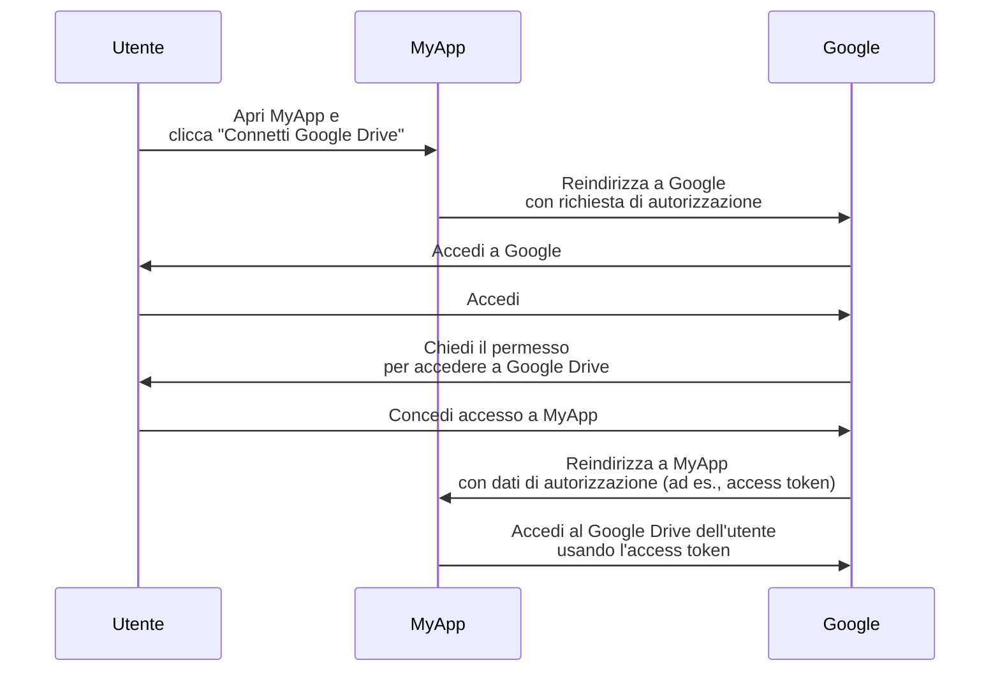

## Cos'è un proprietario della risorsa?

Nel contesto di <Ref slug="oauth-2.0" />, un proprietario della risorsa è un'identità (tipicamente un utente) che ha la capacità di concedere l'accesso a una risorsa protetta (ad esempio, dati, file o servizi).

Ad esempio, hai un'applicazione web MyApp che vuole accedere al Google Drive dell'utente. Ecco un tipico flusso OAuth 2.0:

In questo flusso, l'**utente** è il **proprietario della risorsa** che concede l'accesso al proprio Google Drive a MyApp, mentre **MyApp** è il <Ref slug="client" /> che vuole accedere alle risorse protette e **Google** è sia il <Ref slug="authorization-server" /> che il <Ref slug="resource-server" />.

Come suggerisce il nome, il proprietario della risorsa possiede alcune risorse in un <Ref slug="resource-server" /> e può autorizzare i client ad accedervi per suo conto nel contesto di <Ref slug="oauth-2.0" />.

## Perché il proprietario della risorsa è importante?

Durante un processo di <Ref slug="authorization" />, il proprietario della risorsa è imprescindibile perché è colui che concede o nega esplicitamente l'accesso alle proprie risorse. Il consenso del proprietario della risorsa è obbligatorio sia per motivi tecnici che di conformità:

- **Tecnico**: Il consenso del proprietario della risorsa garantisce che il client abbia le autorizzazioni necessarie per accedere alle risorse. Piuttosto che un accesso tutto o niente, il proprietario della risorsa può concedere un accesso parziale secondo la richiesta del client. D'altra parte, il proprietario della risorsa può anche revocare esplicitamente l'accesso in qualsiasi momento. Questo approccio fornisce un modo chiaro e verificabile per il <Ref slug="access-control" />.
- **Conformità**: Il consenso del proprietario della risorsa è un requisito legale in molte giurisdizioni, specialmente quando si tratta di dati sensibili. Ad esempio, il Regolamento Generale sulla Protezione dei Dati (GDPR) impone che il soggetto dei dati (proprietario della risorsa) debba fornire un consenso esplicito per le attività di trattamento dei dati.

## Proprietario della risorsa vs. resource server

I <Ref slug="resource-server">resource server</Ref> sono responsabili dell'hosting e della fornitura delle **risorse protette**. Sono i guardiani che verificano gli access token e forniscono le risorse ai client.

Il proprietario della risorsa, d'altra parte, può avere un controllo totale o parziale sulle risorse protette nel resource server secondo le politiche di <Ref slug="access-control" />.

<SeeAlso slugs={["resource-server", "oauth-2.0", "resource-indicator", "access-control"]} />

<Resources
  urls={[
    "https://tools.ietf.org/html/rfc6749",
  ]}
/>