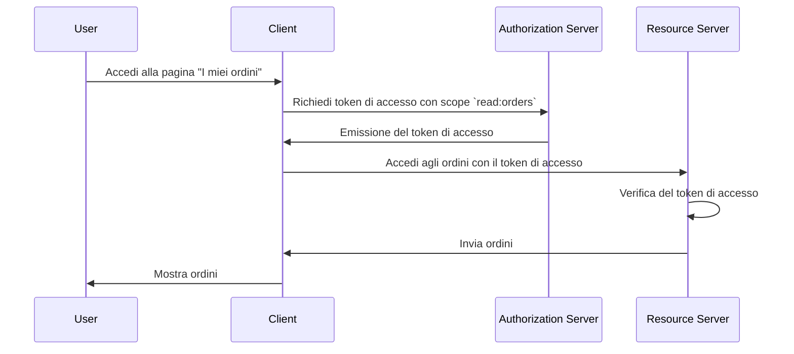

## Che cos'è un server delle risorse?

Nel contesto di <Ref slug="oauth-2.0" />, un **server delle risorse** è un server che ospita le **risorse protette** a cui il <Ref slug="client" /> vuole accedere. Il server delle risorse è anche responsabile della verifica del <Ref slug="access-token" /> e della fornitura delle risorse protette al client secondo le politiche di <Ref slug="access-control" />.

Ad esempio, considera un'applicazione web MyApp che vuole accedere al Google Drive dell'utente. In questo scenario:

- **MyApp** è il client che vuole accedere alle risorse protette.
- **Google** è il server delle risorse che ospita il Google Drive dell'utente.
- **Google** è anche il <Ref slug="authorization-server" /> che emette il token di accesso a MyApp.

Consideriamo un altro esempio in cui un sito di e-commerce vuole accedere alla cronologia degli ordini di un utente da un servizio ordini interno. In questo caso:

- **Sito di e-commerce** è il client che vuole accedere alle risorse protette.
- **Servizio ordini** è il server delle risorse che ospita la cronologia degli ordini dell'utente.
- Se il sito di e-commerce si integra con un servizio OAuth 2.0 o un provider OpenID, quel servizio (provider) funge da authorization server.

## Come funziona un server delle risorse?

OAuth 2.0 definisce i ruoli del server delle risorse e del server di autorizzazione separatamente per fornire una chiara separazione delle responsabilità. Tuttavia, non definisce una rappresentazione specifica del server delle risorse nel framework, riferendosi ad esso come un concetto virtuale che ospita le risorse protette; il <Ref slug="client" /> deve specificare gli <Ref slug="scope">scope</Ref> per le risorse protette a cui vuole accedere.

Supponiamo che il client voglia accedere alla cronologia degli ordini dell'utente dal servizio ordini. Un esempio non normativo di invio di una <Ref slug="token-request" /> per accedere agli ordini potrebbe apparire così:



Nel diagramma di sequenza sopra, il client richiede un token di accesso con lo scope `read:orders` dal server di autorizzazione. Si presume che tutte le parti abbiano concordato il significato dello scope `read:orders`: specifica che il client vuole eseguire azioni di `lettura` sugli `ordini` serviti dal server delle risorse. Il client utilizza quindi il token di accesso per accedere agli ordini dal server delle risorse.

> [!Nota]
> Il significato e la struttura degli scope non sono definiti da OAuth 2.0 e devono essere concordati dal client, dal server di autorizzazione e dal server delle risorse.

Il server delle risorse è responsabile della verifica del token di accesso e della determinazione se il client ha le autorizzazioni necessarie per accedere alle risorse richieste secondo le politiche di <Ref slug="access-control" />. A seconda dell'implementazione, il token di accesso può essere un <Ref slug="opaque-token" /> o un <Ref slug="jwt" />.

## Convenzioni di denominazione

È flessibile nominare il server delle risorse in base al contesto dell'applicazione. Poiché OAuth 2.0 non definisce una rappresentazione specifica del server delle risorse nel parametro <Ref slug="scope" />, è possibile vedere più convenzioni nel settore:

- Omettere il nome del server delle risorse e utilizzare solo l'azione: Ad esempio, `read` e `write`.
- `[verbo]:[risorsa]`: Una convenzione comune è utilizzare la combinazione `verbo` e `risorsa` per specificare le azioni che il client può eseguire sulla risorsa. Ad esempio, `read:orders` e `write:profile`. A volte sono invertiti come `orders:read` e `profile:write`.
- `[uri]:[azione]`: Un'altra convenzione è utilizzare l'URI della risorsa e l'azione che il client può eseguire. Ad esempio, `https://api.example.com/orders:read` e `https://api.example.com/profile:write`.

## Indicatori di risorsa

Vediamo un esempio del parametro scope in una <Ref slug="authentication-request" /> (decodificata):

```plaintext
openid profile email https://api.example.com/orders:read
```

In questo esempio, il parametro `scope` include gli scope `openid`, `profile` ed `email`, che sono scope standard di <Ref slug="openid-connect" />, insieme allo scope `https://api.example.com/orders:read` che specifica la posizione del server delle risorse e il permesso di leggere le risorse.

Sembra accettabile in questo caso specifico, ma man mano che il numero di risorse e scope cresce, può diventare difficile gestire e comprendere gli scope. Per affrontare questo problema, OAuth 2.0 ha introdotto un'estensione chiamata <Ref slug="resource-indicator">indicatori di risorsa</Ref> (RFC 8707) che consente ai client di utilizzare URI per specificare le risorse che vogliono accedere, rendendo i server delle risorse più espliciti nel processo.

Dopo aver aggiunto un parametro indicatore di risorsa alla richiesta di autenticazione (`resource=https://api.example.com/orders`), il parametro scope può essere semplificato a:

```plaintext
openid profile email read
```

Che appare più pulito e più facile da gestire.

> [!Nota]
> Non tutti i server di autorizzazione (provider OpenID) supportano l'estensione dell'indicatore di risorsa. Si prega di controllare attentamente la documentazione del proprio server di autorizzazione prima di utilizzarla.

<SeeAlso slugs={["access-control", "resource-indicator", "resource-owner", "client"]} />

<Resources
  urls={[
    "https://datatracker.ietf.org/doc/html/rfc8707",
  ]}
/>