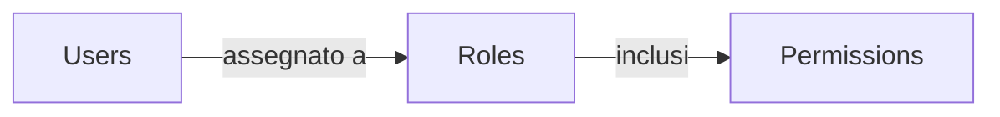

## Ruolo

Un ruolo è uno dei componenti fondamentali in <Ref slug="rbac" />. Serve come contenitore per i permessi che possono essere assegnati agli utenti, agendo come intermediario tra gli utenti e i loro diritti di accesso.



Una struttura tipica di un ruolo contiene un nome e un insieme di permessi:

```typescript
const role = {
  name: 'order_admin',
  permissions: [
    'read:orders',   // Visualizzare i dettagli degli ordini
    'write:orders',  // Modificare gli ordini
    'read:products'  // Visualizzare i prodotti
  ]
}
```

> [!Note]
> I ruoli sono utilizzati principalmente per la gestione dei permessi. Per l'implementazione del controllo degli accessi, è consigliato controllare direttamente i permessi piuttosto che i ruoli. Vedi <Ref slug="rbac" /> per maggiori informazioni.

<SeeAlso slugs={["rbac", "authorization", "access-control"]} />