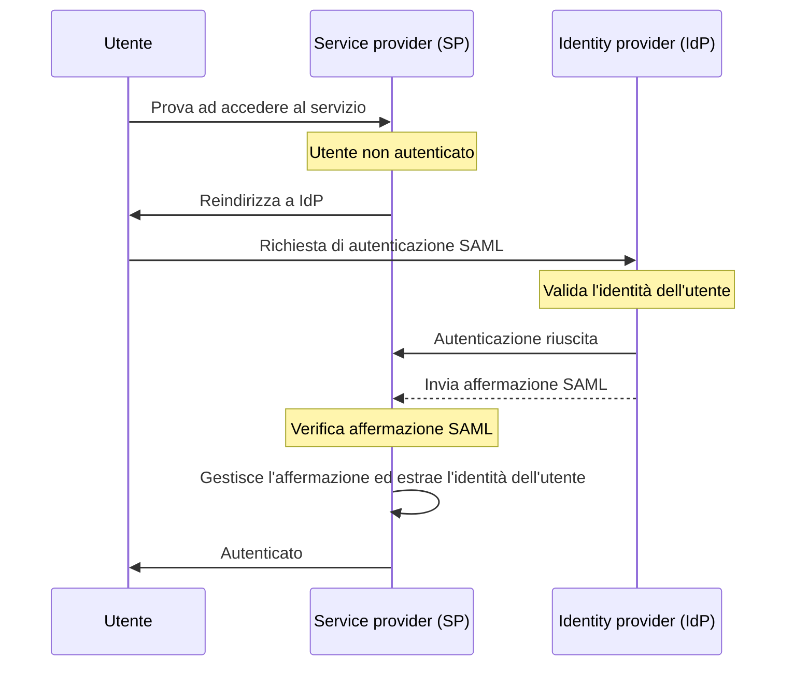

## Cos'è SAML?

SAML (solitamente indicato come SAML 2.0) è uno standard basato su XML per lo scambio di dati di autenticazione (authentication) e autorizzazione (authorization) tra due parti: il <Ref slug="identity-provider" /> e il <Ref slug="service-provider" />. È ampiamente utilizzato per la federazione delle identità e le soluzioni di <Ref slug="enterprise-sso" />.

Come suggerisce il nome, SAML trasmette affermazioni sull'identità e sugli attributi dell'utente. Queste affermazioni sono firmate digitalmente e opzionalmente criptate per garantirne l'integrità e la riservatezza.

## Come funziona SAML?

Prima di approfondire il flusso di autenticazione (authentication) SAML, dobbiamo capire come identity provider e service provider possano riconoscersi e fidarsi l'uno dell'altro. Questa fiducia è stabilita attraverso lo scambio di metadati, dove entrambe le parti condividono informazioni su:

- **Entity ID**: Un identificatore unico per l'identity provider o il service provider.
- **Chiave pubblica**: Utilizzata per verificare le firme digitali nelle affermazioni SAML.
- **Endpoints**: URL per diverse operazioni SAML, come le richieste e le risposte di autenticazione (authentication requests).

Una volta stabilita la fiducia, il flusso di autenticazione SAML può procedere:

### RelayState

Nel flusso SAML, il parametro `RelayState` è utilizzato per mantenere lo stato dell'utente durante il processo di autenticazione. Funziona come un riferimento alla richiesta originale fatta dall'utente prima di essere reindirizzato all'identity provider. Il service provider può utilizzare questo parametro per reindirizzare l'utente alla pagina o risorsa originale dopo l'autenticazione riuscita.

RelayState è anche utilizzato per prevenire attacchi <Ref slug="csrf" /> assicurando che l'utente sia reindirizzato alla pagina corretta dopo l'autenticazione.

### Affermazioni SAML

Le affermazioni SAML sono il componente centrale del protocollo SAML. Contengono informazioni sull'identità dell'utente, sugli attributi e sullo stato di autenticazione. Ci sono tre tipi di affermazioni SAML:

- **Affermazione di autenticazione**: Indica che l'utente è stato autenticato dall'identity provider.
- **Affermazione di attributo**: Contiene informazioni aggiuntive sull'utente, come ruoli, permessi e dati del profilo.
- **Affermazione di decisione di autorizzazione**: Specifica i diritti di accesso dell'utente a risorse specifiche.

## Considerazioni per l'adozione di SAML

SAML è ampiamente adottato negli ambienti aziendali sin dalla sua introduzione nei primi anni 2000. Ecco alcune considerazioni chiave quando si adotta SAML per le tue applicazioni:

- Complessità: Le implementazioni SAML possono essere complesse quando si integrano con le tue applicazioni, specialmente rispetto a framework moderni come <Ref slug="oauth-2.0" /> e <Ref slug="openid-connect" />.
- Efficienza del trasporto: I messaggi SAML possono essere grandi a causa della formattazione XML, il che può influire sulle prestazioni della rete.
- Sicurezza: Le affermazioni SAML devono essere protette da manomissioni e intercettazioni. Assicurati che la tua implementazione SAML segua le migliori pratiche per la crittografia e le firme digitali.

Nonostante queste considerazioni, SAML rimane uno standard robusto e ampiamente utilizzato per la federazione sicura delle identità e le soluzioni di single sign-on negli ambienti aziendali. Tuttavia, per nuove applicazioni o servizi, potresti voler considerare alternative moderne come OAuth 2.0 e OpenID Connect per un approccio più leggero e orientato agli sviluppatori per l'autenticazione e l'autorizzazione.

<SeeAlso slugs={["enterprise-sso", "oauth-2.0", "openid-connect"]} />

<Resources
  urls={[
    "https://blog.logto.io/saml-security-cheat-sheet",
    "https://blog.logto.io/picking-your-sso-method",
    "https://blog.logto.io/differences-between-saml-and-oidc",
  ]}
/>