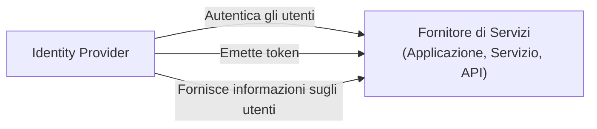

## Cos'è un fornitore di servizi (SP)?

Nel regno di <Ref slug="iam" />, un fornitore di servizi (SP) (o una **parte affidabile** nel contesto di <Ref slug="openid-connect" />) è un'applicazione o servizio che si affida a un <Ref slug="identity-provider" /> per l'autenticazione e l'autorizzazione. È responsabile di fornire servizi agli utenti e di applicare le politiche di <Ref slug="access-control" /> basate sui token emessi dall'identity provider.

## Standard del fornitore di servizi

Non esiste uno standard rigoroso per i fornitori di servizi, poiché possono essere qualsiasi tipo di applicazione o servizio che richiede la gestione dell'identità. Tuttavia, i fornitori di servizi spesso seguono gli standard stabiliti dall'identity provider su cui si basano. Ad esempio, se l'identity provider supporta <Ref slug="openid-connect" />, il fornitore di servizi utilizzerà tipicamente OIDC per l'autenticazione e l'autorizzazione.

## Architettura del fornitore di servizi

Il termine "fornitore di servizi" non specifica una particolare architettura o implementazione. Di solito, i fornitori di servizi devono essere registrati con l'identity provider per stabilire fiducia e abilitare una comunicazione sicura. Il processo di registrazione tipicamente comporta lo scambio di metadati e credenziali del client.

Ad esempio, nel contesto di OpenID Connect, i metadati del fornitore di servizi includono tipicamente:

- **Client ID**: Un identificatore univoco per il fornitore di servizi.
- **Client secret**: Un segreto condiviso utilizzato per autenticare il fornitore di servizi.
- **<Ref slug="redirect-uri">URI di reindirizzamento</Ref>**: Gli URI dove l'identity provider reindirizzerà gli utenti dopo l'autenticazione e l'autorizzazione.

Una volta registrato, il fornitore di servizi può avviare il processo di <Ref slug="authentication" /> reindirizzando gli utenti allo specifico endpoint dell'identity provider.

Quando i fornitori di servizi sono costruiti per casi d'uso senza interazione, sono spesso indicati come <Ref slug="client">client</Ref> che richiedono comunicazione <Ref slug="machine-to-machine" />.

<SeeAlso slugs={["identity-provider", "openid-connect", "oauth-2.0"]} />

<Resources
  urls={[
    "https://blog.logto.io/secure-cloud-apps-with-oauth-and-openid-connect",
    "https://blog.logto.io/incorporate-identity-solution",
    "https://blog.logto.io/centralized-identity-system"
  ]}
/>