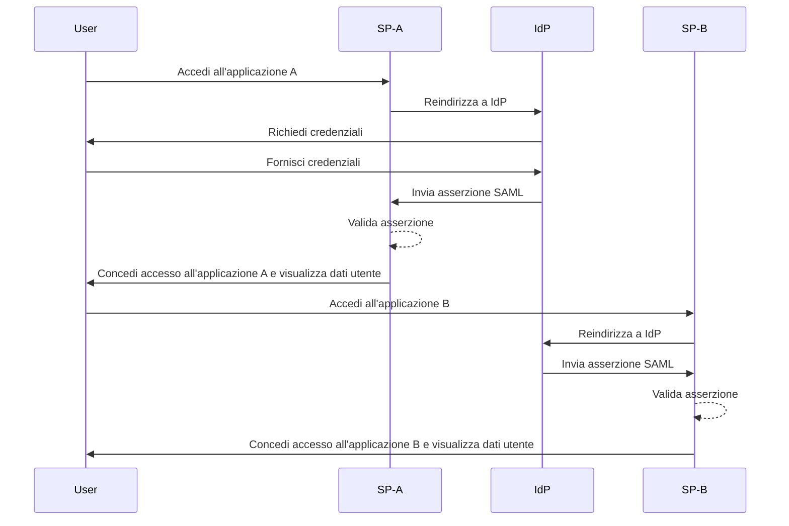
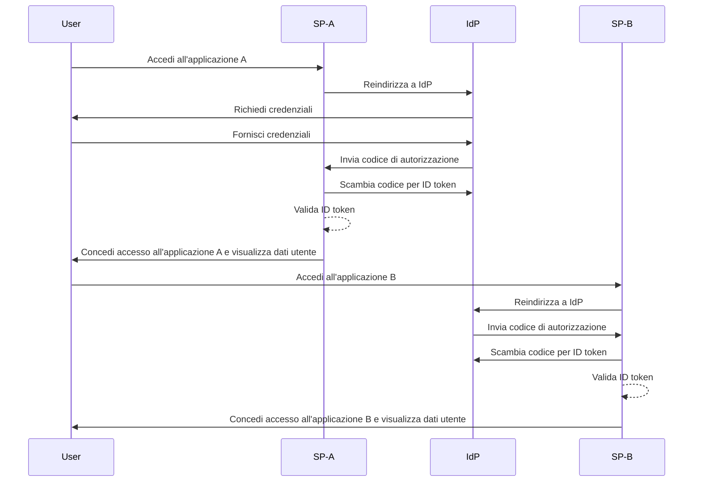

## Cos'è il single sign-on (SSO)?

Il single sign-on (SSO) è un metodo di <Ref slug="authentication" /> che consente agli utenti di accedere a più applicazioni o servizi con un unico set di credenziali. Invece di gestire accessi separati per ciascun sistema, gli utenti si autenticano una volta sola e vengono automaticamente connessi a tutte le piattaforme collegate.

L'SSO è comunemente utilizzato sia in contesti personali che aziendali, specialmente negli ambienti aziendali dove i dipendenti o i lavoratori remoti dipendono da varie applicazioni SaaS per svolgere il loro lavoro. Implementando l'SSO, le organizzazioni possono migliorare la sicurezza, semplificare la gestione degli accessi e aumentare la produttività degli utenti.

Un esempio ben noto di SSO è la suite di servizi di Google, come Gmail, Google Drive e Google Calendar. Dopo aver effettuato l'accesso al proprio account Google, gli utenti possono facilmente accedere a tutti questi servizi senza reinserire le proprie credenziali.

## Come funziona il single sign-on?

L'SSO opera su una relazione di fiducia tra un'applicazione o servizio, noto come <Ref slug="service-provider" /> e un <Ref slug="identity-provider" />. L'IdP gestisce l'autenticazione dell'utente e condivide in modo sicuro le informazioni necessarie con il SP per concedere l'accesso. Questa fiducia è stabilita attraverso un processo chiamato federazione, in cui sia il SP che l'IdP concordano su standard e protocolli specifici per scambiare in modo sicuro i dati di autenticazione.

Quando un utente tenta di accedere a un'applicazione abilitata per SSO, il SP lo reindirizza all'IdP per l'autenticazione. L'IdP richiede all'utente le proprie credenziali, verifica la sua identità e genera un token di sicurezza o un'asserzione contenente le informazioni dell'utente. Questo token viene inviato al SP, che lo utilizza per concedere l'accesso.

Se l'utente tenta di accedere a un'altra applicazione abilitata per SSO, il processo viene ripetuto automaticamente senza richiedere un nuovo accesso. L'IdP invia i dati di autenticazione richiesti direttamente al SP, consentendo all'utente di accedere senza problemi alla nuova applicazione.

<Ref slug="saml" /> e <Ref slug="openid-connect" /> sono due protocolli ampiamente utilizzati per implementare l'SSO. Questi standard definiscono come i dati di autenticazione vengono scambiati tra l'IsP e il SP, garantendo una comunicazione sicura e affidabile.

### SSO basato su SAML

Nell'SSO basato su SAML, una volta che l'utente è autenticato dall'IdP, viene generata un'asserzione SAML basata su XML, firmata e inviata in modo sicuro al SP. Il SP quindi valida l'asserzione e concede l'accesso in base all'identità dell'utente.

### SSO basato su OIDC

OIDC, al contrario, è costruito sopra <Ref slug="oauth-2.0" /> e offre un approccio più moderno all'SSO. Utilizza <Ref slug="jwt" /> per scambiare informazioni di identità tra l'IdP e il SP, fornendo una maggiore sicurezza e flessibilità.

## Vantaggi del single sign-on

1. **Maggiore sicurezza**: L'SSO riduce il rischio di violazioni della sicurezza legate alle password minimizzando il numero di credenziali che gli utenti devono ricordare. Consente inoltre alle organizzazioni di applicare metodi di autenticazione più robusti, come <Ref slug="mfa" />, per proteggere gli account utente.

2. **Esperienza utente migliorata**: Gli utenti possono accedere a più applicazioni senza dover effettuare ripetutamente il login, migliorando la produttività e riducendo la frustrazione. L'SSO semplifica il processo di accesso e fornisce un'esperienza utente coerente su diverse piattaforme.

3. **Gestione centralizzata degli accessi**: Le organizzazioni possono gestire centralmente l'accesso e i permessi degli utenti tramite l'IdP, garantendo politiche di sicurezza e controlli di accesso coerenti su tutte le applicazioni collegate. Questo semplifica i processi di provisioning, deprovisioning e auditing degli utenti.

## Quando utilizzare il single sign-on

1. **Ambienti aziendali e organizzativi**: L'SSO è particolarmente vantaggioso per le aziende che si affidano a più applicazioni e servizi per ottimizzare i flussi di lavoro. Semplifica l'accesso degli utenti e riduce il carico sui team IT per gestire i singoli account utente. Ad esempio, aziende che utilizzano più applicazioni SaaS, come CRM, HR e strumenti di collaborazione.
2. **Applicazioni rivolte ai clienti**: L'SSO può anche migliorare l'esperienza utente per i clienti che accedono a servizi online o piattaforme di e-commerce. Ad esempio, consentendo agli utenti di accedere con i loro account social media o indirizzi email invece di creare nuovi account per ciascun servizio.
3. **Servizi multi-prodotto**: Le aziende che offrono una suite di prodotti o servizi interconnessi possono sfruttare l'SSO per fornire un'esperienza utente senza soluzione di continuità tra le loro offerte. Gli utenti possono navigare tra diverse applicazioni senza il fastidio di ripetuti accessi. Ad esempio, G Suite di Google. Gli utenti possono accedere una volta sul loro browser Chrome e accedere a più servizi Google senza reinserire le proprie credenziali.

L'uso dell'SSO non è limitato a questi scenari e può essere adattato a vari casi d'uso in base alle esigenze specifiche di un'organizzazione o applicazione. È ampiamente considerato una best practice per migliorare la sicurezza, l'esperienza utente e l'efficienza operativa negli ambienti digitali moderni.

<SeeAlso slugs={["enterprise-sso"]} />