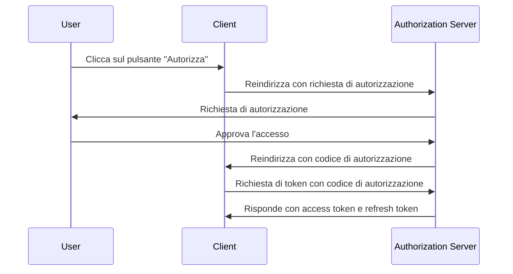
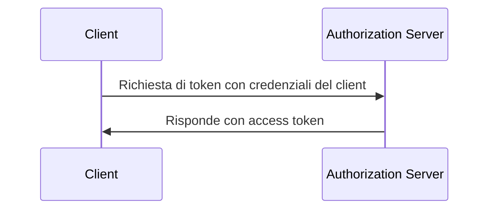

## Cos'è una richiesta di token?

In <Ref slug="oauth-2.0" /> e <Ref slug="openid-connect" />, una richiesta di token è una richiesta al <Ref slug="authorization-server" /> (o <Ref slug="openid-connect" headingId="openid-provider-op" /> in OIDC) per lo scambio di credenziali (ad esempio, codice di autorizzazione, refresh token) per un insieme di token. L'insieme di token tipicamente include uno o più dei seguenti:

- <Ref slug="access-token" />: Un token che concede l'accesso a risorse protette.
- <Ref slug="id-token" />: Un token che contiene informazioni sull'utente (specifico di OIDC).
- <Ref slug="refresh-token" />: Un token che può essere utilizzato per ottenere un nuovo access token senza interazione dell'utente.

A seconda del <Ref slug="oauth-2.0-grant">grant type</Ref> utilizzato, la richiesta può includere diversi parametri e restituire diversi token.

Ad esempio, nel <Ref slug="client-credentials-flow" />, il <Ref slug="client" /> richiede direttamente un <Ref slug="access-token" /> con le credenziali del client. Ecco un esempio non normativo della richiesta di token:

```http
POST /token HTTP/1.1
Host: authorization-server.example.com
Content-Type: application/x-www-form-urlencoded

grant_type=client_credentials
  &client_id=client-id
  &client_secret=client-secret
  &scope=read
```

Se la richiesta ha successo, il server di autorizzazione risponde con un access token:

```http
HTTP/1.1 200 OK
Content-Type: application/json

{
  "access_token": "eyJhbGci...zHg",
  "token_type": "Bearer",
  "expires_in": 3600,
  "scope": "read"
}
```

## Come funziona una richiesta di token?

Come mostra l'esempio sopra, la richiesta di token stessa è semplice. Il client invia una richiesta HTTP all'endpoint di token del server di autorizzazione con i parametri necessari. Il server di autorizzazione valida la richiesta, la elabora e restituisce i token nella risposta.

Tuttavia, a seconda del tipo di grant (flusso) specifico utilizzato, la richiesta di token potrebbe richiedere più preparazione.

### Authorization code flow

Nel <Ref slug="authorization-code-flow" />, il client ottiene prima un codice di autorizzazione avviando una <Ref slug="authorization-request" /> (o <Ref slug="authentication-request" /> in OIDC) con il server di autorizzazione. Una volta che l'utente concede il permesso, il client scambia il codice di autorizzazione per un access token e opzionalmente un refresh token tramite la richiesta di token.

Ecco un diagramma di sequenza semplificato del authorization code flow:



### Client credentials flow

Come mostra l'esempio nella prima sezione, il <Ref slug="client-credentials-flow" /> è molto più semplice. Il client richiede direttamente un access token con le sue credenziali. Il server di autorizzazione valida le credenziali del client e rilascia un access token se ha successo.

Ecco un diagramma di sequenza non normativo del client credentials flow:



### Refresh token

In alcuni tipi di grant, il client può anche richiedere <Ref slug="offline-access" /> includendo lo scope `offline_access` nella richiesta di autorizzazione. Se concesso, il server di autorizzazione rilascia un refresh token insieme all'access token. Il client può utilizzare il refresh token per ottenere un nuovo access token tramite la richiesta di token senza interazione dell'utente.

Ecco un esempio non normativo di utilizzo di un refresh token per ottenere un nuovo access token:

```http
POST /token HTTP/1.1
Host: authorization-server.example.com
Content-Type: application/x-www-form-urlencoded

grant_type=refresh_token
  &refresh_token=refresh-token
  &client_id=client-id
  &client_secret=client-secret
```

---

Altri <Ref slug="oauth-2.0-grant">grant types</Ref> possono anche coinvolgere richieste di token, ma l'idea di base rimane la stessa.

## Parametri chiave in una richiesta di token

Ecco alcuni parametri chiave comunemente usati in una richiesta di token:

- **`grant_type`**: Il tipo di grant richiesto. Valori comuni includono `authorization_code`, `client_credentials`, `refresh_token`, ecc.
- **`client_id`**: L'identificatore del client emesso dal server di autorizzazione.
- **`client_secret`**: Il segreto del client emesso dal server di autorizzazione (per client riservati).
- **`code`**: Il codice di autorizzazione ottenuto dal server di autorizzazione (per il authorization code flow).
- **`refresh_token`**: Il refresh token ottenuto dal server di autorizzazione (per il rinnovo degli access token).
- **`scope`**: Gli <Ref slug="scope">scopes</Ref> richiesti (permessi) per l'access token.
- **`redirect_uri`**: L'URI dove il server di autorizzazione invia la risposta (per il authorization code flow).
- **`code_verifier`**: Il verificatore del codice utilizzato nell'estensione <Ref slug="pkce" /> (per il authorization code flow).

I parametri effettivi e i loro valori dipendono dal tipo di grant e dai requisiti specifici dell'applicazione. Prima di effettuare una richiesta di token, dovresti fare riferimento all'elenco completo dei parametri per il tipo di grant specifico che stai utilizzando.

<SeeAlso slugs={["oauth-2.0", "openid-connect", "authorization-request", "authentication-request"]} />