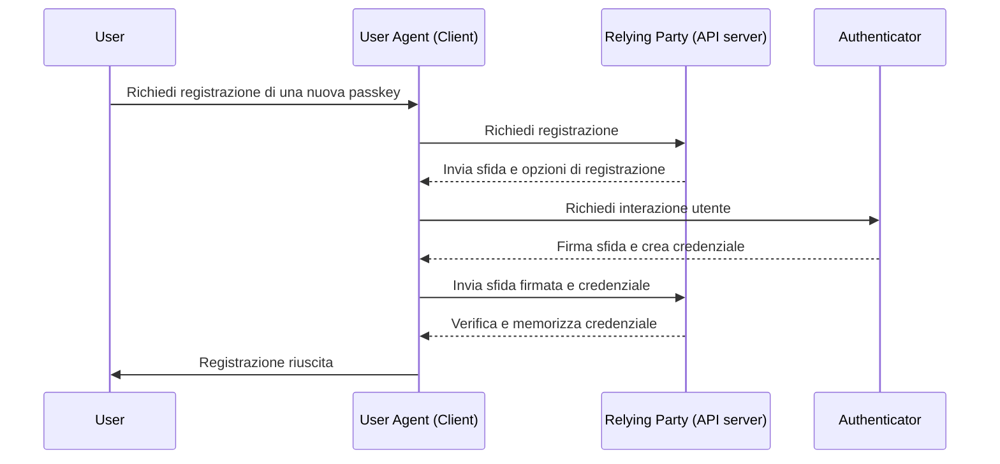
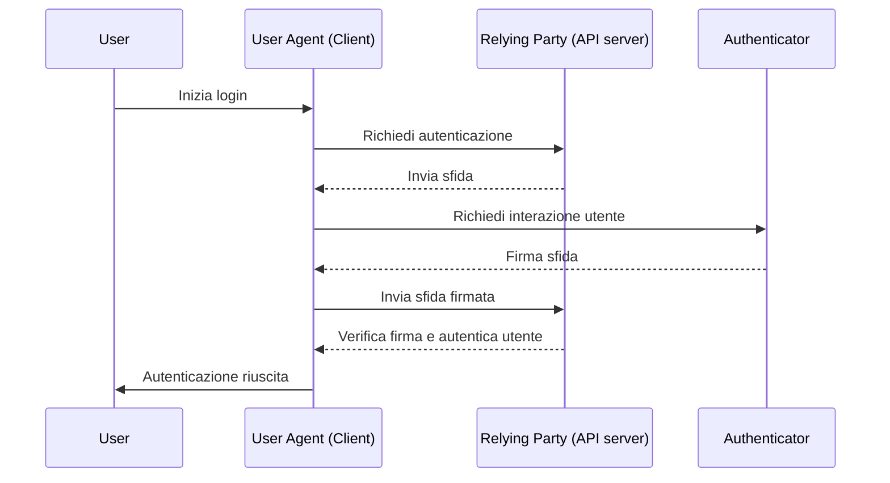

## Cos'è WebAuthn?

WebAuthn (Web Authentication API), sviluppato dal [W3C](https://www.w3.org/) e dalla [FIDO Alliance](https://fidoalliance.org/), è una specifica per l'autenticazione web sicura utilizzando gli standard FIDO2. WebAuthn fornisce un'API per consentire ai siti web di implementare <Ref slug="passkey" />, che sono credenziali resistenti al phishing protette dalla crittografia a chiave pubblica. Le passkey possono sostituire le password sia per i login senza password che per il <Ref slug="mfa" />.

## Come appare il flusso di lavoro di WebAuthn?

Ecco un esempio reale per capire meglio. Hai un'applicazione web MyApp che vuole integrare l'API WebAuthn per implementare Passkey per l'autenticazione a più fattori.

**Fase di registrazione:** Dopo aver effettuato l'accesso con una verifica email e impostato una nuova password, all'utente viene chiesto di creare una Passkey. Sceglie di collegare il proprio dispositivo utilizzando un'impronta digitale. Questo stabilisce la Passkey in modo sicuro sul loro dispositivo.

**Fase di autenticazione:** Durante il prossimo accesso, all'utente viene chiesto di verificare la propria Passkey dopo aver inserito la password. Con una semplice scansione dell'impronta digitale, può facilmente completare il processo di autenticazione.


Per fornire una spiegazione più dettagliata, possiamo dividere il processo in due fasi: registrazione e autenticazione. Innanzitutto, è essenziale comprendere le quattro entità chiave coinvolte nel flusso di WebAuthn.

### 4 entità chiave

1. **Utente:** L'individuo che tenta di accedere a un'applicazione web.
2. **User agent:** Il browser web che gestisce le chiamate API di WebAuthn e gestisce il processo di autenticazione tra l'utente, la relying party e l'autenticatore.
3. **Relying party:** Il servizio, l'applicazione o il server API a cui l'utente cerca di accedere.
4. **Autenticatore:** Il componente hardware o software utilizzato per verificare l'identità dell'utente. Può assumere varie forme in base alla piattaforma o alla capacità del browser, come chiavi di sicurezza (come Yubikeys), telefoni o tablet (collegati tramite Bluetooth, NFC o USB), biometria basata su dispositivi o PIN, ecc.

### Registrazione WebAuthn

La crittografia asimmetrica a chiave pubblica è il processo centrale.

1. **Generazione della coppia di chiavi**: 
L'user agent genera una coppia di chiavi pubblica-privata.
    - **Chiave pubblica**: Condivisa con la relying party.
    - **Chiave privata**: Rimane memorizzata in modo sicuro nell'autenticatore dell'utente.
2. **Sfida di registrazione**: 
Quando l'utente tenta di registrare una passkey, la relying party invia una sfida di registrazione all'user agent.
3. **Verifica dell'utente**: 
L'user agent inoltra la sfida all'autenticatore, che richiede all'utente di verificarsi (ad esempio, autenticazione biometrica o una chiave di sicurezza hardware).
4. **Firma crittografica:** 
L'autenticatore utilizza la sua chiave privata per firmare la sfida, creando una firma crittografica.
5. **Verifica e accesso:** 
L'user agent invia la sfida firmata alla relying party, che verifica la firma utilizzando la chiave pubblica e completa il processo di registrazione.



### Autenticazione WebAuthn

1. **Sfida di autenticazione:**
Quando l'utente tenta di accedere, la relying party invia una sfida di autenticazione all'user agent.
2. **Verifica dell'utente:**
L'user agent invia la sfida all'autenticatore, che richiede all'utente di verificarsi (ad esempio, autenticazione biometrica o una chiave di sicurezza hardware).
3. **Firma crittografica:**
L'autenticatore utilizza la sua chiave privata per firmare la sfida, creando una firma crittografica.
4. **Verifica e accesso:**
L'user agent verifica la firma utilizzando la chiave pubblica e informa la relying party di un'autenticazione riuscita. L'accesso è concesso se la verifica ha successo.



## Come utilizzare WebAuthn?

L'API WebAuthn può essere utilizzata per implementare l'accesso con passkey o la verifica in due passaggi. Consulta l'esperienza Passkey per ulteriori dettagli.

Per utilizzare l'API di autenticazione web (WebAuthn) per un'autenticazione sicura, è necessario gestire due processi principali: registrazione e autenticazione. Ecco semplici esempi di codice su come potresti implementare questi processi utilizzando JavaScript.

**Registrazione**

La relying party (la tua applicazione web) avvia il processo di registrazione chiamando il metodo `navigator.credentials.create()`.

```jsx
// Registrazione
navigator.credentials.create({
  publicKey: {
    rp: {
      name: "Nome della tua relying party",
      id: "id-della-tua-relying-party"
    },
    user: {
      id: "id-utente",
      displayName: "Nome Utente",
      name: "Nome Utente"
    },
    challenge: "valore-della-tua-sfida",
    timeout: 60000 // 60 secondi
  }
}).then(credential => {
  // Memorizza l'id della credenziale per future autenticazioni
  localStorage.setItem("credentialId", credential.id);
}).catch(error => {
  console.error("Errore di registrazione:", error);
});
```

La relying party avvia il processo di autenticazione chiamando il metodo `navigator.credentials.get()`.

```jsx
// Autenticazione
navigator.credentials.get({
  publicKey: {
    rp: {
      name: "Nome della tua relying party",
      id: "id-della-tua-relying-party"
    },
    challenge: "valore-della-tua-sfida",
    timeout: 60000 // 60 secondi
  }
}).then(credential => {
  // Verifica l'id della credenziale e altre proprietà
  if (credential.id === localStorage.getItem("credentialId")) {
    // Autenticazione riuscita
    console.log("Utente autenticato con successo");
  } else {
    console.error("Credenziale non valida");
  }
}).catch(error => {
  console.error("Errore di autenticazione:", error);
});
```

Per conoscere i dettagli, leggi le specifiche: https://fidoalliance.org/specifications/download/.

Nota: Nelle azioni WebAuthn, sia per la registrazione che per l'autenticazione, il "rp ID" (relying party ID) è un campo obbligatorio. Rappresenta il nome di dominio della pagina web corrente. Se non corrisponde al dominio corrente, il browser rifiuterà la richiesta. Ciò significa che le passkey sono legate a un dominio specifico e attualmente non c'è modo di migrare le passkey esistenti a un dominio diverso. Inoltre, le passkey non possono essere utilizzate su domini diversi.

## WebAuth e OpenID Connect (OIDC)

Combinando la forte sicurezza di WebAuthn con il protocollo di identità standardizzato di OIDC, possiamo creare un'esperienza di autenticazione più sicura e user-friendly.

Scopri come funziona:

- **Fase di registrazione**: Gli utenti completano un processo di registrazione standard <Ref slug="openid-connect" /> (ad esempio, verifica email e creazione password). WebAuthn genera una coppia di chiavi pubblica-privata, memorizzando la chiave pubblica con il <Ref slug="identity-provider" /> OIDC e mantenendo la chiave privata sul dispositivo dell'utente.
- **Fase di autenticazione**: Gli utenti accedono a una risorsa protetta da OIDC e vengono reindirizzati alla pagina di accesso. Dopo aver fornito le credenziali di base (ad esempio, email e password), il sistema invoca WebAuthn per l'autenticazione con passkey. Una volta verificata la Passkey, OIDC emette un Access Token o un ID Token per l'accesso dell'utente.

## Qual è la differenza tra WebAuthn e CTAP2?

**WebAuthn** e **CTAP2** sono entrambi componenti essenziali dello standard FIDO2, ma servono a scopi distinti:

- **CTAP2 (Client to Authenticator Protocol 2):** Questo protocollo definisce come un dispositivo, come una chiave di sicurezza o uno smartphone, comunica con un'applicazione web. Stabilisce un canale sicuro tra l'**autenticatore** e il **dispositivo dell'utente**, garantendo che i dati di autenticazione sensibili siano protetti.
- **WebAuthn (Web Authentication API):** Questa API fornisce un modo standardizzato per le applicazioni web di interagire con gli autenticatori compatibili con CTAP2. Gestisce il processo di autenticazione, inclusa la scambio di dati di autenticazione tra il **dispositivo dell'utente** e la **relying party**.

<SeeAlso slugs={["passkey", "mfa", "openid-connect"]} />

<Resources
  urls={[
    "https://fidoalliance.org/specs/fido-v2.0-id-20180227/fido-client-to-authenticator-protocol-v2.0-id-20180227.html",
    "https://blog.logto.io/webauthn-nextjs",
    "https://blog.logto.io/webauthn-base-knowledge"
  ]}
/>