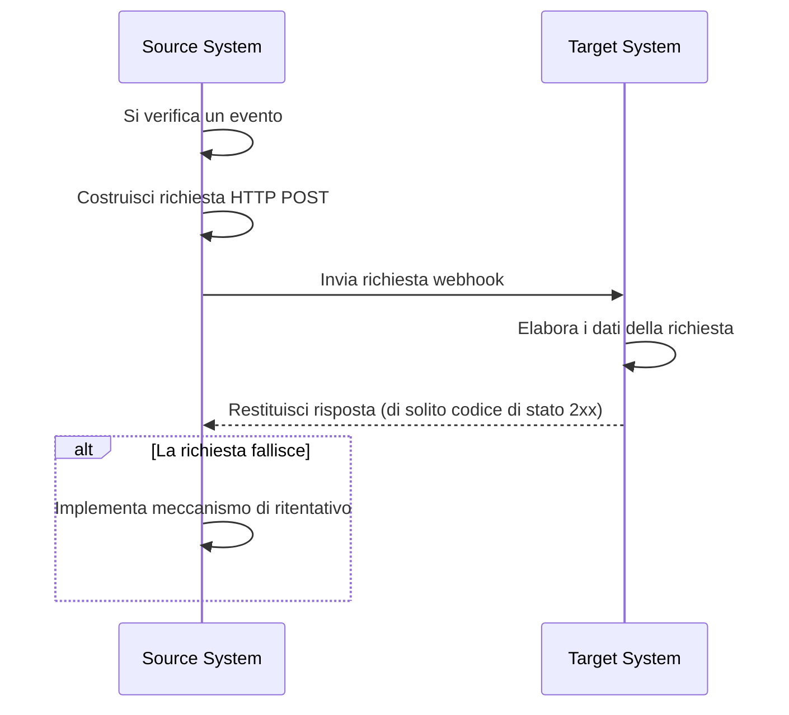
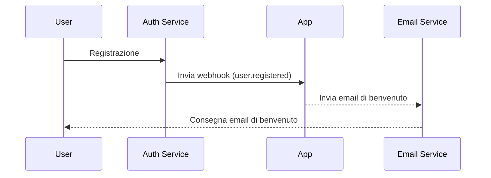

## Che cos'è un webhook?

Un webhook è un meccanismo di callback HTTP che consente alle applicazioni di inviare notifiche in tempo reale a URL predefiniti quando si verificano eventi specifici. Questo meccanismo consente lo scambio automatico di dati e la comunicazione in tempo reale tra i sistemi.

## Come funzionano i webhook?



1. Si verifica un evento specifico nel sistema sorgente
2. Il sistema sorgente costruisce una richiesta HTTP POST contenente i dati dell'evento
3. Il sistema sorgente invia la richiesta all'URL del sistema di destinazione preconfigurato
4. Il sistema di destinazione riceve la richiesta ed elabora i dati
5. Il sistema di destinazione restituisce una risposta al sistema sorgente
6. Se la richiesta fallisce, il sistema sorgente può implementare un meccanismo di ritentativo

## Come funzionano i webhook in uno scenario reale?

Prendiamo come esempio un'applicazione integrata con un servizio di auth. Quando un nuovo utente si registra, l'applicazione invierà un'email di benvenuto all'utente.

Tipicamente, il servizio di auth fornisce un evento webhook `user.registered` che viene attivato quando un nuovo utente completa la registrazione.

Il payload dell'evento webhook contiene le informazioni dell'utente come email e nome utente, che possono essere utilizzate per inviare l'email di benvenuto:

```json
// Nota: la struttura effettiva del payload dipende dal servizio di auth.
{
  "event": "user.registered",
  "timestamp": "2024-03-21T08:00:00Z",
  "data": {
    "user_id": "u_1234567890",
    "email": "john@example.com",    // Indirizzo email per inviare l'email di benvenuto
    "username": "johndoe",          // Nome utente per personalizzare l'email
    "registered_at": "2024-03-21T08:00:00Z"
  }
}
```

Ecco come funziona il flusso del webhook:



## Quali sono le migliori pratiche per implementare i webhook?

Quando sei il mittente (produttore) dei webhook, considera i seguenti aspetti:

### Progettazione del webhook

Progetta strutture di webhook chiare e coerenti:

- Definisci tipi di eventi chiari: Ad esempio, `order.created`, `user.updated`, ecc.
- Usa il formato JSON standard: Assicurati che la struttura dei dati sia chiara e facile da analizzare.
- Controllo delle versioni: Includi informazioni sulla versione negli header della richiesta o nel payload. Ad esempio:

  ```javascript
  // Negli header della richiesta
  headers: {
    'Content-Type': 'application/json',
    'X-Webhook-Version': '1.0'
  }
  
  // O nel payload
  {
    "version": "1.0",
    "event_type": "order.created",
    "data": {
      // Dettagli dell'evento
    }
  }
  ```

- Fornisci contesto sufficiente: Includi timestamp di quando si sono verificati gli eventi, identificatori unici per le risorse correlate, ecc.
- Mantieni la coerenza: Usa convenzioni di denominazione e strutture dati coerenti per tutti i tipi di eventi.

### Meccanismo di invio

Implementa un meccanismo di invio dei webhook affidabile:

- Usa code di attività asincrone: Evita di bloccare il programma principale e migliora la reattività del sistema.
- Implementa meccanismi di ritentativo: Gestisci i fallimenti di rete o la temporanea indisponibilità del ricevitore.

### Strategia di ritentativo

Progetta una strategia di ritentativo appropriata:

- Implementa il backoff esponenziale: Evita ritentativi frequenti che potrebbero stressare il sistema e il ricevitore.
- Imposta un conteggio massimo di ritentativi: Previeni ritentativi infiniti che consumano risorse di sistema.
- Fornisci meccanismi di ritentativo manuale: Offri un'interfaccia per ritentativi manuali per i webhook che alla fine falliscono.

### Implementazione della sicurezza

Implementa un meccanismo di firma per consentire ai ricevitori di verificare l'autenticità delle richieste:

```javascript
const crypto = require('crypto');

function generateSignature(payload, secret) {
  return crypto.createHmac('sha256', secret)
    .update(JSON.stringify(payload))
    .digest('hex');
}

function sendWebhookWithSignature(url, payload, secret) {
  const signature = generateSignature(payload, secret);
  return axios.post(url, payload, {
    headers: { 'X-Webhook-Signature': signature }
  });
}
```

### Ottimizzazione delle prestazioni

Ottimizza le prestazioni di invio dei webhook:

- Usa pool di connessioni: Riduci il sovraccarico di stabilire connessioni e migliora le prestazioni.
- Implementa l'elaborazione in batch: Invia i webhook in batch quando appropriato per ridurre il numero di interazioni di rete.

### Documentazione e strumenti di test

Fornisci supporto per gli utenti dei webhook:

- Documentazione API dettagliata: Includi tutti i possibili tipi di eventi, formati di richiesta e descrizioni dei campi.
- Fornisci strumenti di test: Implementa endpoint di test dei webhook per consentire agli utenti di simulare la ricezione di notifiche webhook.
- Codice di esempio: Fornisci esempi di integrazione in vari linguaggi di programmazione.

## Quali sono le migliori pratiche per utilizzare i webhook?

Quando utilizzi i webhook come ricevitore (consumatore), considera i seguenti aspetti:

### Sicurezza

Poiché gli endpoint per ricevere i webhook sono generalmente accessibili pubblicamente, la sicurezza è una preoccupazione primaria. Presta attenzione ai seguenti punti:

- Verifica l'autenticità della richiesta: Implementa un meccanismo di verifica della firma per garantire che le richieste provengano da mittenti attesi.
  
  ```javascript
  const crypto = require('crypto');

  function verifySignature(payload, signature, secret) {
    const expectedSignature = crypto
      .createHmac('sha256', secret)
      .update(JSON.stringify(payload))
      .digest('hex');
    
    return crypto.timingSafeEqual(
      Buffer.from(signature),
      Buffer.from(expectedSignature)
    );
  }
  ```

- Usa HTTPS: Assicurati che il tuo endpoint di ricezione dei webhook utilizzi HTTPS per prevenire che i dati vengano intercettati o manomessi durante la trasmissione.
- Implementa la whitelist degli IP: Accetta solo richieste webhook da indirizzi IP fidati per ridurre il rischio di attacchi.

### Affidabilità

Per garantire una gestione affidabile dei webhook ricevuti:

- Implementa l'elaborazione idempotente: Progetta il tuo sistema per gestire correttamente le notifiche webhook duplicate, poiché i mittenti possono ritentare le richieste fallite.
- Rispondi rapidamente: Restituisci una risposta (di solito un codice di stato 2xx) immediatamente dopo aver ricevuto una richiesta webhook per evitare che il mittente consideri la richiesta fallita e attivi un ritentativo.

### Prestazioni

Mantieni un funzionamento efficiente del sistema:

- Elaborazione asincrona: Dopo aver ricevuto un webhook, esegui l'elaborazione effettiva dei dati in background senza bloccare la risposta.
- Imposta limiti di timeout: Imposta periodi di timeout ragionevoli per l'elaborazione dei webhook per evitare che attività di lunga durata influenzino le prestazioni del sistema.

### Gestione degli errori

Gestisci adeguatamente le situazioni di errore potenziali:

- Logging: Mantieni registri dettagliati delle richieste webhook ricevute e delle procedure di elaborazione per facilitare l'indagine sui problemi.
- Degradazione graduale: Implementa meccanismi di gestione degli errori appropriati quando non è possibile elaborare i webhook per garantire che altre parti del sistema non siano influenzate.

### Compatibilità delle versioni

Poiché i formati dei webhook possono cambiare nel tempo:

- Gestisci le informazioni sulla versione: Preparati a gestire diverse versioni dei formati dei webhook. Le informazioni sulla versione sono solitamente fornite nell'URL o negli header della richiesta.
- Compatibilità retroattiva: Quando aggiorni la tua logica di gestione dei webhook, assicurati di continuare a supportare le versioni dei formati più vecchie.

### Monitoraggio

Monitora continuamente la ricezione e l'elaborazione dei webhook:

- Imposta avvisi: Implementa il monitoraggio in tempo reale e avvisi per situazioni anomale (come alti tassi di fallimento o traffico insolito).
- Metriche delle prestazioni: Tieni traccia delle metriche delle prestazioni per l'elaborazione dei webhook, come il tempo di risposta e il tasso di successo.

<Resources
  urls={[
    "https://docs.logto.io/docs/recipes/webhooks/",
    "https://docs.logto.io/docs/recipes/webhooks/securing-your-webhooks/",
    "https://en.wikipedia.org/wiki/Webhook"
  ]}
/>