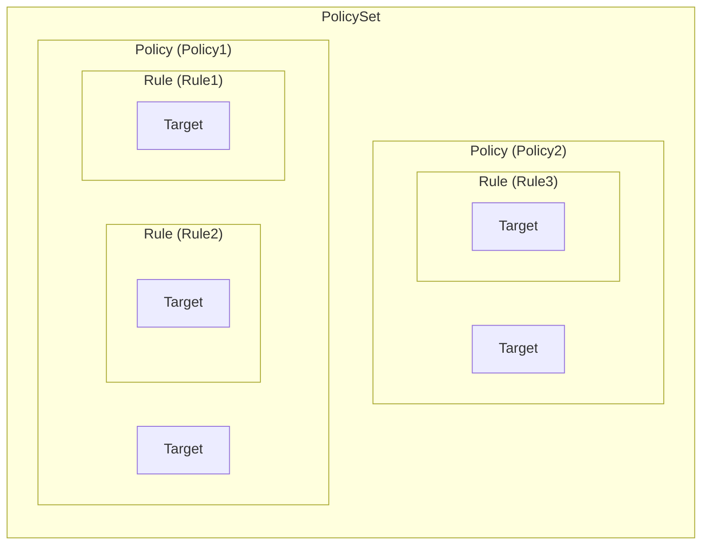
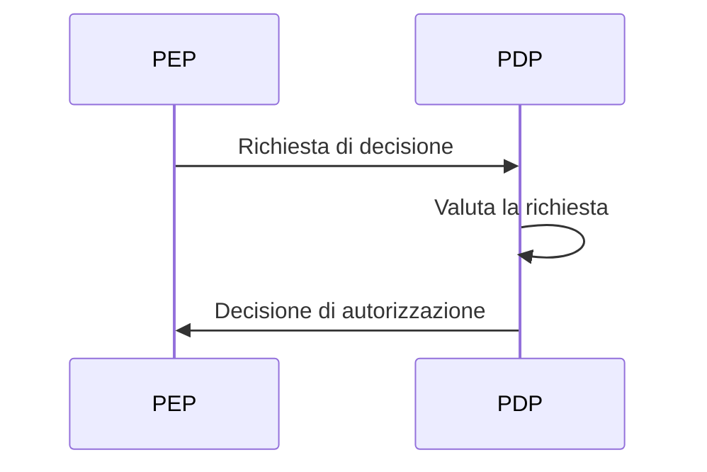
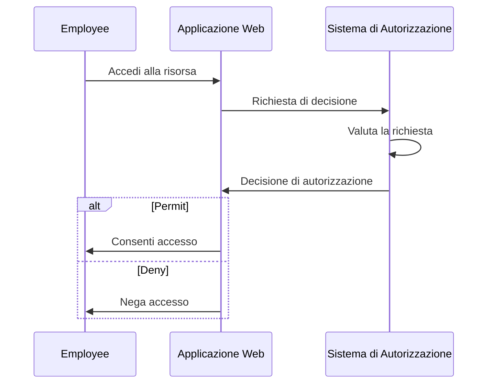
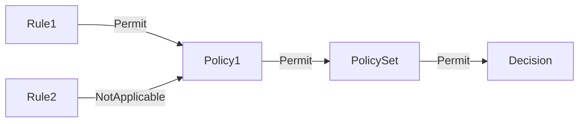
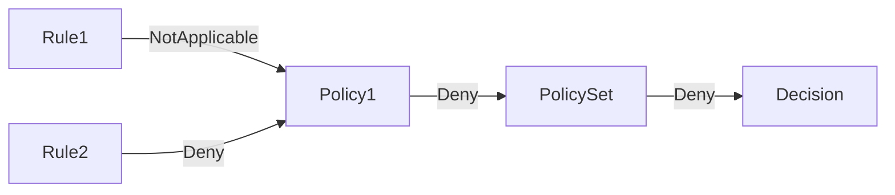

## Cos'è XACML?

Come suggerisce il nome, eXtensible Access Control Markup Language (XACML) è un linguaggio basato su XML utilizzato principalmente per il controllo degli accessi. È uno standard definito dall'Organization for the Advancement of Structured Information Standards (OASIS).

[XACML 3.0](https://docs.oasis-open.org/xacml/3.0/xacml-3.0-core-spec-os-en.html) è l'ultima versione dello standard, rilasciata nel 2013. Sebbene non specifichi un particolare modello di controllo degli accessi, XACML è spesso utilizzato per implementare politiche di <Ref slug="abac" />. Vediamo un semplice esempio di come XACML può essere utilizzato per rappresentare politiche ABAC:

```xml
<PolicySet PolicySetId="ABAC_Policies" PolicyCombiningAlgId="urn:oasis:names:tc:xacml:3.0:policy-combining-algorithm:deny-overrides">
  <Description>Politiche ABAC</Description>
  <Policy PolicyId="Policy1" RuleCombiningAlgId="urn:oasis:names:tc:xacml:3.0:rule-combining-algorithm:deny-overrides">
    <Description>Gli impiegati possono leggere i dati</Description>
    <Target>
      <AnyOf>
        <AllOf>
          <Match MatchId="urn:oasis:names:tc:xacml:1.0:function:string-equal">
            <AttributeValue DataType="http://www.w3.org/2001/XMLSchema#string">read</AttributeValue>
            <AttributeDesignator
              AttributeId="urn:oasis:names:tc:xacml:1.0:action:action-id"
              Category="urn:oasis:names:tc:xacml:3.0:attribute-category:action"
              DataType="http://www.w3.org/2001/XMLSchema#string"
              MustBePresent="true"
            />
          </Match>
        </AllOf>
      </AnyOf>
    </Target>
    <Rule RuleId="Rule1" Effect="Permit">
      <Target>
        <AnyOf>
          <AllOf>
            <Match MatchId="urn:oasis:names:tc:xacml:1.0:function:string-equal">
              <AttributeValue DataType="http://www.w3.org/2001/XMLSchema#string">employee</AttributeValue>
              <AttributeDesignator
                AttributeId="urn:oasis:names:tc:xacml:1.0:subject:subject-id"
                Category="urn:oasis:names:tc:xacml:1.0:subject-category:access-subject"
                DataType="http://www.w3.org/2001/XMLSchema#string"
                MustBePresent="true"
              />
            </Match>
          </AllOf>
        </AnyOf>
      </Target>
    </Rule>
    <Rule RuleId="Rule2" Effect="Deny">
      <Target>
        <AnyOf>
          <AllOf>
            <Match MatchId="urn:oasis:names:tc:xacml:1.0:function:string-equal">
              <AttributeValue DataType="http://www.w3.org/2001/XMLSchema#string">user</AttributeValue>
              <AttributeDesignator
                AttributeId="urn:oasis:names:tc:xacml:1.0:subject:subject-id"
                Category="urn:oasis:names:tc:xacml:1.0:subject-category:access-subject"
                DataType="http://www.w3.org/2001/XMLSchema#string"
                MustBePresent="true"
              />
            </Match>
          </AllOf>
        </AnyOf>
      </Target>
    </Rule>
  </Policy>
  <!-- ...altre politiche... -->
</PolicySet>
```

XACML fa un buon lavoro con le convenzioni di denominazione autoesplicative. Il linguaggio è progettato per essere leggibile e facile da comprendere.

In poche parole, questa politica afferma che gli impiegati sono autorizzati a leggere i dati, mentre agli utenti è negato di leggere i dati. Analizziamo la politica esaminando i componenti chiave:

- `<PolicySet>`: L'elemento radice del set di politiche. Un `PolicySet` può contenere più elementi `Policy` e `PolicySet`, formando una gerarchia di politiche.
- `<Policy>`: Una politica che contiene una o più regole. Ogni politica può avere:
  - Un elemento `Target` che specifica le condizioni in cui la politica si applica.
  - Più elementi `Rule` che definiscono le regole di controllo degli accessi.
  - Un attributo `RuleCombiningAlgId` che specifica come le regole sono combinate per prendere una decisione.
- `<Rule>`: Una regola che definisce le condizioni in cui l'accesso è concesso o negato. Ogni regola ha:
  - Un elemento `Target` che specifica le condizioni in cui la regola si applica.
  - Un attributo `Effect` che specifica se la regola permette o nega l'accesso.

> [!Note]
> I componenti e gli attributi disponibili in XACML non sono limitati a quelli appena menzionati. Consulta la [specifica XACML 3.0](https://docs.oasis-open.org/xacml/3.0/xacml-3.0-core-spec-os-en.html) per un elenco completo di elementi e attributi.

Una rappresentazione grafica della relazione tra i diversi componenti chiave è mostrata di seguito:



Una spiegazione dettagliata di altri elementi e attributi nell'esempio sarà fornita nelle sezioni successive.

## Come funziona XACML

Per semplicità, supponiamo che sia definita solo una politica nel set di politiche sopra. Per attivare il processo di valutazione della politica, è necessario inviare una **richiesta di decisione** da un **punto di applicazione della politica (PEP)** a un **punto di decisione della politica (PDP)**. Il PDP valuta la richiesta rispetto alla politica e restituisce una **decisione di autorizzazione** al PEP.



- PEP: Il componente che invia la richiesta di decisione al PDP e applica la decisione di autorizzazione (cioè esegue <Ref slug="access-control" />).
- PDP: Il componente che valuta la richiesta di decisione rispetto alla politica e restituisce la decisione di autorizzazione.

Utilizziamo un esempio del mondo reale per sostituire il linguaggio shakespeariano. Supponiamo che ci sia un'applicazione web che consente agli impiegati di accedere a determinate risorse e che l'applicazione sia integrata con un sistema di autorizzazione basato su XACML.

Quando un impiegato tenta di accedere a una risorsa, l'applicazione web (**PEP**) invia una **richiesta di decisione** al sistema di autorizzazione (**PDP**). Una volta che il sistema di autorizzazione valuta la richiesta rispetto alla politica XACML, restituisce una **decisione di autorizzazione** all'applicazione web.



## Richiesta di decisione

Una richiesta di decisione in XACML è composta dai seguenti componenti chiave:

- **Subject**: L'entità che richiede l'accesso a una risorsa. Può essere un utente, un dispositivo o qualsiasi altra entità.
- **Resource**: La risorsa a cui si accede. Può essere un file, un database, un endpoint API o qualsiasi altra risorsa.
- **Action**: L'azione eseguita sulla risorsa. Può essere lettura, scrittura, eliminazione o qualsiasi altra azione.
- **Environment**: Il contesto in cui viene effettuata la richiesta di accesso. Può includere informazioni come l'ora del giorno, la posizione o qualsiasi altra informazione contestuale.

Ecco un esempio di una richiesta di decisione in XACML:

```xml
<Request>
  <Attributes Category="urn:oasis:names:tc:xacml:3.0:attribute-category:resource">
    <Attribute AttributeId="urn:oasis:names:tc:xacml:1.0:resource:resource-id" DataType="http://www.w3.org/2001/XMLSchema#string">
      <AttributeValue>http://example.com/data</AttributeValue>
    </Attribute>
  </Attributes>
  <Attributes Category="urn:oasis:names:tc:xacml:3.0:attribute-category:action">
    <Attribute AttributeId="urn:oasis:names:tc:xacml:1.0:action:action-id" DataType="http://www.w3.org/2001/XMLSchema#string">
      <AttributeValue>read</AttributeValue>
    </Attribute>
  </Attributes>
  <Attributes Category="urn:oasis:names:tc:xacml:3.0:attribute-category:subject">
    <Attribute AttributeId="urn:oasis:names:tc:xacml:1.0:subject:subject-id" DataType="http://www.w3.org/2001/XMLSchema#string">
      <AttributeValue>employee</AttributeValue>
    </Attribute>
  </Attributes>
</Request>
```

## Processo di valutazione

Una volta che il PDP recupera il set di politiche, valuta la richiesta di decisione come segue:

1. **Corrispondenza del target**: Per ogni politica, il PDP verifica se la richiesta corrisponde al target della politica. Se la richiesta corrisponde al target, il PDP procede a valutare le regole.
2. **Valutazione delle regole**: Il PDP valuta ciascuna regola nella politica. Se il target di una regola corrisponde alla richiesta, il PDP valuta la condizione della regola. Se la condizione è vera, il PDP restituisce l'effetto della regola (consenti o nega). Se la condizione è falsa, il PDP continua a valutare la regola successiva.
3. **Combinazione delle regole**: Il PDP combina gli effetti di tutte le regole nella politica in base all'attributo `RuleCombiningAlgId` della politica. L'effetto combinato viene quindi restituito come decisione della politica.
4. **Combinazione delle politiche**: Se il set di politiche contiene più politiche, il PDP combina le decisioni di tutte le politiche in base all'attributo `PolicyCombiningAlgId` del set di politiche. La decisione combinata viene quindi restituita come decisione finale di autorizzazione.

### Esempio 1

Ad esempio, nel set di politiche, supponiamo che la richiesta di decisione sia come sopra. Il PDP valuterebbe la richiesta rispetto alla politica `Policy1` come segue:

#### Corrispondenza del target

Il `Target` della politica specifica che qualsiasi soggetto che ha un ID azione di `read` dovrebbe essere valutato dalla politica. Poiché l'azione della richiesta è `read`, la richiesta corrisponde al target della politica.

#### Valutazione delle regole

La politica contiene due regole:

1. `Rule1`: Poiché l'ID soggetto della richiesta è `employee`, la condizione della regola è vera e l'effetto della regola è `Permit`.
2. `Rule2`: Poiché l'ID soggetto della richiesta non è `user`, la condizione della regola è falsa e l'effetto della regola è `NotApplicable`.

#### Combinazione delle regole e delle politiche

- Poiché `Policy1` utilizza l'algoritmo di combinazione delle regole `deny-overrides`, la decisione della politica è `Permit` perché `Rule1` consente l'accesso e il suo effetto prevale sull'effetto `NotApplicable` di `Rule2`.
- Anche il set di politiche utilizza l'algoritmo di combinazione delle politiche `deny-overrides`, e la decisione finale è `Permit` perché la decisione della politica è `Permit`.

Ecco una rappresentazione grafica non normativa del processo di valutazione:



### Esempio 2

Ora, consideriamo una diversa richiesta di decisione in cui tutti gli altri attributi sono gli stessi, ma l'ID soggetto è `user` invece di `employee`.

#### Corrispondenza del target

Poiché l'azione è invariata, la richiesta corrisponde ancora al target della politica.

#### Valutazione delle regole

- `Rule1`: L'ID soggetto della richiesta non è `employee`, quindi la condizione della regola è falsa e l'effetto della regola è `NotApplicable`.
- `Rule2`: L'ID soggetto della richiesta è `user`, quindi la condizione della regola è vera e l'effetto della regola è `Deny`.

#### Combinazione delle regole e delle politiche

- La decisione della politica è `Deny` perché `Rule2` nega l'accesso e il suo effetto prevale sull'effetto `NotApplicable` di `Rule1`.
- La decisione finale è `Deny` perché l'algoritmo di combinazione delle politiche `deny-overrides` del set di politiche restituisce la decisione più restrittiva.

Ecco una rappresentazione grafica non normativa del processo di valutazione:



### Esempio 3

Infine, consideriamo una richiesta di decisione in cui l'azione è `write` invece di `read`. Tutti gli altri attributi rimangono gli stessi come nell'esempio 1.

#### Corrispondenza del target

La richiesta non corrisponde più al target della politica perché l'azione è `write`, non `read`. Pertanto, la politica non viene valutata.

#### Combinazione delle regole e delle politiche

Poiché la politica non viene valutata, la decisione finale è `NotApplicable`.

Ecco una rappresentazione grafica non normativa del processo di valutazione:


## Algoritmi di combinazione

XACML definisce diversi algoritmi di combinazione standard che determinano come gli effetti di più regole o politiche sono combinati per prendere una decisione. Negli esempi sopra, abbiamo menzionato l'algoritmo di combinazione `deny-overrides` sia per le regole che per le politiche.

Come suggerisce il nome, l'algoritmo `deny-overrides` dà priorità alle decisioni `Deny` rispetto alle decisioni `Permit`. Ecco una spiegazione semplificata di come funziona l'algoritmo `deny-overrides`:

- se una qualsiasi regola o politica nega l'accesso, la decisione finale è `Deny`; 
- se nessuna regola o politica nega l'accesso e ALMENO una regola o politica consente l'accesso, la decisione finale è `Permit`;
- se nessuna regola o politica nega l'accesso e NESSUNA regola o politica consente l'accesso, la decisione finale è `NotApplicable`.

L'algoritmo effettivo è più complesso e tiene conto di altre decisioni "indeterminate" come `Indeterminate{D}` e `Indeterminate{P}`.

> [!Note]
> Questo algoritmo non fornisce una decisione di "fallback" nel caso in cui nessuna regola o politica corrisponda alla richiesta. In tali casi, la decisione è `NotApplicable`.

Per un elenco completo degli algoritmi di combinazione e del loro comportamento, consulta la [specifica XACML 3.0](https://docs.oasis-open.org/xacml/3.0/xacml-3.0-core-spec-os-en.html#_Toc325047268).

## Considerazioni sull'implementazione

XACML è un linguaggio potente per esprimere politiche di controllo degli accessi basate su attributi. Prima di implementare XACML nel tuo sistema, considera quanto segue:

- Progettazione del controllo degli accessi: XACML è flessibile ed espressivo, ma richiede una progettazione attenta poiché può coinvolgere set di politiche complessi che possono portare a conseguenze indesiderate.
- Complessità: Le politiche XACML sono spesso complesse e possono essere difficili da gestire. Per la maggior parte delle applicazioni, modelli di controllo degli accessi più semplici come <Ref slug="rbac" /> possono essere più appropriati.
- Prestazioni: La valutazione delle politiche XACML può essere computazionalmente costosa, specialmente quando si gestiscono set di politiche di grandi dimensioni. Considera le implicazioni sulle prestazioni dell'utilizzo di XACML nel tuo sistema.

<SeeAlso slugs={['abac', 'rbac', 'access-control', 'authorization']} />

<Resources
  urls={[
    'https://docs.oasis-open.org/xacml/3.0/xacml-3.0-core-spec-os-en.html',
  ]}
/>