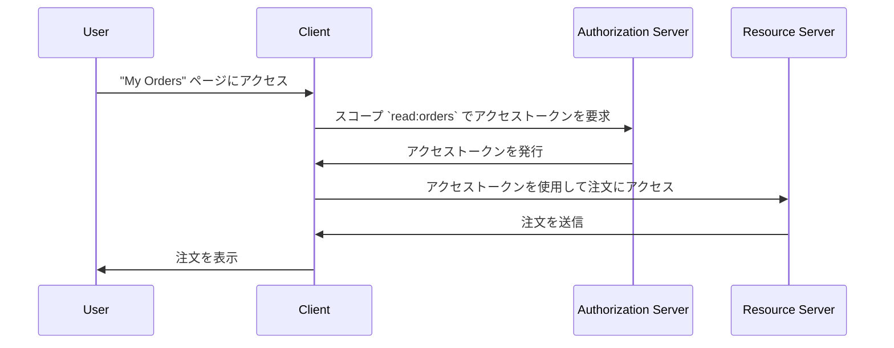

## アクセス制御 (Access control) とは？

アクセス制御 (Access control) には3つの主要なコンポーネントがあります:

- **主体 (Subject)**: リソースに対してアクションを実行するエンティティです。主体はユーザー、サービス、デバイスである可能性があります。
- **リソース (Resource)**: アクセス制御 (Access control) によって保護されるエンティティです。リソースはファイル、データベース、API、またはその他のデジタル資産である可能性があります。
- **アクション (Action)**: 主体がリソースに対して実行できる操作です。アクションには読み取り、書き込み、実行、またはその他の操作が含まれます。

> アクセス制御 (Access control) は、**主体 (Subject)** と **アクション (Action)** に基づいて、**リソース (Resource)** への選択的アクセス制限を定義します。

以下はアクセス制御 (Access control) のいくつかの現実世界の例です:

- ユーザー (主体) は、EC システムで自分の注文 (リソース) を読み取る (アクション) ことができます。
- ユーザー (主体) は、ソーシャルネットワークで他のユーザーのプロフィール (リソース) を削除する (アクション) ことができません。
- サービス (主体) は、マイクロサービスアーキテクチャでデータベース (リソース) にデータを書き込む (アクション) ことができます。

技術的な実装では、時々リソースを無視し、アクセス制御 (Access control) を誰 (主体) が何のアクションを実行できるかの制限として定義します。例えば、基本的な OAuth 2.0 フレームワークはスコープ (権限) を使用してアクションのみを指定し、リソースを定義しません。

<Ref slug="authorization-server" /> や <Ref slug="identity-provider" /> に応じて、アクセス制御 (Access control) のサポートは異なる場合があります。一部のシステムでは、OAuth 2.0 の拡張である [OAuth 2.0 のリソースインジケーター](https://datatracker.ietf.org/doc/html/rfc8707) をサポートしており、クライアントがアクセスしたいリソースを指定できます。

## アクセス制御 (Access control) モデル ||access-control-models||

少数の主体とリソース間で制限を決定するのは簡単ですが、スケーラブルではありません。したがって、業界では効果的に管理するために多くのアクセス制御 (Access control) モデルを開発しています。<Ref slug="iam" /> の文脈では、以下が一般的なアクセス制御 (Access control) モデルです:

- <Ref slug="rbac" />: 権限を役割に割り当て、その役割を主体に割り当てるモデルです。例えば、管理者の役割はすべてのリソースにアクセスできるかもしれませんが、ユーザーの役割は限定されたリソースにしかアクセスできないかもしれません。
- <Ref slug="abac" />: 主体、リソース、環境の属性 (プロパティ) を利用してアクセス制御 (Access control) の決定を行うモデルです。例えば、"department=engineering" という属性を持つユーザーが、エンジニアリングのリソースにアクセスできるかもしれません。

他にも [ポリシーベースのアクセス制御 (PBAC)](https://csrc.nist.gov/glossary/term/policy_based_access_control) などのアクセス制御 (Access control) モデルがあります。各モデルにはそれぞれの強みと弱みがあり、モデルの選択はユースケースと要件に依存します。

## OAuth 2.0 におけるアクセス制御 (Access control)

OAuth 2.0 の文脈では、アクセス制御 (Access control) は通常 <Ref slug="scope">スコープ</Ref> を使用して実装されます。通常、スコープの値はリソースとアクションを組み合わせた文字列です。例えば、`read:orders` や `write:profile` です。

> [!Note]
> "スコープ (Scopes)" という用語は、ほとんどの場合 "権限" と同義です。

OAuth 2.0 はスコープの構造と意味を定義していないことに注意する価値があります。スコープの解釈は <Ref slug="resource-server" /> に任されており、スコープの発行は <Ref slug="authorization-server" /> に任されています。

例えば、ユーザー (主体) が EC システムで自分の注文 (リソース) にアクセスする必要がある場合、OAuth 2.0 を活用してスコープ `read:orders` を定義し、Web アプリケーション (クライアント) が認可サーバーからこのスコープを要求することができます。以下は簡略化されたフローです:

このフローでは、技術的アーキテクチャに応じて、リソースサーバーは API サービスであるか、リソース (注文) にアクセスする能力を持っている限り、クライアント (Web アプリケーション) 自身である場合もあります。

### リソースインジケーターパラメータ

人々はしばしばスコープをリソースとアクションで定義します (例: `read:orders`、ここで `orders` はリソースで `read` はアクションです) が、リソースとアクションの数が増えるとこの方法のスケーラビリティに制限があります。RFC 8707 は OAuth 2.0 に `resource` パラメータ (つまり <Ref slug="resource-indicator">リソースインジケーター</Ref>) を導入し、クライアントがアクセスしたいリソースを指定できるようにします。

RFC は `resource` パラメータがリソースを表す URI であるべきことを指定しています。たとえば、単に `orders` を使用する代わりに、`https://api.example.com/orders` を使用できます。この方法は、実際のリソース URL を使用することで、名前の競合を防ぎ、リソースのマッチングの精度を高めます。

### 認可サーバーのサポート

OAuth 2.0 は認可サーバーがどのようにアクセス制御 (Access control) を実施すべきかを定義していません。実装の詳細は認可サーバーに委ねられています。したがって、認可サーバーの選択はアクセス制御 (Access control) メカニズムに大きく影響します。例えば、一部の認可サーバーはリソースインジケーターをサポートしているかもしれませんが、そうでないものもあります。ビジネス要件に基づいてどのアクセス制御 (Access control) モデルを使用するかを決定し、そのモデルをサポートする認可サーバーを選択することが重要です。アクセス制御 (Access control) モデルに確信が持てない場合、<Ref slug="rbac" /> はほとんどの場合で十分です。

<SeeAlso slugs={["rbac", "abac", "resource-indicator", "authorization"]} />

<Resources
  urls={[
    "https://blog.logto.io/mastering-rbac",
    "https://blog.logto.io/rbac-and-abac",
    "https://datatracker.ietf.org/doc/html/rfc8707",
    "https://blog.logto.io/organization-and-role-based-access-control",
  ]}
/>
