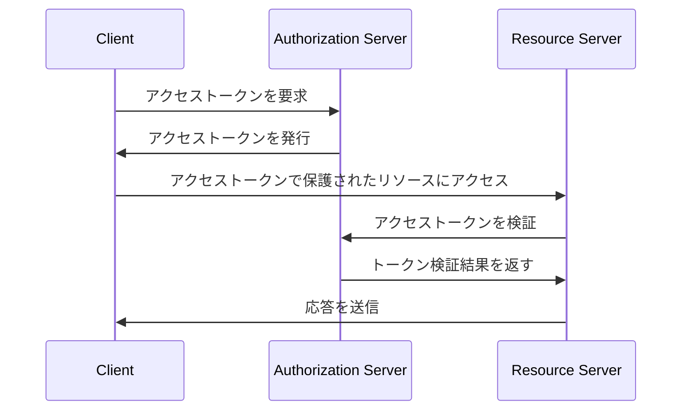
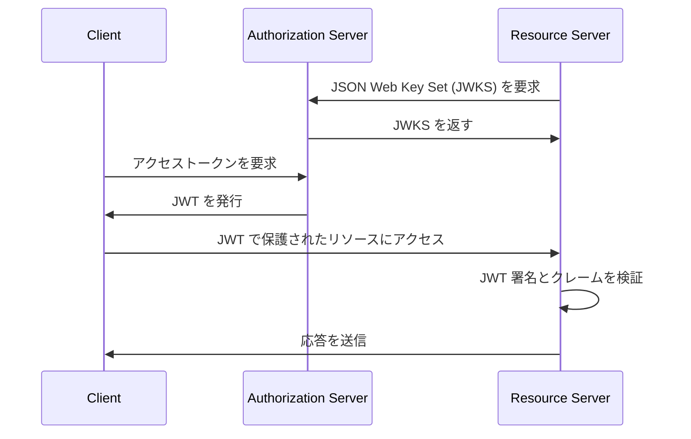
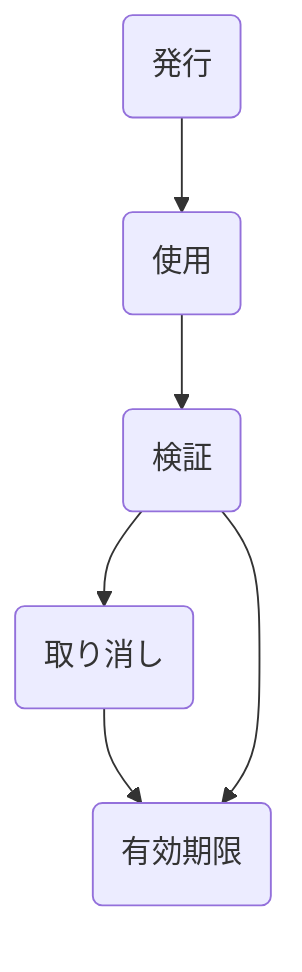

## アクセストークンとは何ですか？

アクセストークンは、通常文字列形式の資格情報で、保護されたリソースにアクセスするために使用されます。OAuth 2.0 と OpenID Connect (OIDC) のコンテキストでは、<Ref slug="authorization-server">認可サーバー</Ref> は、クライアント（アプリケーション）に対して認証および認可が成功した後にアクセストークンを発行することがあります。

OAuth 2.0 と OIDC の RFC ではアクセストークンの実装詳細を指定していませんが、実際には次の2つの一般的なタイプのアクセストークンが使用されます：

- <Ref slug="opaque-token" />: クライアントにとって意味を持たない（「不透明な」）ランダムな文字列。クライアントはトークンをリソースサーバーに提示し、トークンは認可サーバーで検証されます。
- <Ref slug="jwt" />: <Ref slug="claim">クレーム</Ref>（例: ユーザーID、有効期限）を含み、デジタル署名が付与された自己完結型トークン。リソースサーバーは追加の要求を認可サーバーに行わずにトークンを検証することができます。

## アクセストークンはどう機能しますか？

アクセストークンのタイプに応じて、アクセストークンの使用フローは異なる場合があります。

以下は不透明なアクセストークンを使用するシンプルな例です：

以下は JWT を使用するシンプルな例です：

リソースサーバーがトークンを検証する方法の違いは次のようになります：

- 不透明なトークンの場合、リソースサーバーはトークンを受け取るたびに認可サーバーに追加の要求を行ってトークンを検証する必要があります。
- JWT の場合、トークンに必要なすべての情報が含まれているため、リソースサーバーは認可サーバーに追加の要求を行わずにトークンを検証することができ、また、リソースサーバーは認可サーバーの JSON Web Key Set (JWKS) から公開鍵をキャッシュすることができます。

アクセストークンは通常短命で、有効期限があります（例: 1時間）。クライアントは現在のトークンが期限切れになると新しいアクセストークンを要求する必要があります。

## どのタイプのトークンを使用すべきですか？

不透明なトークンと JWT の選択は、アプリケーションのユースケースとセキュリティ要件に依存します。以下は2つのトークンタイプの比較です：

|                | 不透明なトークン               | JWT                                                           |
|----------------|-------------------------------|---------------------------------------------------------------|
| フォーマット         | ランダム文字列                    | 自己完結型 JSON オブジェクト                                    |
| パフォーマンス      | 追加の要求が必要                  | 検証が高速                                               |
| 自己完結型       | いいえ                          | はい                                                           |
| トークンサイズ     | 小さい                          | 大きい                                                        |
| 取り消し          | 即時                            | トークンの期限切れまたは認可サーバーとのインタラクションが必要          |
| 拡張性           | 限定的                           | カスタムクレーム                                              |
| ステートレス      | いいえ                          | はい                                                           |
| セキュリティ       | トークンの検証が必要               | 署名の検証が必要                                             |
| 標準            | いいえ                          | はい (RFC 7519)                                               |

2つのトークンタイプのどちらを選択するかについて詳しく知りたい方は、[不透明なトークン vs JWT](https://blog.logto.io/opaque-token-vs-jwt) を参照してください。

## 認可サーバーとリソースサーバーの役割

ほとんどの場合、<Ref slug="authorization-server" /> には以下の責任があります：

- 認証と認可が成功した後、クライアントにアクセストークンを発行します。認可サーバーはアクセス制御ポリシー（例: ユーザー同意、<Ref slug="rbac" />、<Ref slug="abac" />）に基づき、トークン要求をスコープダウン（サブセットに権限を縮小）または拒否します。
- アクセストークンが認可サーバーによって発行されたものであり、期限切れでないか、取り消されていないかを確認します（<Ref slug="token-introspection" />）。
- トークンに関する情報（例: スコープ、有効期限）をトークンのインスペクションや <Ref slug="userinfo-endpoint" /> 経由で提供します。

認可サーバーがアクセストークンの意味を解釈しないことに注意する必要があります。たとえば、アクセストークンには `read:orders` というスコープが含まれているかもしれませんが、認可サーバーはそのスコープの意味を知りません。リソースサーバーがアクセストークンを解釈し、トークンのスコープに基づいて <Ref slug="access-control" /> を施行する責任があります。つまり、<Ref slug="resource-server" /> には通常以下の責任があります：

- アクセストークンの<Ref slug="claim">クレーム</Ref>（例: 有効期限、リソースインジケーター、スコープ）を検証します。
- トークンのクレーム（通常はスコープ）に基づいてアクセス制御を施行します。
- アクセストークンが有効な場合、保護されたリソースを提供します。

## アクセストークンのライフサイクル

アクセストークンのライフサイクルは通常、次のステージを含みます：

<SeeAlso slugs={['opaque-token', 'jwt', 'token-introspection', 'userinfo-endpoint', 'access-control']} />

<Resources
  urls={[
    "https://blog.logto.io/opaque-token-vs-jwt",
    "https://blog.logto.io/oauth2-token-introspection",
    "https://blog.logto.io/understanding-tokens-in-oidc",
    {
      url: "https://datatracker.ietf.org/doc/html/rfc6749#section-1.4",
      result: {
        ogTitle: "OAuth 2.0 Access Token",
      },
    },
    "https://datatracker.ietf.org/doc/html/rfc7662",
  ]}
/>
