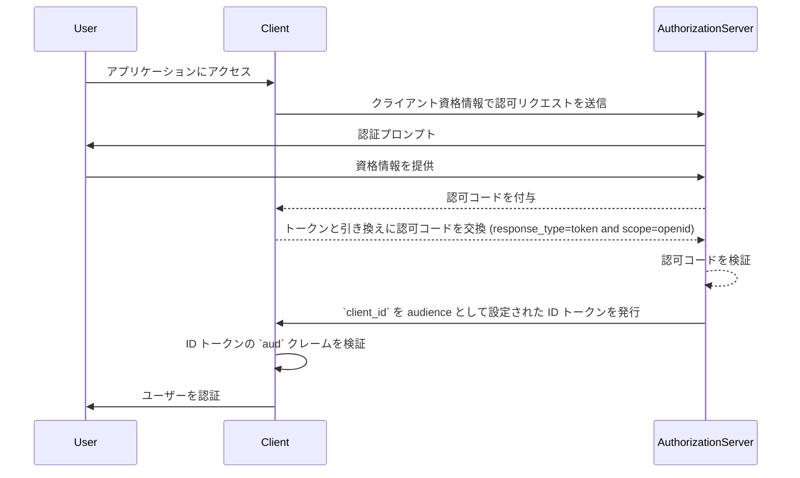
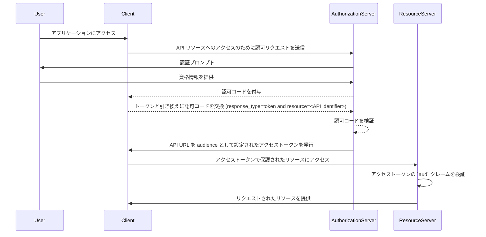

## Audience とは？

<Ref slug="authentication" /> と <Ref slug="authorization" /> のコンテキストにおいて、audience は、認可トークンの想定される受信者を定義する重要なコンポーネントです。<Ref slug="jwt" /> では、[aud](https://datatracker.ietf.org/doc/html/rfc7519#section-4.1.3) クレームとして言及され、このクレームはトークンが指定されたサービスやアプリケーションにのみ受け入れられることを保証します。通常、audience クレームは、トークンが意図するアプリケーションの client_id またはトークンがアクセスを許可された API やリソースを表す URL のいずれかを含みます。audience を指定することにより、許可されていないサービスやユーザーによる誤用を防ぐためのセキュリティ制御として機能します。

## Audience はどのように機能するのか？

クライアントが<Ref slug="access-token" />を認可サーバーにリクエストするとき、audience クレームがトークンレスポンスに含まれます。この audience の値は、トークンが提示された際にリソースサーバーによって検証されます。リソースサーバーは、トークン内の audience クレームが自分の識別子または保護しているサービスの識別子と一致するかどうかを確認します。一致しない場合、トークンは拒否され、分散システム、特に複数のマイクロサービスや API が関与するシナリオでセキュリティが強化されます。audience クレームを制御することにより、開発者はトークンが適切なコンテキストで使用されることを保証し、アプリケーションの認証および認可ワークフローに追加の保護層を追加できます。

- **リクエスター**: クライアントアプリケーションはトークンをリクエストする際に audience 値を指定します。
- **イシューア (Issuer)**: 認可サーバーはトークンレスポンスに audience クレームを含めます。
- **ベリファイア**: トークンの受信者は、自分の識別子と audience クレームをチェックします。audience クレームが受信者の識別子と一致する場合、トークンは有効とみなされます。そうでない場合は拒否されます。

## JWT における Audience の例

### OpenID Connect (OIDC) ID トークンにおける Audience クレーム

```json
{
  "header": {
    "alg": "RS256",
    "typ": "JWT",
    "kid": "abc123"
  },
  "payload": {
    "iss": "https://auth.logto.io",
    "sub": "test_user",
    "aud": "client_id_foo",
    "exp": 1516239022,
    "iat": 1516239022,
    "nonce": "n-0S6_WzA2Mj",
    "primary_email": "foo@logto.io",
    "email_verified": true,
    "username": "foo"
  },
  "signature": "..."
}
```

<Ref slug="openid-connect" /> の <Ref slug="id-token" /> は、認証されたユーザーに関する情報を含むセキュリティトークンであり、認証が成功した後、クライアントアプリケーションに届けられます。アクセス トークンとは異なり、ID トークンはユーザーの識別情報を利用する側 (クライアント) に伝えるために特別に設計されています。これらのトークンは通常、JWT としてエンコードされており、ユーザーの識別子 (sub クレーム)、イシューア (iss クレーム)、audience (aud クレーム) などのクレームを含みます。

この場合、`aud` クレームは ID トークンの想定される受信者を指定しており、それはクライアントアプリケーションです。`aud` クレームの値は通常、トークンをリクエストしたアプリケーションの `client_id` に対応しています。クライアントアプリケーションが ID トークンを受け取った時、そのトークンが自分のものであることを確認するために audience クレームを検証します。この検証ステップにより、トークンの不正使用やユーザー情報への無許可のアクセスを防止し、認証プロセスのセキュリティを強化します。



### アクセストークンにおける Audience クレーム

```json
{
  "header": {
    "alg": "RS256",
    "typ": "JWT",
    "kid": "abc123"
  },
  "payload": {
    "iss": "https://auth.logto.io",
    "sub": "test_user",
    "aud": "https://example.logto.app/api/users",
    "exp": 1516239022,
    "iat": 1516239022,
    "scope": "read write",
    "client_id": "client_id_foo"
  },
  "signature": "..."
}
```

ID トークンとは異なり、<Ref slug="access-token" /> は API やサービスなどの保護されたリソースへのアクセスを許可するために使用されます。アクセストークン内の `aud` クレームはトークンの想定受信者を指定し、通常はトークンがアクセスを許可された API やサービスです。通常、API をホストするリソースサーバーは、トークンをリクエストしたクライアントアプリケーションとは異なるドメインを持っています。この場合、`client_id` の代わりに、トークンが意図した API エンドポイントの URL を含む `aud` クレームを設定します。この URL は、ターゲットリソースを一意に識別するためのリソースインディケーターまたは API 識別子として知られています。

リソースサーバーがアクセストークンを受け取ったとき、その `aud` クレームを検証してトークンが自分のものであることを確認します。audience をチェックすることにより、リソースサーバーはリソースへの無許可のアクセスを防止し、トークンの想定される受信者に基づいたアクセス制御ポリシーを実施できます。このメカニズムは、機微なデータを保護し、アクセストークンが適切なコンテキストで使用されることを保証し、システム全体のセキュリティを強化します。



## FAQs

### トークン検証において、audience クレームが重要なのはなぜですか？

audience クレームはトークン検証において重要です。なぜなら、それがトークンが意図された受信者にのみ受け入れられることを保証するからです。audience クレームを検証することにより、受信者はトークンの不正使用やリソースへの不正アクセスを防ぐことができます。このセキュリティ制御は、複数のサービスが相互に連携する分散システムでは特に重要であり、アクセス制御ポリシーを実施し、機密データを保護するのに役立ちます。

### トークンは複数の audience を持つことができますか？

セキュリティ上の理由から、トークンには単一の audience を持たせることが推奨されます。不明確さを防ぎ、トークンが適切なコンテキストで使用されることを保証するためです。ただし、特定のシナリオでは、同じドメイン内で複数のサービスや API にトークンが向けられている場合のように、複数の audience を持つトークンが必要な場合もあります。そのような場合、開発者はマルチ audience トークンを使用することの影響を十分に考慮し、潜在的なリスクを軽減するための適切なセキュリティ対策を実装するべきです。

### audience クレームにおける API 識別子として何を使用するべきですか？

API やサービスを表すアクセストークン内の audience クレームを指定する際には、リソースを一意に識別する絶対 URI を使用することが推奨されます。この URI は、API エンドポイントのベース URL や、トークンがアクセスすることを許可された特定のリソースパスであることができます。URI を API 識別子として使用することにより、audience クレームが明確であり、トークンの想定される受信者を正確に表していることを確認できます。