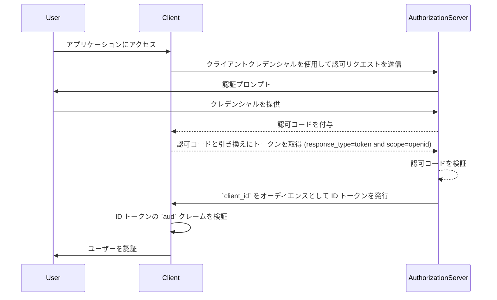
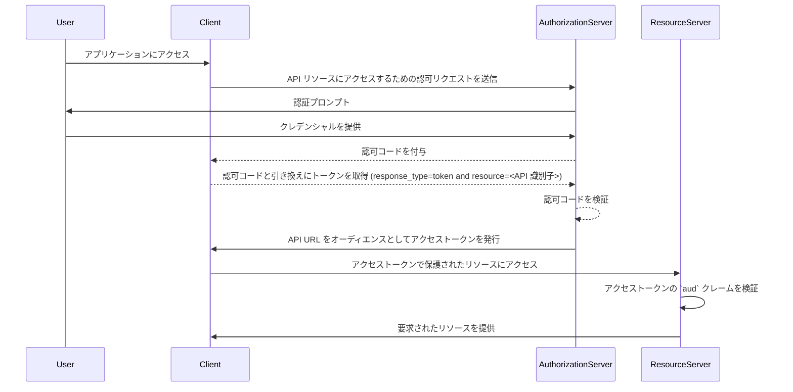

## オーディエンス (Audience) とは？

認証 (Authentication) と認可 (Authorization) の文脈において、オーディエンス (audience) は、認可トークンの受信対象を定義する重要な要素です。<Ref slug="jwt" /> 内の [aud](https://datatracker.ietf.org/doc/html/rfc7519#section-4.1.3) クレームとして言及されるこのクレームは、トークンが指定されたサービスやアプリケーションのみで受け入れられることを確保します。通常、オーディエンス (audience) クレームには、トークンが意図されているアプリケーションの client_id またはトークンがアクセスを許可する API やリソースを示す URL が含まれます。オーディエンス (audience) を指定することで、認可されていないサービスやユーザーによる誤用を防ぐセキュリティコントロールとして機能します。

## オーディエンス (Audience) の仕組み

クライアントが認可サーバーからアクセストークンを要求する際、オーディエンス (audience) クレームはトークン応答に含まれます。このオーディエンス値は、トークンが提示されたときにリソースサーバーによって検証されます。リソースサーバーは、トークン内のオーディエンス (audience) クレームが自身の識別子または保護しているサービスの識別子と一致しているかをチェックします。一致しない場合は、トークンは拒否され、特に複数のマイクロサービスや API が関与する状況において、分散システムのセキュリティを強化します。オーディエンス (audience) クレームを管理することで、開発者はトークンが適切なコンテキストで使用されることを保証し、アプリケーションの認証 (Authentication) および認可 (Authorization) ワークフローに追加の保護層を追加できます。

- **要求者**: クライアントアプリケーションがトークンを要求する際にオーディエンス値を指定します。
- **発行者 (Issuer)**: 認可サーバーがトークン応答にオーディエンス (audience) クレームを含めます。
- **検証者**: トークンの受取人が自身の識別子とオーディエンス (audience) クレームを確認します。オーディエンス (audience) クレームが受取人の識別子と一致する場合、トークンは有効と見なされます。それ以外の場合は拒否されます。

## JWT 内のオーディエンス (Audience) の例

### OpenID Connect (OIDC) ID トークンにおけるオーディエンス (Audience) クレーム

```json
{
  "header": {
    "alg": "RS256",
    "typ": "JWT",
    "kid": "abc123"
  },
  "payload": {
    "iss": "https://auth.logto.io",
    "sub": "test_user",
    "aud": "client_id_foo",
    "exp": 1516239022,
    "iat": 1516239022,
    "nonce": "n-0S6_WzA2Mj",
    "primary_email": "foo@logto.io",
    "email_verified": true,
    "username": "foo"
  },
  "signature": "..."
}
```

OpenID Connect (OIDC) における <Ref slug="id-token" /> は、認証されたユーザーに関する情報を含むセキュリティトークンであり、認証が成功した後にクライアントアプリケーションに提供されます。アクセス・トークンとは異なり、ID トークンは依存するクライアントにユーザーの識別情報を伝えるために特別に設計されています。これらのトークンは通常 JWT (JSON Web Token) としてエンコードされ、ユーザーの識別子 (sub クレーム)、発行者 (iss クレーム)、オーディエンス (aud クレーム) などのクレームを含みます。

この場合、`aud` クレームは ID トークンの意図されたオーディエンスを指定し、それはクライアントアプリケーションです。`aud` クレームの値は通常、トークンを要求したアプリケーションの `client_id` と一致します。クライアントアプリケーションが ID トークンを受信すると、オーディエンス (audience) クレームを検証し、トークンが自身の消費のために発行されたことを確認できます。この検証ステップはトークンの誤用を防ぎ、ユーザー情報への不正アクセスを防ぐとともに、認証プロセスのセキュリティを強化します。



### アクセストークンにおけるオーディエンス (Audience) クレーム

```json
{
  "header": {
    "alg": "RS256",
    "typ": "JWT",
    "kid": "abc123"
  },
  "payload": {
    "iss": "https://auth.logto.io",
    "sub": "test_user",
    "aud": "https://example.logto.app/api/users",
    "exp": 1516239022,
    "iat": 1516239022,
    "scope": "read write",
    "client_id": "client_id_foo"
  },
  "signature": "..."
}
```

ID トークンとは異なり、アクセストークンは API やサービスなどの保護されたリソースへのアクセスを許可するために使用されます。アクセストークン内の `aud` クレームは、トークンの意図された受信者を指定し、通常はトークンによってアクセスが許可されている API やサービスです。通常、API をホストするリソースサーバーは、トークンを要求したクライアントアプリケーションとは異なるドメインを持っています。この場合、`aud` クレームには `client_id` の代わりにトークンが意図されている API エンドポイントの URL が含まれています。この URL はリソースインジケーターまたは API 識別子として知られることが多く、ターゲットリソースを一意に識別します。

リソースサーバーがアクセストークンを受信すると、`aud` クレームを検証してトークンが自身の消費のために発行されたことを確認します。オーディエンスを確認することにより、リソースサーバーはリソースへの不正アクセスを防ぎ、トークンの意図されたオーディエンスに基づいてアクセスコントロールポリシーを施行できます。このメカニズムは機密データを保護し、アクセストークンが適切なコンテキストで使用されることを確保し、システム全体のセキュリティを強化します。



## よくある質問

### トークン検証においてオーディエンス (Audience) クレームが重要な理由は？

オーディエンス (audience) クレームは、トークンが意図された受信者のみに受け入れられることを確保するため、トークン検証において重要です。オーディエンス (audience) クレームを検証することで、受信者はトークンの誤用やリソースへの不正アクセスを防ぐことができます。このセキュリティコントロールは、複数のサービスが相互作用する分散システムにおいて特に重要であり、アクセス制御ポリシーを施行し、機密データを保護するのに役立ちます。

### トークンに複数のオーディエンス (Audience) を持たせることは可能ですか？

セキュリティ上の理由から、曖昧さを防ぎ、トークンが適切なコンテキストで使用されることを確保するために、トークンは単一のオーディエンス (audience) を持つことが推奨されます。ただし、同じドメイン内の複数のサービスや API に対してトークンが意図されている場合など、マルチオーディエンス (multi-audience) トークンが必要なシナリオもあります。このような場合、開発者はマルチオーディエンス (multi-audience) トークンを使用することの影響を慎重に考慮し、潜在的なリスクを軽減するための適切なセキュリティ対策を実装する必要があります。

### オーディエンス (Audience) クレームにはどのような API 識別子を使用すべきですか？

API やサービスを表すアクセストークンのオーディエンス (audience) クレームを指定する際には、リソースを一意に識別する絶対 URI を使用することが推奨されます。この URI は、API エンドポイントのベース URL またはトークンがアクセスを許可されている特定のリソースパスであることができます。URI を API 識別子として使用することで、オーディエンス (audience) クレームが曖昧でなく、トークンの意図された受信者を正確に表していることを保証できます。