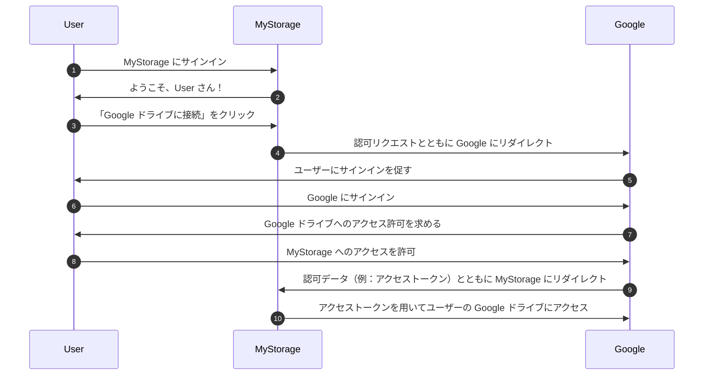

## 認証 (Auth)

このページは、「auth」という用語の曖昧さを解消するためのものです。この用語は以下のような略語としてよく使用されます：

- <Ref slug="authentication" />: アイデンティティの所有を確認するプロセス（例：ユーザーやサービス）。「どのアイデンティティを所有していますか？」という質問に答えます。
- <Ref slug="authorization" />: アイデンティティがリソース上でどのアクションを実行できるかを決定するプロセス。「何ができますか？」という質問に答えます。

> [!Note]
> 時には、認証 (authentication) と認可 (authorization) はそれぞれ「AuthN」および「AuthZ」として言及されることがあります。

これら二つの概念は、<Ref slug="iam" /> 領域においてどちらも重要ですが、根本的に異なります。例を見てみましょう：ウェブアプリケーションの MyStorage には、ファイルをアップロードして Google ドライブに接続する機能があります。典型的なユーザーフローは次のようになります：

このフローでは、ユーザーは二度の認証 (authentication) ステップを行います：MyStorage での認証 (ステップ 1) と、Google での認証 (ステップ 6) です。また、Google ドライブへのアクセスを許可する一度の認可 (authorization) ステップがあります (ステップ8)。

## どれを意味していますか？

「auth」という用語を目にしたとき、それが認証 (authentication) を指しているのか認可 (authorization) を指しているのかを明確にすることが重要です。そうしないと、両方のプロセスがカバーされていると期待してしまうかもしれません（このウェブサイトがそうしているように）。

<SeeAlso slugs={["authentication", "authorization", "iam", "oauth-2.0", "openid-connect"]} />
