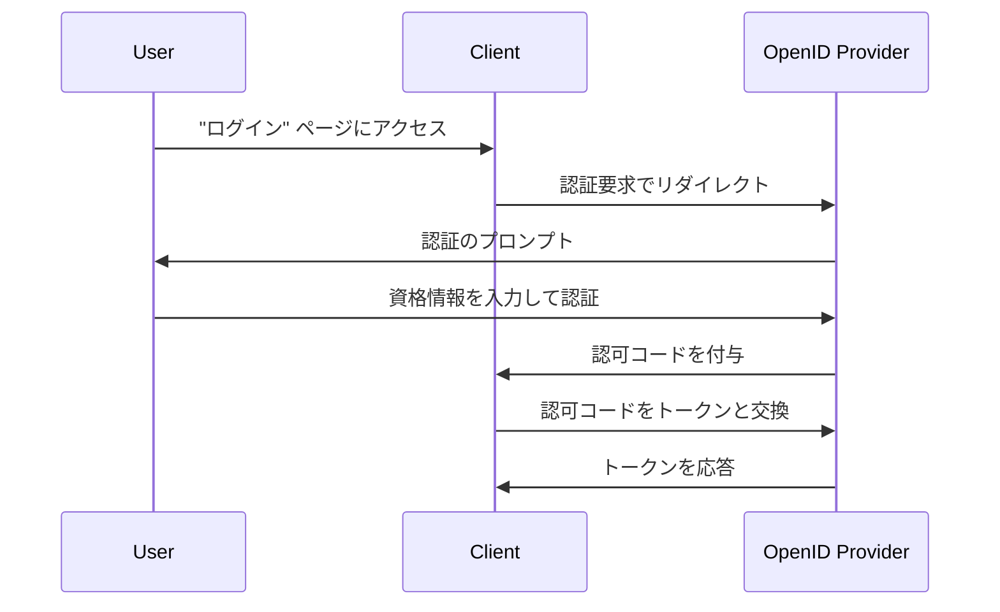

## 認証要求 (Authentication request) とは何ですか？

認証要求 (Authentication request) の意味は文脈によって異なる場合がありますが、ここでは OpenID Connect (OIDC) 仕様での定義に焦点を当てます。OIDC では、認証要求はユーザーを認証するための認可サーバーへの <Ref slug="authorization-request" /> です。

標準の定義は非常に混乱しがちです。なぜなら、「認可リクエスト」のような類似した用語が使用されているからです。これは、OIDC が主に認可を目的として設計された OAuth 2.0 の上に構築されており、OIDC が OAuth 2.0 の用語を継承し、それを拡張して認証をサポートしているためです。

明確にするために、定義に少し文脈を追加しましょう：

> (OpenID Connect) 認証要求は、(OAuth 2.0 認可) リクエストを (OpenID Connect 認可) サーバーに送り、ユーザーを認証するためのものです。

さらに長くなりました！ では、すべての括弧を取り除いてみましょう：

> 認証要求は、ユーザーを認証するためにサーバーに送るリクエストです。

すべての属性を取り除くと、定義は簡潔になります。以下に用語の内訳を示します：

- **認証要求**: OIDC 仕様の用語です。
- <Ref slug="authorization-request" />: OAuth 2.0 仕様の用語です。OIDC はこの仕様を再利用し、拡張しています。
- <Ref slug="authorization-server" />: OAuth 2.0 仕様の用語です。OIDC はまた、ユーザーを認証する能力を持つ同じエンティティを指すために <Ref slug="openid-connect" headingId="openid-provider-op" /> という用語も使用しています。

次のセクションでは、OIDC をサポートする認可サーバーを指すために「OpenID Provider (OP)」という用語を使用します。

## 認証要求はどのように機能しますか？

クライアントアプリケーションがユーザーを認証したい場合、OpenID Provider (OP) に認証要求を開始します。前述したように、認証要求は OAuth 2.0 の認可リクエストでもあるため、特定の OAuth 2.0 グラントタイプ (フロー) を使用して認証プロセスを完了できます。

OIDC は認証をサポートするために 3 つのグラントタイプ (フロー) を定義しています：

1. <Ref slug="authorization-code-flow" />: 最も推奨される認証フローです。<Ref slug="pkce" /> と一緒に使用することで、より高いセキュリティを提供し、ほとんどのアプリケーションに適しています。
2. <Ref slug="implicit-flow" />: セキュリティ上の理由で <Ref slug="oauth-2.1" /> で廃止されている簡略化されたフローです。
3. <Ref slug="hybrid-flow" />: 認可コードフローとインプリシットフローの組み合わせです。

認証要求は、OIDC の認証フローの最初のステップです。含めるべき具体的なパラメーターや、選択するフローにしたがって従うべき手順は異なります。各フローに関してさらに学びたい場合は、上記のフロー名をクリックしてください。

以下は、認可コードフローを使用した認証要求の簡易な例です：

クライアントがトークンを受け取った後、そのトークン (例：<Ref slug="access-token" />) を使用して、ユーザーに代わって保護されたリソース (例：API) にアクセスすることができます。

### 認証要求の主要パラメーター

以下は認証要求の主要なパラメーターです：

- **`response_type`**: クライアントが認可サーバーから期待する応答のタイプです。認可コードフローの場合は `code`、インプリシットフローの場合は `id_token`、ハイブリッドフローの場合は `code id_token` です。
- **`client_id`**: OpenID Provider (OP) によって発行されたクライアント識別子です。
- **`redirect_uri`**: 認証要求後にユーザーエージェントをリダイレクトするための URI です。
- **`scope`**: <Ref slug="id-token" /> および <Ref slug="access-token" /> のために要求される <Ref slug="scope">スコープ</Ref> (許可) です。
- **`resource`**: リクエストされたリソースの <Ref slug="resource-indicator" /> を指定するオプションのパラメーターです。このパラメーターを使用するには、認可サーバーが [RFC 8707](https://datatracker.ietf.org/doc/html/rfc8707) をサポートしている必要があります。

上記のパラメーターは完全なリストではないことに注意してください。認証要求を行う前に、使用する特定のフローのパラメーターの完全なリストを参照する必要があります。

<SeeAlso slugs={["openid-connect", "oauth-2.0", "authorization-code-flow", "implicit-flow", "hybrid-flow"]} />

<Resources
  urls={[
    "https://openid.net/specs/openid-connect-core-1_0.html",
  ]}
/>