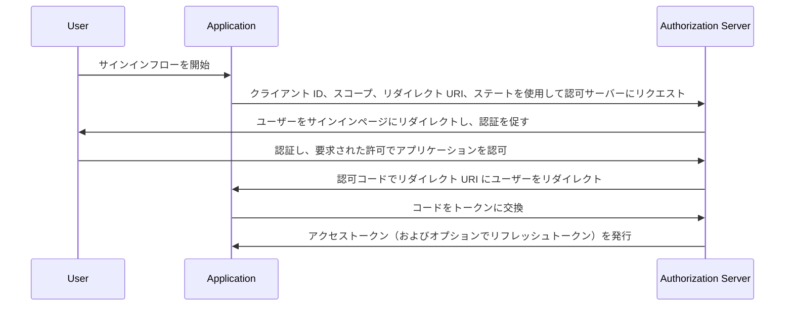

## 認可コードフロー (Authorization code flow) とは？

認可コードフロー (Authorization code flow)（別名: 認可コードグラント）は、[OAuth 2.0 RFC 6749, section 4.1](https://datatracker.ietf.org/doc/html/rfc6749#section-4.1) で定義されている、広く使用されている OAuth 2.0 認可メカニズムであり、アプリケーションがユーザーの代理でアクセストークンを取得できるようにします。このフローは、クライアントシークレットが安全に格納できる、機密アプリケーション（例: 従来のサーバーサイドで動作する Web アプリケーション）に特に適しています。

認可コードフロー (Authorization code flow) は、OAuth 2.0 でアクセストークンを取得するための堅牢で安全な方法であり、多くの Web アプリケーションにとって好まれる選択です。OAuth 2.0 と API 統合に取り組む開発者にとって、このフローを理解することは不可欠です。

## 認可コードフロー (Authorization code flow) はどのように機能しますか？

認可コードフロー (Authorization code flow) は次の手順を含みます：

1. **フローの開始**: ユーザーは通常、アプリケーション内のリンクまたはボタンをクリックしてサインインすることでフローを開始します。アプリケーションはユーザーを認可サーバーの認可エンドポイントにリダイレクトし、クライアント ID、要求されたスコープ、リダイレクト URI、およびステートパラメータを渡します。認可サーバーはパラメータを検証し、ユーザーに認可サーバーのサインインページでの認証を促します。
2. **ユーザーの認証と認可**: ユーザーは認可サーバーで認証し、要求されたリソースへのアクセス許可をアプリケーションに与えます。
3. **コードの生成とリダイレクション**: 認可サーバーは認可コードを生成し、先に提供されたリダイレクト URI を使用してユーザーをアプリケーションに戻します。認可コードはリダイレクト URI のクエリ文字列に含まれています。
4. **コード交換**: アプリケーションはクエリ文字列から認可コードを抽出し、認可サーバーのトークンエンドポイントに POST リクエストを送信して、認可コードをアクセストークンに交換します。アプリケーションはこのリクエストにクライアント ID、クライアントシークレット、リダイレクト URI、および認可コードも含める必要があります。
5. **アクセストークンの取得**: 認可サーバーは認可コードを検証し、検証が成功した場合にアプリケーションにアクセストークン（およびオプションでリフレッシュトークン）を発行します。アプリケーションは、その後アクセストークンを使用してユーザーの代理で認可された API リクエストを行うことができます。

この手順は、次のシーケンス図で示されます：



## 認証リクエスト (Authentication request)

リクエストパラメータは以下の通りです：

- **client_id**: 必須。 有効な OAuth 2.0 クライアント識別子。
- **scope**: 必須。この値は、ユーザーが認可サーバーから要求しているリソースのセットを指定します。 例: `openid profile email`。
- **response_type**: 必須。アプリケーションが認可コードを期待していることを示すために値は `code` でなければなりません。
- **redirect_uri**: 必須。 認証応答が送信される URI であり、クライアントが認可サーバーで事前に登録したリダイレクト URI と正確に一致する必要があります。
- **state**: 推奨。リクエストとコールバック間の状態を維持するために使用される不透明な値です。また、<Ref slug="csrf" /> 攻撃を防ぐために使用されます。
- **nonce**: オプション。クライアントセッションを ID トークンに関連付けるためのランダム文字列で、リプレイ攻撃を軽減します。
- **prompt**: オプション。リダイレクトエンドユーザーに再認証および同意を促すかどうかを指定する、大文字と小文字を区別するスペース区切りの文字列値のリスト。定義された値は次のとおりです：
  - **none**: 認可サーバーは認証または同意のユーザーインターフェイスページを表示してはなりません。エンドユーザーがまだ認証されていない場合、またはクライアントが要求された主張の事前設定された同意を持たない場合、またはリクエスト処理の他の条件を満たさない場合、エラーが返されます。エラーコードは通常、`login_required`、`interaction_required`。これは既存の認証および/または同意を確認する方法として使用できます。
  - **login**: 認可サーバーはエンドユーザーに再認証を促す必要があります。エンドユーザーを再認証できない場合は、通常 `login_required` のエラーを返さなければなりません。
  - **consent**: 認可サーバーはクライアントに情報を返す前にエンドユーザーに同意を促す必要があります。同意を得られない場合は、通常 `consent_required` のエラーを返さなければなりません。
  - **select_account**: 認可サーバーはエンドユーザーにユーザーアカウントの選択を促す必要があります。これにより、認可サーバーに複数のアカウントを持つエンドユーザーが、現在セッションを持つ複数のアカウントから選択できるようになります。エンドユーザーによるアカウント選択を得られない場合は、通常 `account_selection_required` のエラーを返さなければなりません。

[完全なリクエストパラメータの定義](https://openid.net/specs/openid-connect-core-1_0.html#AuthRequest)

### 認証リクエスト (Authentication request) の例

```bash
curl -X GET "https://authorization-server.com/auth" \
  -d "response_type=code" \
  -d "client_id=YOUR_APPLICATION_ID" \
  -d "redirect_uri=https://yourapp.com/callback" \
  -d "scope=openid profile email" \
  -d "state=RANDOM_STRING_FOR_STATE"
```

一般的な成功の応答：

```http
HTTP/1.1 302 Found
Location: https://yourapp.com/callback?
  code=YOUR_AUTHORIZATION_CODE
  &state=RANDOM_STRING_FOR_STATE
```

## トークン交換リクエスト (Token exchange request)

上記の認証リクエストに正常に応答すると、クライアントは `https://yourapp.com/callback` のコールバック URI に自動的にリダイレクトされ、コードは URI パラメータとして渡されます。

クライアントは、アクセストークンを取得するために、後続のトークン交換リクエストで `code` を取得および処理することが期待されます。

### トークン交換リクエスト (Token exchange request) の例

```bash
curl -X POST "https://authorization-server.com/token" \
  -H "Content-Type: application/x-www-form-urlencoded" \
  -d "client_id=YOUR_CLIENT_ID" \
  -d "code=YOUR_AUTHORIZATION_CODE" \
  -d "redirect_uri=https://yourapp.com/callback" \
  -d "grant_type=authorization_code" \
```

## 利点

- **セキュリティの向上**: クライアントシークレットがユーザーのブラウザにさらされることがないため、クライアントのなりすましのリスクが軽減されます。
- **一回限りの認可コード**: 認可コードは短命であり、一度しか使用できないため、傍受およびリプレイ攻撃のリスクが軽減されます。
- **短命のトークン**: このフローで発行されるアクセストークンは短命（通常 1 時間）であるため、トークンが危険にさらされた場合の不正アクセスのリスクが軽減されます。
- **リフレッシュトークン**: 認可サーバーはオプションでリフレッシュトークンを発行でき、アプリケーションはユーザーの操作を必要とせずに新しいアクセストークンを取得できます。

## 認可コードフロー (Authorization code flow) とインプリシットフロー (Implicit flow) の違いは何ですか？

認可コードフロー (Authorization code flow) とインプリシットフロー (Implicit flow) の主な違いは、アクセストークンが取得される方法にあります：

- **認可コードフロー (Authorization code flow)**: クライアントアプリケーションは最初に認可エンドポイントから認可コードを受け取り、その後トークンエンドポイントへの後続の POST リクエストでアクセストークンに交換します。
- **インプリシットフロー (Implicit flow)**: クライアントアプリケーションは認可エンドポイントから直接アクセストークンを受け取ります。

## 認可コードフロー (Authorization code flow) とクライアント資格フロー (Client credentials flow) の違いは何ですか？

認可コードフロー (Authorization code flow) とクライアント資格フロー (Client credentials flow) の主な違いは、フローが使用されるコンテキストにあります：

- **認可コードフロー (Authorization code flow)**: クライアントアプリケーションがユーザーの代理でリソースにアクセスする必要がある場合に使用されます。このフローにはユーザーの認証および認可が含まれます。
- **クライアント資格フロー (Client credentials flow)**: クライアントアプリケーションが自身の代理でリソースにアクセスする必要がある場合に使用されます。このフローはクライアントの認証を含むが、ユーザーの認証を含まず、マシン間通信に最適です。

## 認可コードフロー (Authorization code flow) の典型的なユースケースは何ですか？

- ユーザー認証と API へのアクセスを必要とする従来の Web アプリケーション。
- サードパーティサービスからユーザーデータに安全にアクセスする必要があるアプリケーション。

<SeeAlso slugs={['device-flow', 'implicit-flow', 'client-credentials-flow']} />

<Resources urls={['https://datatracker.ietf.org/doc/html/rfc6749']} />