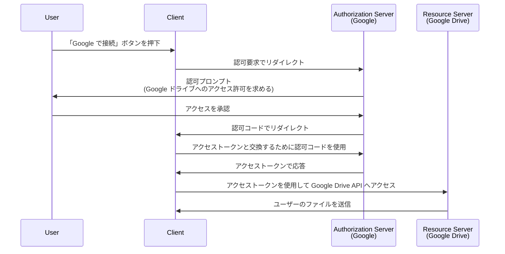

## 認可要求 (Authorization request) とは何ですか？

文脈に応じて、「認可要求 (authorization request)」という用語は異なる意味を持つ場合があります。この記事では、<Ref slug="oauth-2.0" /> 仕様における定義に焦点を当てます。

OAuth 2.0 では、<Ref slug="client" /> がユーザーに代わって保護されたリソースにアクセスするための認可を取得する方法を定義するいくつかのグラントタイプ (フロー) があります。

> ![注意]
> 「認可要求 (authorization requests)」は、<Ref slug="openid-connect" /> の文脈で「認証要求 (authentication requests)」と混同されることがよくあります。OIDC 特有の詳細については <Ref slug="authentication-request" /> を参照してください。

## 認可要求 (Authorization request) はどのように機能しますか？

クライアント (アプリケーション) がユーザーに代わって保護されたリソースにアクセスしたい場合、<Ref slug="authorization-server" /> に認可要求を開始します。クライアントは要求の中で要求されたグラントタイプと必要なパラメーターを示す必要があります。

ここに、OAuth 2.0 のエンドユーザー認可のための典型的なグラントタイプ (フロー) があります:

- <Ref slug="authorization-code-flow" />: エンドユーザーの認可に最も推奨されるフローです。通常は、より良いセキュリティのために <Ref slug="pkce" /> と共に使用され、ほとんどのアプリケーションに適しています。
- <Ref slug="implicit-flow" />: 簡略化されたフローで、セキュリティの懸念により <Ref slug="oauth-2.1" /> で廃止されました。
- [リソース所有者パスワード認証情報 (ROPC) グラント](https://datatracker.ietf.org/doc/html/rfc6749#section-4.3): ユーザーの認証情報を直接アクセストークンと交換するグラント (フロー)。セキュリティリスクのため推奨されません。

また、入力機能が制限されたデバイス向けの <Ref slug="device-flow" /> などの他の拡張もあります。各フローにはそれぞれの特性と使用ケースがあります。ほとんどのWebアプリケーションにおいては、認可コードフローが推奨される選択です。

> <Ref slug="machine-to-machine" /> の認可は通常、ユーザーの関与を伴わない <Ref slug="client-credentials-flow" /> を使用して行われます。

例えば、クライアント (アプリケーション) がユーザーの Google ドライブファイルにアクセスするための認可をリクエストする場合の認可コードフローの簡略化されたシーケンス図は次のとおりです:

<Ref slug="access-token" /> を取得すると、クライアントはユーザーに代わり、そのトークンを使用して Google ドライブファイルにアクセスすることができます。

### 認可要求 (Authorization request) の主要なパラメーター

OAuth 2.0 の認可要求には通常、次のパラメーターが含まれます:

- **`response_type`**: クライアントが期待するレスポンスタイプ。認可コードフローの場合は `code`、インプリシットフローの場合は `token` などの一般的な値。
- **`client_id`**: 認可サーバーによって発行されたクライアント識別子。
- **`redirect_uri`**: 認可プロセス後にユーザーを送る URI。
- **`scope`**: アクセストークンのために要求される <Ref slug="scope">スコープ</Ref> (許可)。
- **`resource`**: 要求されたリソースに対する <Ref slug="resource-indicator" /> を指定するオプションのパラメーター。認可サーバーがこのパラメーターを使用するには [RFC 8707](https://datatracker.ietf.org/doc/html/rfc8707) をサポートしている必要があります。

上記のパラメーターは非網羅的です。実際のパラメーターとその値は、グラントタイプやアプリケーションの特定の要件に依存します。

<SeeAlso slugs={["oauth-2.0", "authentication-request", "authorization-code-flow", "implicit-flow", "device-flow"]} />

<Resources
  urls={[
    { url: "https://datatracker.ietf.org/doc/html/rfc6749#section-4", result: {
      ogTitle: "Obtaining Authorization in OAuth 2.0",
      ogDescription: " To request an access token, the client obtains authorization from the resource owner."
    } }
  ]}
/>