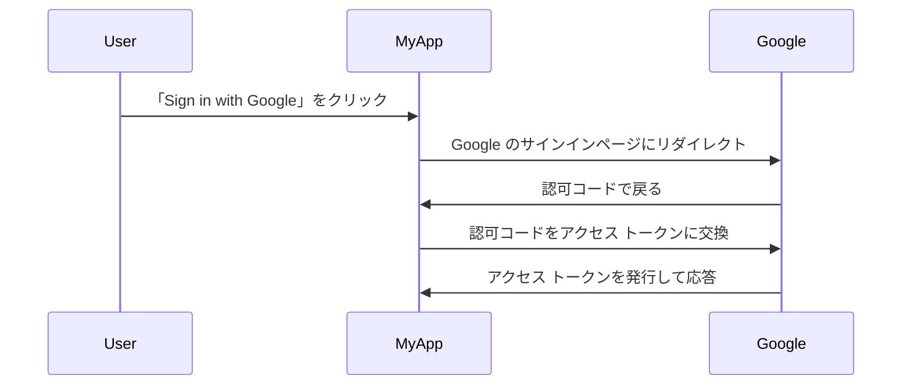

## 認可サーバー (Authorization Server) とは？

「認可サーバー」という用語は、認可を実行する任意のサーバーを指す一般的な用語になる可能性があります。ここでは、<Ref slug="oauth-2.0" /> および <Ref slug="openid-connect" /> フレームワークのコンテキストでの定義に焦点を当てます。

OAuth 2.0 では、認可サーバーは認証 (Authentication) と認可に成功した後にクライアントに<Ref slug="access-token">アクセス トークン</Ref>を発行するコンポーネントです。アクセス トークンは、クライアントがユーザー（リソース オーナー）に代わって保護されたリソースにアクセスするために使用されます。

多くの用語が登場しましたか？現実世界の例を見てみましょう。ユーザーが「MyApp」というアプリケーションで「Sign in with Google」をクリックし、<Ref slug="authorization-code-flow" /> を使用して Google にサインインする場合です。

この例では、Google はユーザーが正常にサインインした後に **アクセス トークン** を **クライアント**（MyApp）に発行する **認可サーバー** として機能します。その後、クライアントは **アクセス トークン** を利用して Google 上のユーザーのプロフィール（保護されたリソース）を取得することができます。

### OpenID Connect (OIDC) における認可サーバー (Authorization Server)

OpenID Connect は OAuth 2.0 の上に構築されているため、OAuth 2.0 からいくつかの用語と概念を再利用しています。OIDC は OAuth 2.0 認可サーバー (Authorization Server) に認証機能を追加し、認可サーバーを <Ref slug="openid-connect" headingId="openid-provider-op" /> にもなります。曖昧さを避けるため、OIDC 内で認可サーバーについて言及する際には常に「OpenID プロバイダー」という用語の使用をお勧めします。

OIDC の OpenID プロバイダー (認可サーバー) は、アクセス トークンを発行するだけでなく、クライアントに <Ref slug="id-token">ID トークン</Ref> も発行します。ID トークンにはユーザー情報が含まれ、ユーザーの認証 (Authentication) に使用されます。

## 認可サーバー (Authorization Server) の仕組み

認可サーバーは、クライアントにアクセス トークンを発行するために <Ref slug="oauth-2.0-grant">OAuth 2.0 グラント (フロー)</Ref> をサポートする必要があります。グラント タイプは通常、クライアントと認可サーバーがアクセス トークンを取得するための一連の手順で構成されます。

- ユーザーの認可では、ほとんどのグラント タイプがクライアントに認可サーバーへの <Ref slug="authorization-request" /> を開始させる必要があります。上記の Google サインインの例では、「Google のサインインページにリダイレクトする」ステップは、クライアントによって開始された認可リクエストです。
- <Ref slug="machine-to-machine" /> 認可では、クライアントは <Ref slug="client-credentials-flow" /> を使用して直接 <Ref slug="token-request" /> を認可サーバーに送信することがあります。

認可サーバーは、クライアントのリクエストを検証し、クライアントを認証 (Authentication) し、ユーザーのIDを確認した後にアクセス トークンを発行する必要があります。また、<Ref slug="authorization-code-flow" /> の場合には <Ref slug="pkce" /> などの追加のセキュリティ対策を実施することがあります。

## 認可サーバー (Authorization Server) のユースケース

名前が示すように、認可サーバーは<Ref slug="authorization" />を処理するために使用されます。認可サーバー (Authorization Server) は、ファースト パーティおよびサード パーティが関与する場合があります:

- 上述の Google サインイン例。
- e コマースサイト（クライアント）が別のウェブサイトからユーザーの支払い情報（保護されたリソース）にアクセスを要求する場合。
- モバイルアプリ（クライアント）が位置情報サービスプロバイダーからユーザーの位置データ（保護されたリソース）へのアクセスを要求する場合。

また、内部認可のためだけに使われることもあります。例えば:

- ユーザーが e コマースウェブサイト（クライアント）で自分の注文（保護されたリソース）にアクセスする必要がある場合。
- サービス（クライアント）がマイクロサービス アーキテクチャ内のデータベース（保護されたリソース）にアクセスする必要がある場合。

現代のアプリケーションでは、認可サーバーはユーザー認証 (Authentication) をサポートする <Ref slug="openid-connect" /> を備えた <Ref slug="identity-provider" /> となることもあります。

<SeeAlso slugs={["oauth-2.0", "authorization-request", "access-token"]} />

<Resources
  urls={[
    "https://blog.logto.io/ciam-102-authz-and-rbac",
    "https://tools.ietf.org/html/rfc6749",
  ]}
/>