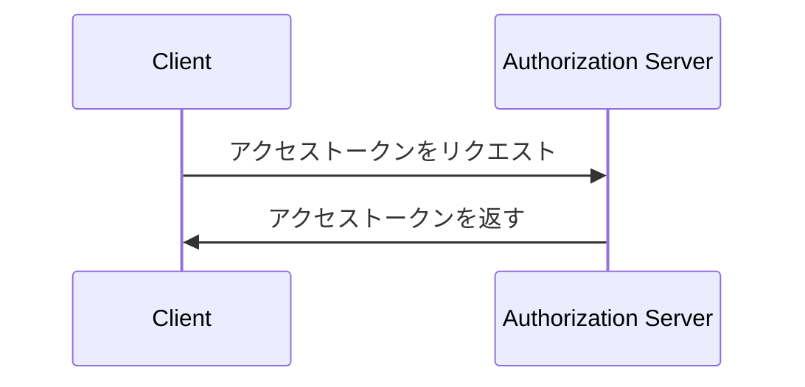
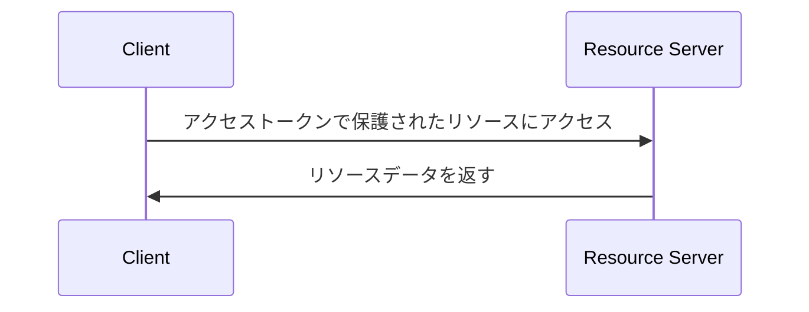

## クライアント・クレデンシャル・フロー (Client credentials flow) とは？

クライアント・クレデンシャル・フロー (Grant) は、機密クライアントが保護されたリソースにアクセスするための <Ref slug="access-token">アクセストークン (access token)</Ref> を取得できる <Ref slug="oauth-2.0-grant" /> タイプです。通常、このフローはクライアントがサーバーまたはサービスである<Ref slug="machine-to-machine" />通信に使用されます。

> [!Note]
> クライアント・クレデンシャル・フローはエンドユーザー認可には適していません。エンドユーザー認可には、<Ref slug="authentication-request" /> または <Ref slug="authorization-request" /> を使用する必要があります。

## クライアント・クレデンシャル・フローはどのように動作するのか？

クライアント・クレデンシャル・フローは、簡単な2ステップのプロセスです：

1. **トークンリクエスト**: クライアントは、クライアントクレデンシャル（クライアントIDとクライアントシークレット）および要求された<Ref slug="scope">スコープ (scope)</Ref>を含む<Ref slug="token-request" />を送信します。
2. **トークンレスポンス**: <Ref slug="authorization-server" /> はクライアントクレデンシャルを検証し、クライアントが認可されている場合にはアクセストークンを発行します。

クライアント・クレデンシャル・フローの簡略化されたシーケンス図を以下に示します：



クライアント・クレデンシャル・フローのトークンリクエストの非規範的な例を以下に示します：

```http
POST /token HTTP/1.1
Host: your-authorization-server.com
Content-Type: application/x-www-form-urlencoded

grant_type=client_credentials
  &client_id=YOUR_CLIENT_ID
  &client_secret=YOUR_CLIENT_SECRET
  &scope=read write
```

認可サーバーはクライアントクレデンシャルを検証し、クライアントが認可されている場合にはアクセストークンを発行します。クライアントがアクセストークンを受け取ると、それを使用して自身の代わりに保護されたリソース（例：API）にアクセスできます。クライアントがアクセストークンを使用して API にアクセスする方法の例を以下に示します：



<Ref slug="resource-server" /> はアクセストークンを検証し、クライアントがリソースにアクセスするための必要な権限を持っていることを確認するために<Ref slug="access-control" />ポリシーを適用する必要があります。

### クライアント・クレデンシャル・フローのトークンリクエストにおけるキー パラメータ

他のOAuth 2.0 フローと異なり、クライアント・クレデンシャル・フローは、次のキー パラメータを持つ単純な<Ref slug="token-request" />です：

- **`grant_type`**: グラントタイプはクライアント・クレデンシャル・フローを示すために `client_credentials` に設定されるべきです。
- **`client_id`**: 認可サーバーによって発行されたクライアント識別子。
- **`client_secret`**: 認可サーバーによって発行されたクライアントシークレット。
- **`scope`**: アクセストークンのために要求された<Ref slug="scope">スコープ (scope)</Ref>（権限）。
- **`resource`**: 要求されたリソースの<Ref slug="resource-indicator" />を指定するオプションのパラメータ。このパラメータを使用するには、認可サーバーが[RFC 8707](https://datatracker.ietf.org/doc/html/rfc8707)をサポートする必要があります。

## セキュリティの考慮事項

### 機密クライアント

クライアント・クレデンシャル・フローは、クライアントシークレットを安全に保存できる<Ref slug="client" headingId="confidential-clients" />（機密クライアント）に適しています。クライアントが公開クライアント（例：シングルページアプリケーション）である場合、クライアント・クレデンシャル・フローを使用すべきではありません。なぜなら、クライアントシークレットが露出する可能性があるからです。

### トークンの有効期限

クライアント・クレデンシャル・フローで取得したアクセストークンは長時間の有効期限を持つことができますが、トークンが漏洩した場合の不正アクセスのリスクを軽減するために、短期間（例：1時間）のアクセストークンを使用することが推奨されます。

### クライアントシークレットのローテーション

セキュリティを強化するために、クライアントシークレットを定期的にローテーションすることを推奨します。認可サーバーは、クライアントがアクセストークンを取得する能力に影響を与えることなくクライアントシークレットのローテーションをサポートすべきです。例えば、認可サーバーはローテーションプロセス中の後方互換性のために複数のクライアントシークレットをサポートすべきです。

<SeeAlso slugs={["machine-to-machine", "token-request", "access-token", "scope", "resource-indicator"]} />

<Resources
  urls={[
    "https://blog.logto.io/programmatic-authentication-methods",
    { 
      url: "https://datatracker.ietf.org/doc/html/rfc6749#section-4.4",
      result: {
        ogTitle: "Client Credentials Grant",
        ogDescription: "The client can request an access token using only its client credentials (or other supported means of authentication) when the client is requesting access to the protected resources under its control, or those of another resource owner that have been previously arranged with the authorization server."
      }
    }
  ]}
/>
