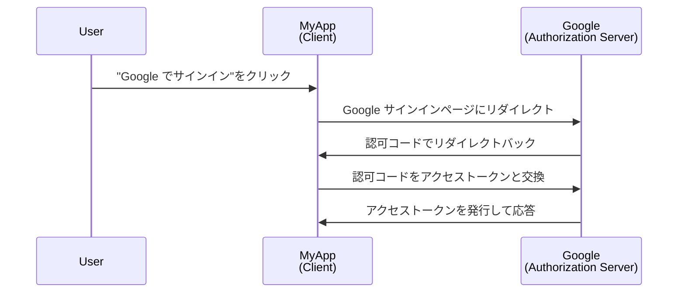
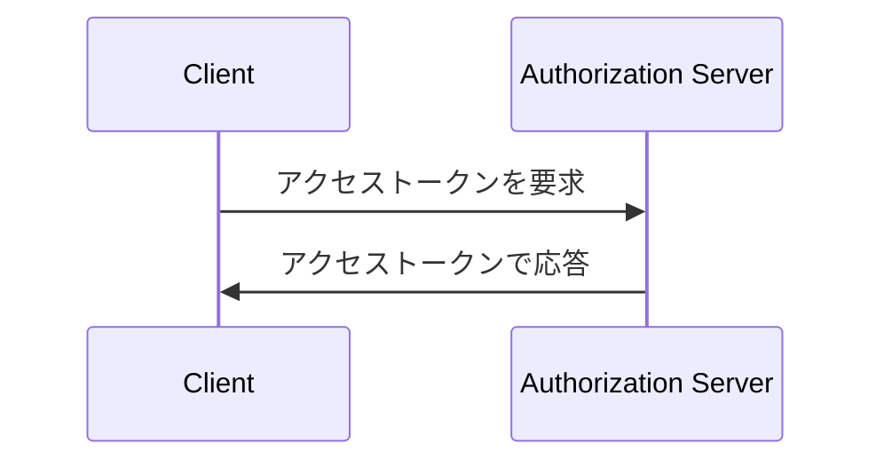

## クライアントとは何か？

<Ref slug="oauth-2.0" /> と <Ref slug="openid-connect" /> のコンテキストにおけるクライアントとは、認証または認可を要求するアプリケーションのことです。例えば、ユーザーがアプリケーション上で「Googleでサインイン」をクリックすると、そのアプリケーションは Google に認可を要求する**クライアント**として動作します。

> 「クライアント」と「アプリケーション」は、<Ref slug="iam" /> の文脈でしばしば互換的に使用されます。

クライアントは、その能力および信頼レベルに基づいて複数のカテゴリに分類されますが、フレームワークにとって重要な区別はパブリッククライアントとコンフィデンシャルクライアントの間にあります。これは、クライアントがどのようにトークンを取得するかと、使用できるグラントタイプに影響を与えます。

### パブリッククライアント ||public-clients||

パブリッククライアントは、そのクレデンシャルを機密に保つことができないアプリケーションであり、リソースオーナー (ユーザー) がアクセスできます。パブリッククライアントの例には以下が含まれます：

- シングルページアプリケーション (SPAs)
- モバイルアプリ
- デスクトップアプリ

モバイルやデスクトップアプリには安全なストレージ機能があると主張するかもしれませんが、ほとんどのフレームワークでは、エンドユーザーに配布されるため、それらをパブリッククライアントと見なしており、エンドユーザーがクレデンシャルにアクセスできると仮定しています。

### コンフィデンシャルクライアント ||confidential-clients||

コンフィデンシャル (プライベート) クライアントは、リソースオーナー (エンドユーザー) に漏らすことなく機密情報を秘密に保持できるアプリケーションです。コンフィデンシャルクライアントの例には以下が含まれます：

- ウェブサーバー
- バックエンドサービス

## クライアントはどのように動作するのか？

### ユーザー認証と認可

クライアントがユーザーを認証しようとする場合、クライアントは<Ref slug="authorization-request" />を<Ref slug="authorization-server" />に送信して<Ref slug="access-token" />を取得します。クライアントは、リクエストに必要なパラメータ（クライアント ID、リダイレクト URI、スコープなど）を含める必要があります。以下は、認可コードフローの簡略化したシーケンス図です：

この例では、Google はユーザーが正常にサインインした後に**クライアント** (MyApp) にアクセストークンを発行する**認可サーバー**として機能します。その後、クライアントは**アクセス トークン**を使用して、Google 上のユーザーのプロファイル (保護されたリソース) を取得できます。

OpenID Connect (OIDC) クライアントの場合、クライアントはユーザーを認証するために<Ref slug="authentication-request" />を開始する必要があります。認可リクエストと同じエンドポイントを使用しますが、パラメータと応答が異なります。

### マシン間通信

<Ref slug="machine-to-machine" />通信では、クライアントは<Ref slug="client-credentials-flow" />を使用して認可サーバーに直接<Ref slug="token-request" />を送信できます。リクエストにはクライアント ID、クライアントシークレット、スコープを含める必要があります。以下は、クライアントクレデンシャルフローの簡略化したシーケンス図です：

認可サーバーはクライアントクレデンシャルを検証し、クライアントが認可されている場合にアクセストークンを発行します。クライアントはクライアントシークレットを送信する必要があるため、クライアントクレデンシャルフローは機密クライアントのみを対象として使用することが重要です。

## セキュリティの考慮事項

### クライアントの種類

クライアントの種類 (パブリックまたはプライベート) は、クライアントに関するセキュリティの考慮事項に影響します。

- パブリッククライアントはクライアントクレデンシャルフローを使用すべきではありません。クライアントシークレットを安全に保存できないためです。代わりに、<Ref slug="pkce" />を使用した<Ref slug="authorization-code-flow" />が、ユーザーを認証するためのパブリッククライアントに推奨されます。
- コンフィデンシャルクライアントは、マシン間通信のためにクライアントクレデンシャルフローを使用できます。彼らはクライアントシークレットを安全に保存し、セキュアな環境でのみ使用する必要があります。

### トークンストレージ

クライアントは、可能な限り最高のセキュリティレベルを使用してトークンを保存すべきです。たとえば、Web アプリケーションでは、XSS 攻撃を防ぐために、HTTP-only クッキーを使用してアクセス トークンを保存することが推奨されます。

### トークンの有効期限

アクセストークンには限られた有効期間があり、不正アクセスのリスクを減らすためです。クライアントは、<Ref slug="refresh-token">リフレッシュトークン</Ref>を使用して新しいアクセストークンを取得することにより、有効期限の切れたトークンを優雅に処理する必要があります。

### トークンの失効

クライアントはトークンの失効に対応できるようにする必要があります。ユーザーがサインアウトした場合や、認可サーバーがトークンを失効した場合、クライアントはクライアントサイドストレージからトークンをクリアする必要があります。

<SeeAlso slugs={["oauth-2.0", "oauth-2.0-grant", "openid-connect", "authorization-request", "authentication-request"]} />

<Resources
  urls={[
    "https://blog.logto.io/secure-cloud-apps-with-oauth-and-openid-connect",
    "https://datatracker.ietf.org/doc/html/rfc6749",
    "https://openid.net/specs/openid-connect-core-1_0.html"
  ]}
/>
