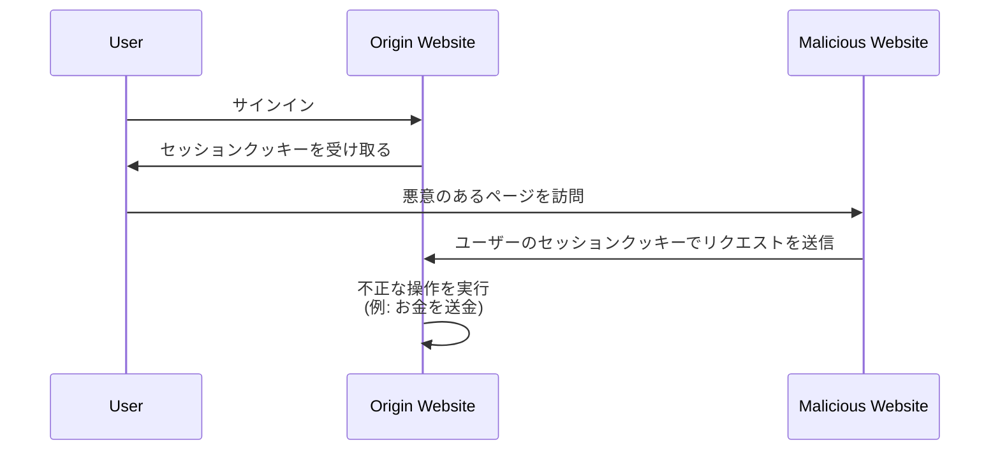

## クロスサイトリクエストフォージェリ (CSRF) とは？

Web アプリケーションを開発する際、CSRF は開発者やセキュリティ専門家に恐れられる言葉です。これは、認証されたユーザーをだまして (または騙して)、許可なしに Web アプリケーションで不本意な操作を実行させる攻撃の一種です。

CSRF は、「ワンクリック攻撃」や「セッションライディング」としても知られています。これは、ユーザーのアクティブセッションを利用して悪意のある操作を行うためです。

## CSRF の仕組み

CSRF 攻撃は、Web アプリケーションがユーザーのブラウザに対して持つ信頼を悪用することで成立します。以下がその一般的な流れです：



このシーケンスについていくつか疑問があるかもしれません。それらについて探っていきましょう。

### なぜ悪意のあるウェブサイトはオリジンウェブサイトにリクエストを送信できるのか？

同一オリジンポリシー (SOP) は、Web ブラウザにおけるセキュリティ機能であり、あるオリジンから読み込まれたドキュメントやスクリプトが別のオリジンからのリソース（例：クッキー、DOM）とどのようにやり取りできるかを制限します。しかし、SOP はブラウザが別のオリジンにリクエストを送信することを防ぎません。

したがって、悪意のあるウェブサイトはセッションクッキーを直接読み取ったり変更したりすることはできませんが、ユーザーのアクティブセッションを利用してオリジンウェブサイトにリクエストを送信することができます。

ほとんどの Web アプリケーションが不正なクロスオリジンリクエストを防ぐために [CORS](https://developer.mozilla.org/en-US/docs/Web/HTTP/CORS) を使用していると主張するかもしれませんが、CSRF にはそれを回避する方法があります：

1. GET ベースの攻撃：悪意のあるウェブサイトは、ユーザーをだまして、オリジンウェブサイトでアクションを実行する URL にアクセスさせます。

    - `https://example.com/transfer?amount=1000&to=attacker` のようなリダイレクト。
    - `https://example.com/transfer?amount=1000&to=attacker` を読み込む画像タグ。

    これが GET リクエストが副作用を持つべきでない重要な理由です。

2. フォームベースの攻撃：悪意のあるウェブサイトは、オリジンウェブサイトにデータを送信する隠しフォームを作成できます。例えば、`https://example.com/transfer` への POST リクエストと隠しフォームフィールド。

### なぜ悪意のあるウェブサイトはユーザーのセッションクッキーを持っているのか？

ユーザーのブラウザは、リクエスト時に自動的にオリジンウェブサイトにクッキーを送信します。これにより、オリジンウェブサイトはユーザーが認証されていることを知り、ユーザーの代わりにアクションを実行できるのです。

実際、悪意のあるウェブサイトはセッションクッキーを「持っている」わけではありません。ブラウザの挙動を悪用して、クッキーと共にリクエストを送信するのです。

## CSRF 攻撃を防ぐには？

CSRF 攻撃を防ぐには、サーバーとクライアントの両方を含む多層的なアプローチが必要です。以下は、CSRF 脆弱性を軽減するための一般的な技術です：

### アンチ CSRF トークンを使用する

アンチ CSRF トークンはサーバーによって生成され、Web アプリケーションのフォームに埋め込まれたランダムな値です。フォームが送信されると、サーバーはそのトークンを検証してリクエストが正当であることを確認します。

例えば、HTML フォームの隠し入力フィールド：

```html
<form action="/transfer" method="post">
  <input type="hidden" name="csrf_token" value="random_token_here" />
  <!-- 他のフォームフィールド -->
  <button type="submit">送金</button>
</form>
```

このアプローチを用いることで、悪意のあるウェブサイトはアンチ CSRF トークンを知らないため、リクエストを偽造することができません。<Ref slug="redirect-uri" /> における `state` パラメータも類似の概念です。

### SameSite クッキーを使用する

クッキーの `SameSite` 属性は、クッキーがサーバーに送信されるタイミングを制限することで CSRF 攻撃を防ぐことができます：

| `SameSite` 値   | 説明 |
|------------------|--------------------------------------------------------------------------------------|
| `Strict`         | クッキーはファーストパーティコンテキストでのみ送信されます。                                      |
| `Lax`            | クッキーはファーストパーティコンテキストおよび外部サイトからの GET リクエストと共に送信されます。        |
| `None`           | クッキーはすべてのコンテキストで送信されます。`Secure` 属性が必要です。                       |

GET リクエストに副作用がない `Strict` や `Lax` に `SameSite` 属性を設定することで、CSRF 攻撃を防ぐことができます。

加えて、クッキーが HTTPS 接続経由でのみ送信されることを保証するため、`Secure` 属性を常に設定するべきです。

### ヘッダーをチェックする

1. **Origin ヘッダー**: `Origin` ヘッダーは、ブラウザがリクエストの送信元を示すために送信するものです。サーバーはこのヘッダーをチェックし、リクエストが予期された送信元から来ているかどうかを確認できます。
2. **Referer ヘッダー**: `Referer` ヘッダーには、前のページの URL が含まれています。このヘッダーは偽造される可能性がありますが、追加の保護層として使用できます。

<SeeAlso slugs={["authorization-code-flow", "redirect-uri"]} />

<Resources
  urls={[
    'https://blog.logto.io/csrf',
    "https://cheatsheetseries.owasp.org/cheatsheets/Cross-Site_Request_Forgery_Prevention_Cheat_Sheet.html",
  ]}
/>
