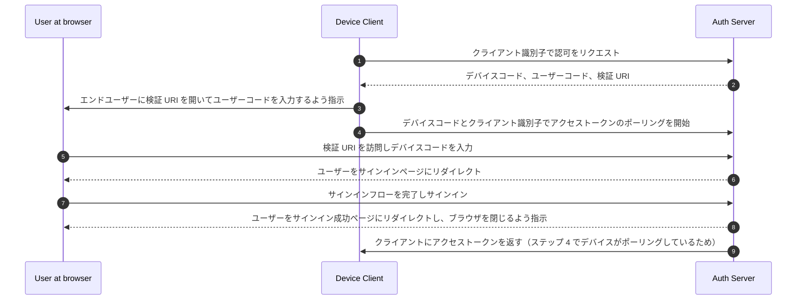

## デバイスフロー (Device flow) とは？

[OAuth デバイス認可フロー](https://www.rfc-editor.org/rfc/rfc8628)、別名デバイスフロー (Device flow) は、入力機能が制限されたデバイス（例：スマートテレビ、IoT デバイス、ゲームコンソール）やヘッドレスアプリ（例：CLI ツール）向けに設計された <Ref slug="oauth-2.0-grant" /> です。これにより、ユーザーはこれらのデバイスで <Ref slug="authorization-request">認可リクエスト</Ref> を開始し、スマートフォンやラップトップなどのより入力が可能なデバイスを使用してプロセスを完了することができます。

## デバイスフロー (Device flow) を使用するタイミングは？

1. **入力が制限されたデバイス**
    - スマートテレビでのサインイン（例：メディアアプリ）
    - ゲームコンソールでのサインイン（例：ゲームシステムやメディアアプリ）
    - ミートデバイスでのサインイン（例：公式アプリやビデオ会議アプリ）
    - ウェアラブルデバイスでのサインイン（例：入力が制限されたスマートウォッチ）
    - IoT デバイスへのアクセス（例：プリンター、ビデオエンコーダー、スピーカー）
2. **ヘッドレスアプリケーション**
    - コマンドラインインターフェースでのログイン（例：GitHub CLI や Stripe CLI）
3. **デスクトップアプリケーションの QR コードログイン**
    - スマートフォンで QR コードをスキャンしてデスクトップアプリケーションに迅速かつ安全にサインイン（例：Telegram、Steam のデスクトップでのサインイン）。この QR コードサインインフローは、従来の OAuth 2.0 デバイスフローのバリエーションと見なすことができます。

## デバイスフロー (Device flow) のエンドユーザーフローはどのように見えるか？

QR コードサインインのバリエーションを無視して、標準的な OAuth 2.0 デバイスフローに焦点を当てましょう。関与するデバイスには 2 種類あります：

### デバイスコード表示デバイス

これは、ユーザーがアクセスを認可する必要がある入力制限のあるデバイスまたはヘッドレスアプリケーションです。これには、[デバイスコードと検証 URI](#what-does-device-flow-workflow-look-like) が表示され、ユーザーに進行方法を案内します。

基本的な UI は次のとおりです：


ユーザーエクスペリエンスを向上させるために、サービスは検証 URL の QR コードを生成することがよくあります：


さらに効率を高めるために、`verification_uri` の QR コードリソース（例：`https://example.com/device`）を `verification_uri_complete`（例：`https://example.com/device?user_code=DSHP-SNCT`）に置き換え、URL にデバイスコードを含めることで、ユーザーがフィールドにデバイスコードを事前入力できるようにします。

### 認可デバイス

サインイン対象デバイスの指示に従って、ユーザーは次のことを行います：

1. ブラウザアクセスと入力機能を持つ別のデバイスを使用して検証 URL を開きます。
2. 表示されたデバイスコードを入力（事前入力されている可能性があります）し、続行します。
3. ブラウザに既存のセッションがない場合、ユーザーはまずサービスにサインインします。
4. 同意ページが表示され、ユーザーにデバイスサインインを認可するよう促します。
5. 最後に、認可後に成功ページが表示されます。


以下は、テスト用のいくつかの確立された製品のデバイスフロー検証 URL です：

- スマートテレビで [Youtube にログイン](https://www.youtube.com/watch?v=yTcuazSy5Cs)：[youtube.com/activate](https://youtube.com/activate)
- スマートテレビで Disney+ にログイン：[disneyplus.com/begin](https://disneyplus.com/begin)
- [Samsung Galaxy Watch で Shopify にログイン](https://www.drmare.com/spotify-music/spotify-on-galaxy-watch.html)：[spotify.com/pair](https://spotify.com/pair)
- ミートデバイスで [Zoom にログイン](https://developers.zoom.us/blog/device-authorization/)：[zoom.us/oauth_device](https://zoom.us/oauth_device)
- [GitHub CLI にログイン](https://docs.github.com/en/apps/oauth-apps/building-oauth-apps/authorizing-oauth-apps#device-flow)：[github.com/login/device](https://github.com/login/device)
- [Google デバイスフロー](https://www.oauth.com/oauth2-servers/device-flow/user-flow/) を利用：https://www.google.com/device

## デバイスフロー (Device flow) のワークフローはどのように見えるか？

まず、デバイスコード表示デバイスに表示される情報を処理するために使用されるデバイス認可応答のパラメータを理解する必要があります：

| パラメータ                              | 説明                                                                                                                                                                    |
| -------------------------------------- | ------------------------------------------------------------------------------------------------------------------------------------------------------------------------------ |
| `device_code`                          | デバイス検証コード。                                                                                                                                                  |
| `user_code`                            | エンドユーザー検証コード。                                                                                                                                                |
| `verification_uri`                     | 認可サーバー上のエンドユーザー検証 URI。エンドユーザーがユーザーエージェントに手動で入力するよう求められるため、URI は短く覚えやすいものであるべきです。 |
| `verification_uri_complete` (オプション) | "user_code"（または "user_code" と同じ機能を持つ他の情報）を含む検証 URI で、非テキスト伝送用に設計されています。             |
| `expires_in`                           | "device_code" と "user_code" の有効期間（秒単位）。                                                                                                                  |
| `interval`                             | クライアントがトークンエンドポイントへのポーリングリクエストの間に待機すべき最小時間（秒単位）。値が提供されない場合、クライアントはデフォルトとして 5 を使用する必要があります。 |

```json
{
    "device_code": "GmRhmhcxhwAzkoEqiMEg_DnyEysNkuNhszIySk9eS",
    "user_code": "WDJBMJHT",
    "verification_uri": "https://custom.domain.com/device",
    "verification_uri_complete":
        "https://custom.domain.com/device?user_code=WDJB-MJHT",
    "expires_in": 900,
    "interval": 5
}
```

ユーザーがデバイスフローを使用して認証を行う場合、主に以下のステップが含まれます：



1. デバイスクライアントは、クライアント識別子（通常は auth サーバープラットフォーム上のクライアント ID）を使用して auth サーバーから認可をリクエストします。
2. auth サーバーは、デバイスクライアントにデバイスコード、ユーザーコード、および検証 URI を応答します。
3. デバイスクライアントは、検証 URI とユーザーコードをテキスト（または QR コードなど）の形式でユーザーに表示し、URI を訪問してコードを入力するよう指示します。
4. ステップ 3 と同時に、デバイスクライアントは auth サーバーからデバイスコードとクライアント識別子でアクセストークンのポーリングを開始し、ユーザーが <Ref slug="authorization-request" /> を確認し、ユーザー認可を完了するのを待ちます。
5. ユーザーは、別のデバイスのブラウザを介して auth サーバーがホストする検証 URI を訪問し、ユーザーコードを入力します。
6. auth サーバーは、ユーザーをサインインページにリダイレクトし、サインインを完了するよう指示します。
7. ユーザーはサインインフローを完了し、正常にサインインします。
8. auth サーバーは、ユーザーをサインイン成功ページにリダイレクトし、ブラウザを閉じるよう指示します。
9. ステップ 8 と同時に、auth サーバーはステップ 4 からポーリングしているデバイスクライアントにアクセストークンを返します。

これらのプロセスの後、デバイスクライアントは後続のサービスのために <Ref slug="access-token" /> を取得できるようになります。

詳細については、[RFC 8628 OAuth 2.0 デバイス認可グラント](https://datatracker.ietf.org/doc/html/rfc8628#autoid-3) を参照してください。

## デバイスフロー (Device flow) のセキュリティ考慮事項は？

デバイスフローは、2 つのデバイス間の相互作用を伴うため、デバイスコードの露出、ブルートフォース攻撃、または中間者 (MitM) 攻撃などの潜在的なセキュリティリスクにさらされます。

デバイスコードを取得するだけでは直ちに認可を得ることはできません（ユーザーはまだ認証と認可を行う必要があります）が、攻撃者は有効期間中にデバイスコードリクエストを再生しようとする可能性があります。これにより、認可されていない繰り返しアクセスが発生する可能性があります。セキュリティを強化するために、次の予防策を考慮してください：

- **`expires_in` の期間を短縮する：** デバイスコードの有効期間を短縮することで、攻撃の機会を減らします。
- **失敗した試行を制限する：** ブルートフォース攻撃を防ぐために、誤ったコード入力の回数を制限します。
- **HTTPS を強制する：** デバイスと認可サーバー間のすべての通信が HTTPS を使用して暗号化されていることを確認し、中間者攻撃を防ぎます。
- **シングルユースのデバイスコードを制限する：** 各デバイスコードを **1 回のセッション** に制限し、認可されていない第三者による再利用を防ぎます。

デバイスコードのシングルユースは、OAuth 2.0 デバイスフローの組み込み要件ではないことに注意してください。これはオプションのベストプラクティスです。一部の開発者は、同じコードでの同時デバイス認可（例：数百のデバイスで）を意図的に設計する場合がありますが、このアプローチはセキュリティリスクを増大させるため、慎重に評価する必要があります。

## OIDC プロバイダーはデバイスフロー (Device flow) をサポートしているか？

デバイスフローは伝統的に OAuth に関連付けられていますが、<Ref slug="openid-connect" /> プロバイダーもそれをサポートすることができます。OIDC は、OAuth の主な焦点である認可を超えた追加の利点を提供します。それは認証にまで拡張され、アプリケーションが <Ref slug="access-token" /> と <Ref slug="id-token" /> の両方を単一のフローで取得できるようにします。

OIDC の堅牢な統一アイデンティティ管理、トークン検証や <Ref slug="refresh-token">リフレッシュ</Ref> を含む、は、特に入力機能が制限されたデバイスとアプリケーション間の安全で信頼性の高い <Ref slug="authentication" /> と <Ref slug="authorization" /> に適しています。

<SeeAlso slugs={['oauth-2.0-grant', 'authorization-code-flow', 'implicit-flow', 'client-credentials-flow']} />

<Resources urls={['https://blog.logto.io/a-brief-introduction-to-oauth2-device-flow', 'https://datatracker.ietf.org/doc/html/rfc8628']} />