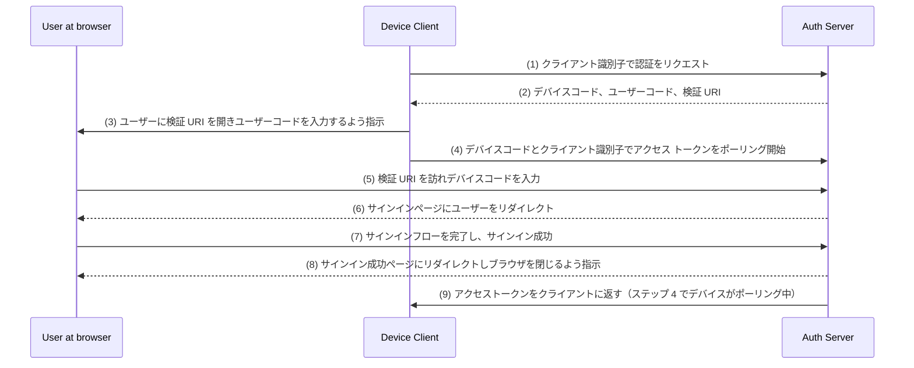

## デバイスフロー (Device flow) とは？

[OAuth Device Authorization Flow](https://www.rfc-editor.org/rfc/rfc8628)、別名デバイスフロー (Device flow) は、入力能力が制限されたデバイス（例: スマートテレビ、IoT デバイス、ゲームコンソール）やヘッドレスアプリ（例: CLI ツール）向けに設計された [OAuth 2.0](https://oauth.net/2/) の実装です。これにより、これらのデバイスで認証リクエストを開始し、スマートフォンやラップトップのようなより入力能力のあるデバイスを使用してプロセスを完了することができます。

## デバイスフロー (Device flow) を使用する場面は？

1. **入力が制限されたデバイス**
    - スマートテレビでのサインイン（例: メディアアプリ）
    - ゲームコンソールでのサインイン（例: ゲームシステムやメディアアプリ）
    - ミーティングデバイスでのサインイン（例: 公式アプリやビデオミーティングアプリ）
    - ウェアラブルデバイスでのサインイン（例: 入力が限られたスマートウォッチ）
    - IoT デバイスへのアクセス（例: プリンター、ビデオエンコーダー、スピーカー）
2. **ヘッドレスアプリケーション**
    - コマンドラインインターフェースでのログイン（例: GitHub CLI や Stripe CLI）
3. **デスクトップアプリケーションの QR コードログイン**
    - スマートフォンで QR コードをスキャンして、デスクトップアプリケーションに素早く安全にサインイン（例: Telegram、Steam のデスクトップでのサインイン）。この QR コードサインインフローは、従来の OAuth 2.0 デバイスフローの一種と見なされます。

## デバイスフロー (Device flow) エンドユーザーフローはどのように見えるのか？

QR コードサインインのバリエーションは無視して、標準の OAuth 2.0 デバイスフローに焦点を当てましょう。ここでは 2 種類のデバイスが関与します：

### デバイスコード表示デバイス

これは、ユーザーがアクセスを認証する必要がある入力が制限されたデバイスまたはヘッドレスアプリケーションです。これには[デバイスコードと検証 URI](#what-does-device-flow-workflow-look-like) を表示し、ユーザーに進行方法を案内します。

基本的な UI は次のとおりです：


ユーザーエクスペリエンスを向上させるために、サービスはしばしば検証 URL の QR コードを生成します：


さらに効率を高めるために、`verification_uri` の QR コードリソース（例: `https://example.com/device`）を `verification_uri_complete`（例: `https://example.com/device?user_code=WDJB-MJHT`）に置き換えます。これにより、デバイスコードを URL に含めることができ、ユーザーがデバイスコードをフィールドに事前入力するのを助けます。

### 認証デバイス

サインイン対象デバイスの指示に従って、ユーザーは次の操作を実行します：

1. ブラウザアクセスと入力能力を持つ別のデバイスで検証 URL を開きます。
2. 表示されたデバイスコードを入力し（事前入力されている場合もあります）、続行します。
3. ブラウザ上に既存のセッションがない場合、ユーザーはまずサービスにサインインします。
4. 同意ページが表示され、ユーザーにデバイスサインインを認証するよう求められます。
5. 最後に、認証が完了すると成功のページが表示されます。

以下はあなたのテスト用に確立された製品のデバイスフロー検証 URL の一例です：

- [スマートテレビで YouTube にログイン](https://www.youtube.com/watch?v=yTcuazSy5Cs): [youtube.com/activate](https://youtube.com/activate)
- スマートテレビで Disney+ にログイン: [disneyplus.com/begin](https://disneyplus.com/begin)
- [Samsung Galaxy Watch で Shopify にログイン](https://www.drmare.com/spotify-music/spotify-on-galaxy-watch.html): [spotify.com/pair](https://spotify.com/pair)
- [ミーティングデバイスで Zoom にログイン](https://developers.zoom.us/blog/device-authorization/): [zoom.us/oauth_device](https://zoom.us/oauth_device)
- [GitHub CLI にログイン](https://docs.github.com/en/apps/oauth-apps/building-oauth-apps/authorizing-oauth-apps#device-flow): [github.com/login/device](https://github.com/login/device)
- [Google デバイスフロー](https://www.oauth.com/oauth2-servers/device-flow/user-flow/): https://www.google.com/device

## デバイスフロー (Device flow) ワークフローはどのように見えるのか？

まず、デバイスコード表示デバイスに表示される情報を処理するためのデバイス認証応答のパラメータを理解する必要があります：

| Parameter                              | Description                                                                                                                                                                    |
| -------------------------------------- | ------------------------------------------------------------------------------------------------------------------------------------------------------------------------------ |
| `device_code`                          | デバイス検証コード。                                                                                                                                                              |
| `user_code`                            | エンドユーザー検証コード。                                                                                                                                                      |
| `verification_uri`                     | 認証サーバー上のエンドユーザー検証 URI。この URI は短く覚えやすいものでなければならず、エンドユーザーはこれをユーザーエージェントに手動で入力するよう求められます。                  |
| `verification_uri_complete` (optional) | 「user_code」またはその機能を持つ他の情報を含む検証 URI で、非テキスト形式の伝達を目的としています。                                                                        |
| `expires_in`                           | 「device_code」および「user_code」の有効期間（秒）。                                                                                                                                |
| `interval`                             | クライアントがトークンエンドポイントへのポーリングリクエストの間に待機する最低秒数。値が提供されない場合、クライアントはデフォルトとして 5 を使用する必要があります。                                           |

```json
{
    "device_code": "GmRhmhcxhwAzkoEqiMEg_DnyEysNkuNhszIySk9eS",
    "user_code": "WDJBMJHT",
    "verification_uri": "https://custom.domain.com/device",
    "verification_uri_complete":
        "https://custom.domain.com/device?user_code=WDJB-MJHT",
    "expires_in": 900,
    "interval": 5
}
```

ユーザーが認証のためにデバイスフロー (Device flow) を使用する際、主に以下のステップを含みます：



1. デバイスクライアントはクライアント識別子（通常は認証サーバープラットフォーム上のクライアント ID）を使用して認証サーバーに認証をリクエストします。
2. 認証サーバーは、デバイスコード、ユーザーコード、検証 URI をデバイスクライアントに返します。
3. デバイスクライアントは検証 URI とユーザーコードをテキスト（または QR コードなど）として表示し、ユーザーに URI を訪問しコードを入力するよう指示します。
4. ステップ 3 と同時に、デバイスクライアントはデバイスコードとクライアント識別子を使用して認証サーバーからアクセス トークンをポーリングし始め、ユーザーが認証リクエストを確認し認証を完了するのを待ちます。
5. ユーザーは別のデバイスのブラウザを介して認証サーバーによってホストされる検証 URI を訪れ、ユーザーコードを入力します。
6. 認証サーバーはユーザーをサインインページにリダイレクトし、サインインを完了するよう指示します。
7. ユーザーはサインインフローを完了し、正常にサインインします。
8. 認証サーバーはユーザーをサインイン成功ページにリダイレクトし、ユーザーにブラウザを閉じるよう指示します。
9. ステップ 8 と同時に、認証サーバーはステップ 4 以降ポーリングしているクライアントにアクセストークンを返します。

これらのプロセスの後、デバイスクライアントはその後のサービスのためのアクセストークンを取得できるようになります！

詳細については、[RFC 8628 OAuth 2.0 Device Authorization Grant](https://datatracker.ietf.org/doc/html/rfc8628#autoid-3) をお読みください。

<SeeAlso slugs={['authorization-code-flow', 'implicit-flow', 'client-credentials-flow']} />

<Resources urls={['https://blog.logto.io/a-brief-introduction-to-oauth2-device-flow', 'https://datatracker.ietf.org/doc/html/rfc8628']} />