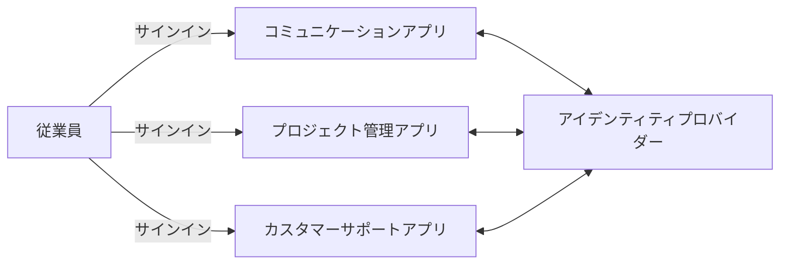
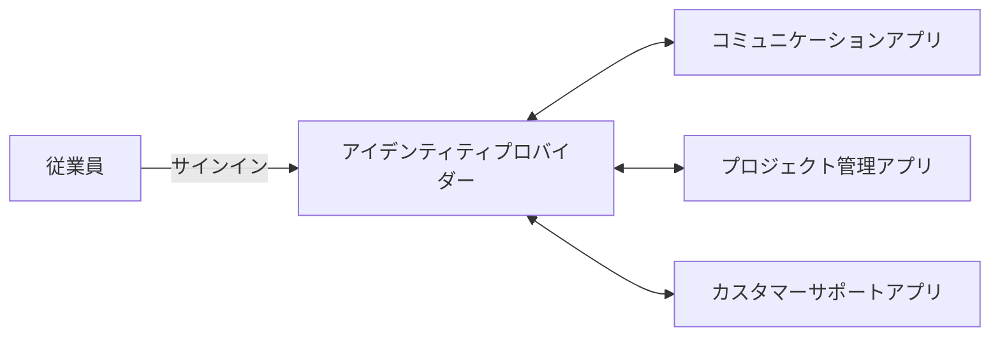
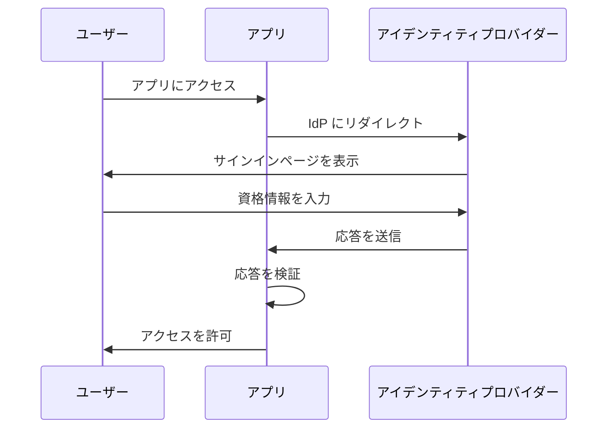
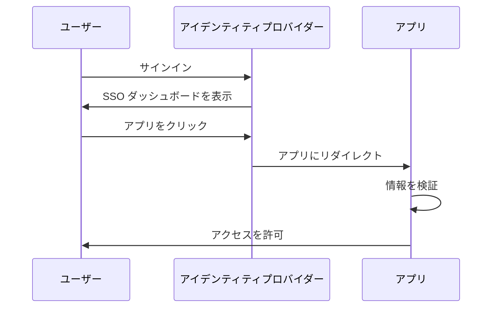
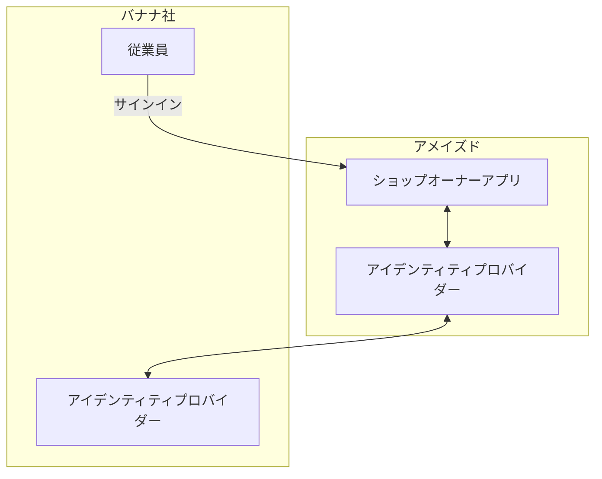

## エンタープライズ SSO とは？

定義に入る前に、SSO とエンタープライズ SSO の違いを明確にすることが重要です。これが混乱を引き起こすことがよくあります。

- <Ref slug="single-sign-on" /> は、ユーザーが一度ログインして複数のアプリケーションやリソースに再ログインすることなくアクセスできることを指す一般的な用語です。
- エンタープライズ SSO は、組織内の従業員向けに設計された特定のタイプの SSO です。

まだ不明確ですか？例を見てみましょう。

_アメイズド_ というオンラインショッピングサイトには、顧客向けとショップオーナー向けの 2 つの Web アプリケーションがあります。顧客は商品を購入するためにショッピングアプリにサインインし、ショップオーナーは店舗を管理するためにショップオーナーアプリにサインインします。両方のアプリは、認証に同じアイデンティティプロバイダー (identity provider) を使用しています。その結果、ユーザーは一度サインインするだけで両方のアプリにアクセスでき、シングルサインオンの体験を提供します。

内部では、_アメイズド_ はチームコミュニケーション、プロジェクト管理、カスタマーサポートのために複数のアプリケーションを使用しています。日々のワークフローを効率化するために、_アメイズド_ は従業員向けにエンタープライズ SSO を実施しています。エンタープライズ SSO を使用すると、従業員は単一のログインで全ての内部アプリケーションにアクセスできます。

通常、エンタープライズ SSO ソリューションは 従業員がワンクリックですべてのアプリケーションにアクセスできる中央のダッシュボードも提供します。このダッシュボードは SSO ダッシュボードと呼ばれることが多いです。

要するに、どちらのシナリオもシングルサインオンの例です。違いは、最初の例が一般的な SSO であり、2 番目の例がエンタープライズ SSO であることです。これらは通常、それぞれカスタマー IAM (Identity and Access Management) とワークフォース IAM のユースケースです。

## エンタープライズ SSO はどのように機能するか？

エンタープライズ SSO は、複数のアプリケーションを中央のアイデンティティプロバイダー (identity provider) に接続することで機能します。この接続は、一方向 (アプリケーションからアイデンティティプロバイダーへの) または、双方向 (アプリケーションとアイデンティティプロバイダーの間の) が可能です。SAML、OpenID Connect、OAuth 2.0 などのさまざまな標準やプロトコルがこれらの接続に利用されます。

プロトコルに関係なく、基本的なワークフローは通常、次のように似ています。

1. ユーザーが認証を必要とするアプリケーション (例: コミュニケーションアプリ) にアクセスします。
2. アプリケーションはユーザーをアイデンティティプロバイダーに認証のためにリダイレクトします。
3. ユーザーはアイデンティティプロバイダーにログインします。
4. アイデンティティプロバイダーは認証応答をアプリケーションに戻します。
5. アプリケーションは応答を検証し、ユーザーにアクセスを許可します。

同じアイデンティティプロバイダーに接続されている別のアプリケーション (例: プロジェクト管理アプリ) にユーザーがアクセスすると、もう一度資格情報を入力することなく自動的にログインされます。この場合、ステップ 3 はスキップされ、ステップ 2、4、5 はバックグラウンドで発生するため、ユーザーは認証プロセスに気付かない可能性があります。

このプロセスはサービスプロバイダー (SP) -主導の SSO と呼ばれ、アプリケーション (SP) が認証プロセスを開始します。

別のシナリオでは、アイデンティティプロバイダーはユーザーがすべての接続されたアプリケーションにアクセスできる中央のダッシュボードを提供します。簡略化されたワークフローは以下の通りです。

1. ユーザーはアイデンティティプロバイダーにログインします。
2. アイデンティティプロバイダーはユーザーがアクセスできるアプリケーションのリストを表示します。
3. ユーザーはアプリケーション (例: カスタマーサポートアプリ) をクリックしてアクセスします。
4. アイデンティティプロバイダーは認証情報を持ってユーザーをアプリケーションにリダイレクトします。
5. アプリケーションは情報を検証し、ユーザーにアクセスを許可します。

このプロセスはアイデンティティプロバイダー (IdP)-主導の SSO と呼ばれ、アイデンティティプロバイダー (IdP) が認証プロセスを開始します。

## なぜエンタープライズ SSO が重要なのか？

### ワークフォース IAMにおけるエンタープライズ SSO

#### 中央管理

エンタープライズ SSO の主な利点は、従業員にとっての便利さだけでなく、組織にとっての強化されたセキュリティとコンプライアンスです。さまざまなアプリケーションの複数の資格情報を管理したり、個別に認証と認可を設定する代わりに、組織はユーザーアイデンティティ、アクセス制御ポリシー、監査ログの管理を集中化できます。

例えば、従業員が退社したとき、IT 部門がアイデンティティプロバイダーで従業員のアカウントを無効にし、全てのアプリケーションへのアクセスを即座に取り消すことができます。これはライフサイクル管理と呼ばれる、無許可アクセスやデータ侵害を防ぐための重要なプロセスです。

#### アクセス制御

エンタープライズ SSO ソリューションには、ロールベースアクセス制御 (RBAC) や属性ベースアクセス制御 (ABAC) などのアクセス制御機能がよく含まれます。これらの機能により、組織はユーザーロール、属性、その他のコンテクスト情報に基づいて詳細なアクセスポリシーを定義し、従業員が適切なリソースに適切なアクセスレベルを持つことを保証します。

RBAC とABAC の詳細な比較については、[RBAC and ABAC: The access control models you should know](https://blog.logto.io/rbac-and-abac) をご覧ください。

#### 強化されたセキュリティ

別の利点は、マルチファクター認証 (MFA)、パスワードレス認証、適応型認証などの強力な認証方法をすべてのアプリケーションに強制する能力です。これらの方法は、敏感なデータを保護し、業界規制に準拠するのに役立ちます。

MFA に関する詳細は、[Exploring MFA: Looking at authentication from a product perspective](https://blog.logto.io/elaborate-mfa) を参照してください。

### カスタマー IAMにおけるエンタープライズ SSO

「エンタープライズ SSO」という用語はカスタマー IAM ソリューションでも使用されます。このコンテキストでは、どのような意味があるのでしょうか？_アメイズド_ の例に立ち戻ります：一部のショップオーナーは法人として記録されています。あるショップオーナー、_バナナ社_ は従業員向けにエンタープライズ SSO を実施しています。契約の一環として、_バナナ社_ は _アメイズド_ に対し、ショップオーナーアプリにアクセスする際に _バナナ社_ からの全てのメールアドレス (例：`*@banana.com`) に対してエンタープライズ SSO を強制することを要求します。

この場合、_アメイズド_ はエンタープライズ SSO を _バナナ社_ の従業員向けに有効にするために、自社のアイデンティティプロバイダーをバナナ社 のアイデンティティプロバイダーと統合する必要があります。この統合は、SAML、OpenID Connect、OAuth などの標準プロトコルを使用して行われることが多く、エンタープライズ SSO 接続、エンタープライズ SSO コネクタ、または SSO フェデレーションと呼ばれます。

カスタマー IAM に関する詳細な説明については、CIAM シリーズをご覧ください：

- [CIAM 101: Authentication, Identity, SSO](https://blog.logto.io/ciam-101-intro-authn-sso)
- [CIAM 102: Authorization & Role-Based Access Control](https://blog.logto.io/ciam-102-authz-and-rbac)

#### エンタープライズ対応を実現する

B2B (企業対企業) シナリオでは、エンタープライズ SSO はエンタープライズ顧客をサポートするための SaaS プロバイダーにとって必須機能です。これは、単なる便利さの問題ではなく、両当事者にとってのセキュリティとコンプライアンスの問題です。エンタープライズ SSO は、エンタープライズ顧客によって管理されるすべてのアイデンティティがエンタープライズアイデンティティプロバイダーを通じて認証されることを強制し、エンタープライズがそのユーザー、データ、アクセスおよびセキュリティポリシーを制御下に置くことを保証します。

エンタープライズ SSO は、エンタープライズ顧客のニーズを満たす能力である _エンタープライズ対応_ を達成するための重要な要素です。しかし、アイデンティティおよびアクセス管理は、特にエンタープライズ顧客のコンテキストにおいて複雑であり、時間、リソース、専門知識に多大な投資を必要とします。現代の SaaS プロバイダーは、これらの複雑さのため IAM プラットフォームを選択することがよくあります。

<SeeAlso slugs={['single-sign-on']} />
