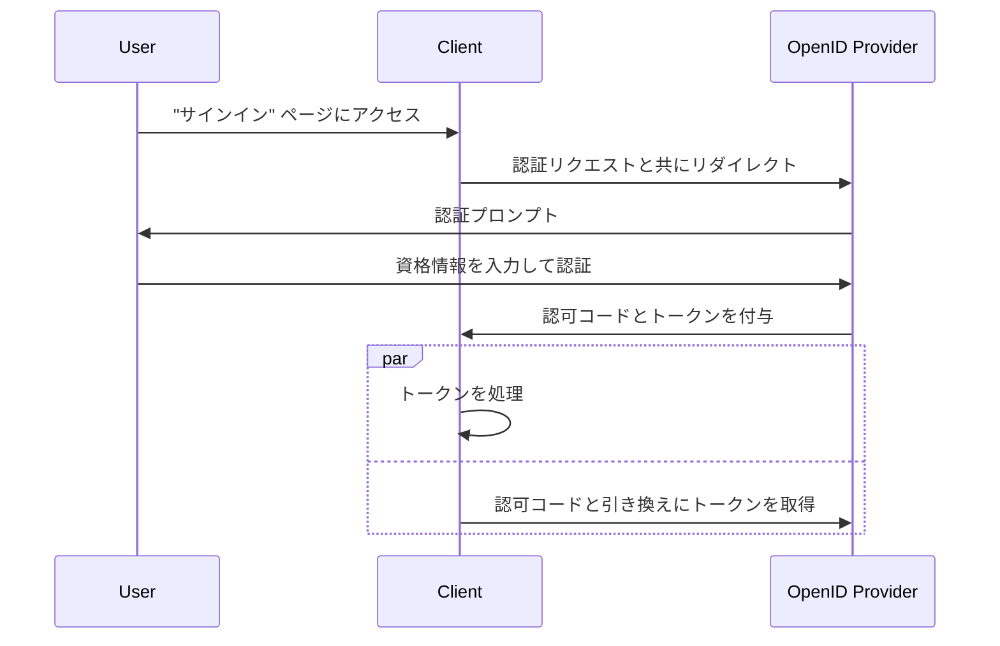

## ハイブリッドフロー (Hybrid flow) とは？

ハイブリッドフロー (Hybrid flow) は、<Ref slug="authorization-code-flow" /> と <Ref slug="implicit-flow" /> の特徴を組み合わせた認証プロセスです。ハイブリッドフローは<Ref slug="oauth-2.0" />の仕様の一部ではなく、<Ref slug="openid-connect" /> によって提供される拡張機能である点に留意してください。

このフローは、ユーザー認証においてセキュリティと使いやすさのバランスを提供するために設計されています。しかし、インプリシットフローに関連する[セキュリティの考慮事項](#security-considerations)のため、ハイブリッドフローは新しいアプリケーションに対して推奨されていません。ハイブリッドフローの一般的な代替手段は、より良いセキュリティのために <Ref slug="pkce" /> を使用する認可コードフローです。

## ハイブリッドフロー (Hybrid flow) はどのように機能するのか？

ハイブリッドフローの主な手順は次のとおりです：

1. 他の OIDC フローと同様に、ハイブリッドフローは <Ref slug="client" /> が <Ref slug="openid-connect" headingId="openid-provider-op" /> に<Ref slug="authentication-request" /> を開始することで始まります。

    注意: クライアントは `response_type` パラメータを `code` と少なくとも `id_token` または `token` のいずれかと組み合わせて含める必要があります。これにより、次の3つの組み合わせが可能です：

      - `code id_token`: クライアントは認可コードと ID トークンを期待します。
      - `code token`: クライアントは認可コードとアクセストークンを期待します。
      - `code id_token token`: クライアントは認可コード、ID トークン、アクセストークンを期待します。

    これは自明です: クライアントは認可コードと1つ以上のトークンを期待しており、これは認可コードフローとインプリシットフローに対応しています。
2. ユーザーは <Ref slug="openid-connect" headingId="openid-provider-op" /> で認証を行います。
3. <Ref slug="openid-connect" headingId="openid-provider-op" /> は認可コードおよび要求されたトークンと共にユーザーをクライアントアプリケーションにリダイレクトします。
4. クライアントアプリケーションはトークンを処理し、ユーザーに代わって保護されたリソースにアクセスするためにそれを使用できます。また、<Ref slug="token-request" /> を介して追加のトークンを取得するために認可コードを使用できます。

ハイブリッドフローの簡略化されたシーケンス図は次のとおりです：



ハイブリッドフロー認証リクエストの非標準的な例は次のとおりです：

```http
GET /authorize?response_type=code%20id_token
  &client_id=YOUR_CLIENT_ID
  &redirect_uri=https%3A%2F%2Fclient.example.com%2Fcallback
  &scope=openid%20profile%20email
  &nonce=123456
  &state=abc123 HTTP/1.1
Host: your-openid-provider.com
```

### ハイブリッドフロー認証リクエストの主要パラメータ

ハイブリッドフロー認証リクエストには次の主要なパラメータが含まれます：

- **`response_type`**: 値は `code` と少なくとも `id_token` または `token` のいずれかを組み合わせたものである必要があります。例えば、`code id_token` または `code token` です。
- **`client_id`**: <Ref slug="openid-connect" headingId="openid-provider-op" /> (認可サーバー) によって発行されたクライアント識別子。
- **`redirect_uri`**: 認可サーバーが認証プロセス後にユーザーを送信する URI です。
- **`scope`**: トークンの要求された<Ref slug="scope">スコープ</Ref> (権限)。
- **`resource`**: 要求されたリソースの<Ref slug="resource-indicator" />を指定するオプションのパラメータです。このパラメータを使用するには、認可サーバーが[RFC 8707](https://datatracker.ietf.org/doc/html/rfc8707)をサポートしている必要があります。

パラメータの完全なリストとその説明については、[ハイブリッドフローを使用した認証](https://openid.net/specs/openid-connect-core-1_0.html#HybridFlowAuth)を参照してください。

## セキュリティの考慮事項

ハイブリッドフローはセキュリティ制限で知られているインプリシットフローを含んでいます。トークンは依然としてフロントチャンネル (ブラウザ) を介して送信されるため、潜在的な攻撃にさらされる可能性があります。これらの懸念から、インプリシットフローは <Ref slug="oauth-2.1" /> で廃止される予定です。

<Ref slug="pkce" /> を使用した <Ref slug="authorization-code-flow" /> は、ハイブリッドフローの推奨代替手段であり、フロントチャンネルでトークンを公開することなくユーザーを認証するためのより安全な方法を提供します。

<SeeAlso slugs={["openid-connect", "oauth-2.1", "authorization-code-flow", "pkce", "implicit-flow"]} />

<Resources
  urls={[
    "https://blog.logto.io/implicit-flow-is-dead",
    "https://blog.logto.io/oauth-2-1",
    "https://openid.net/specs/openid-connect-core-1_0.html#HybridFlowAuth",
  ]}
/>