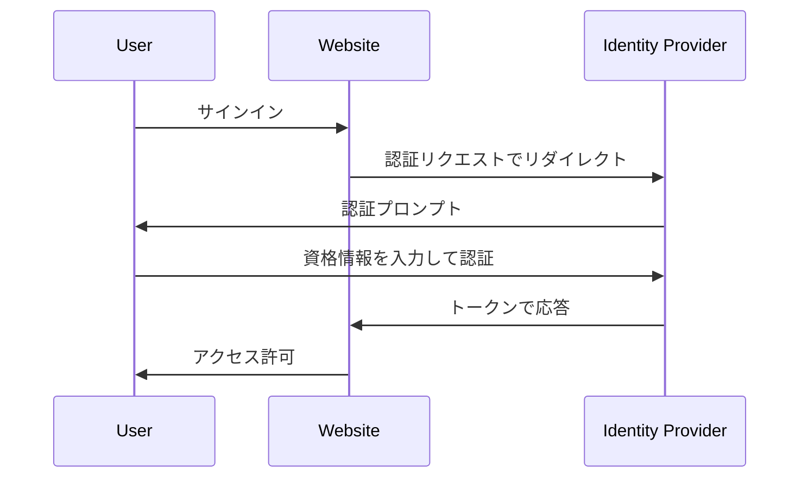

## アイデンティティとアクセス管理 (IAM) とは？

定義が示すように、アイデンティティとアクセス管理 (IAM) はデジタルアイデンティティを管理し、<Ref slug="access-control" /> を行う多くの側面を含む広範な概念です。まず、用語を分解してみましょう：

- **Identity (アイデンティティ)**: ユーザー、サービス、デバイスのデジタルな表現。アイデンティティは識別子、role (ロール)、permissions (権限) などの属性を含むことができます。
- **Access (アクセス)**: リソースと対話し、アクションを実行し、サービスを利用する能力。要するに、アクセスは特定のリソースに対してどのようなアクションを実行するかに関することです。

### アイデンティティ管理

アイデンティティ管理はデジタルアイデンティティを管理し、認証し、保護するプロセスです。以下の重要な活動が含まれます：

- **Identity registration (アイデンティティ登録)**: ユーザー、サービス、デバイスの新しいアイデンティティを作成。
- **Identity authentication (アイデンティティ認証)**: パスワード、生体認証、または多要素認証 (MFA) などのさまざまなメカニズムを通じてアイデンティティの所有権を確認。
- **Identity security (アイデンティティセキュリティ)**: 不正アクセス、悪用、または開示からアイデンティティを保護。

各トピックは広範であり、パスワード管理、アイデンティティフェデレーション、アイデンティティライフサイクル管理などのサブトピックにさらに分割できます。

### アクセス管理

アクセス管理 (または <Ref slug="access-control" />) は特定のリソース上で誰がどのアクションを実行できるかを制御するプロセスです。以下の重要な活動が含まれます：

- **Access control policies (アクセス制御ポリシー)**: 誰がどのリソースにアクセスできるか、どのアクションを実行できるかを決定するルールとポリシーを定義。
- **Access enforcement (アクセス施行)**: 認証、authorization (認可)、監査などのメカニズムを通じてアクセス制御ポリシーを実施。
- **Access governance (アクセスガバナンス)**: 規制とセキュリティのベストプラクティスに準拠するためにアクセス権を監視および管理。

各活動は、定義されたポリシーに基づいて、authorized (認可された) アイデンティティ (ユーザー、サービス、デバイス) のみがリソースにアクセスできるようにするために、現代のアプリケーションやシステムで重要な役割を果たします。

## IAMのコンポーネントは何ですか？

実際には、IAM はソフトウェア、サービス、ベストプラクティスを組み合わせて実装されます。IAM の重要なコンポーネントの2つは：

- **<Ref slug="identity-provider" />**: ユーザーアイデンティティと認証を管理するサービス。
- **<Ref slug="service-provider" />**: 認証とauthorization (認可) のためにアイデンティティプロバイダーに依存するサービス。多くの場合、それは開発しているアプリケーションやサービスです。

アイデンティティプロバイダーとサービスプロバイダーの明確な分離は、アプリケーションロジックからIAMを切り離すのに役立ち、管理と拡張を容易にします。

## IAMの実践における例

IAM がどのように機能するかの例を見てみましょう：Webサイトにサインインする際、あなたが誰であるかを確認し、そのWebサイトへのアクセスを許可するプロセスは、アイデンティティとアクセス管理のプロセスと見なすことができます。

通常、IAM プロセスには2つの主なステップが含まれます：authentication (認証) とauthorization (認可)。

- <Ref slug="authentication" /> は「どのアイデンティティを所有しているか？」という質問に答えます。
- <Ref slug="authorization" /> は「何ができるか？」という質問に答えます。

> 時には、authentication (認証) は「あなたは誰？」と解釈されます。しかし、デジタルアイデンティティについて議論する際は、authentication (認証) を「アイデンティティの所有を証明する」と示す方がより正確です。

さらに、アイデンティティとアクセス管理の概念はさらに大きくなり、WIAM (Workforce IAM) や CIAM (Customer IAM) などの新しい概念を生み出しています。

WIAM と CIAM は同じ基盤を共有していますが、使用例は異なります：WIAM は通常内部ユーザー向けに使用され、CIAM は外部顧客向けに使用されます。いくつかの例：

- **WIAM**: あなたの会社には従業員のための統一されたアイデンティティシステムがあり、それにより全員が同じアカウントを使ってソフトウェアのサブスクリプションやクラウドコンピューティングサービスなどの会社のリソースにアクセスできます。
- **CIAM**: あなたのオンライン書店は、顧客や販売者のためのユーザーアイデンティティシステムを必要とします。サインインの体験はオンボーディングの重要な部分であり、コンバージョンファネルの先頭に位置しています。

CIAM の概念と関連トピックについてさらに学びたい場合は、[CIAM 101: Authentication, Identity, SSO](https://blog.logto.io/ciam-101-intro-authn-sso) を参照できます。

### 認証

IAM に使用される一般的な認証方法はいくつかあります：

- **Password-based authentication (パスワードベースの認証)**: 最も一般的な方法であり、ユーザーがユーザー名とパスワードを提供して自分のアイデンティティを証明します。
- **<Ref slug="passwordless" /> 認証**: メールや電話に送信されるワンタイムコードを使用するなどしてユーザーがパスワードなしでサインインできる方法。passwordless (パスワードレス) 認証は、他の方法、例えば生体認証を指す場合もあります。
- **ソーシャルログイン**: ユーザーが Google、Facebook、Twitter などのソーシャルメディアアカウントを使用してサインインできる方法。
- **<Ref slug="passkey" /> (WebAuthn)**: ユーザーがセキュリティキー (USB キーや WebAuthn をサポートするスマートフォンなど) を使用してサインインできる方法。
- **Biometric authentication (生体認証)**: 指紋、顔認識、音声認識などの身体的特徴を使用してユーザーのアイデンティティを確認する方法。
- **<Ref slug="machine-to-machine" /> 認証**: サービスやデバイスが API キーや証明書などを使用して人間の介入なしに互いに認証する方法。

追加のセキュリティ層として、これらの認証方法と組み合わせて <Ref slug="mfa" /> を使用できます。MFA は、ユーザーがパスワード (知っているもの)、セキュリティキーや <Ref slug="totp" /> (持っているもの)、生体データ (そのもの) などの2つ以上の要素を提供して自分のアイデンティティを証明する必要があります。

### 認可

認証が行われると、authorization (認可) はアイデンティティが実行できるアクションを決定します。認可はそのアイデンティティの role (ロール)、グループメンバーシップ、権限、属性、ポリシーなどのさまざまな要素に基づくことができます。いくつかの一般的な認可モデルがあります：

- **<Ref slug="rbac" />**: 権限をロールに割り当て、その後ロールをアイデンティティに割り当てるモデル。例えば、従業員ロールは特定のリソースにアクセスできる可能性があり、管理者ロールはすべてのリソースにアクセスできる可能性があります。
- **<Ref slug="abac" />**: アイデンティティ、リソース、および環境の属性 (プロパティ) を使用してアクセス制御の意思決定を行うモデル。例えば、「department=engineering」という属性を持つアイデンティティはエンジニアリングリソースにアクセスできるかもしれません。
- **Policy-based access control (PBAC) (ポリシーベースのアクセス制御)**: アクセス制御のルールを定義するためにポリシーを使用するモデル。ポリシーは、時刻、場所、デバイスタイプなどのさまざまな要素に基づくことができます。
- **Fine-grained access control (細粒度アクセス制御)**: 個々のリソースやアクションのレベルで権限を設定することを可能にし、より詳細な制御を提供するモデル。

## IAMのための広く使用されるオープン標準は何ですか？

IAM で広く使用されるいくつかのオープン標準とプロトコルがあります：

- **<Ref slug="oauth-2.0" />**: アプリケーションがユーザーの資格情報を共有せずにユーザーに代わってリソースにアクセスできるようにするプロトコル。OAuth 2.0 は、サードパーティのアプリケーションがユーザーの Google ドライブファイルにアクセスすることを許可するような認可に一般的に使用されます。
- **<Ref slug="openid-connect" />**: OAuth 2.0 の上に構築されたアイデンティティレイヤーで、アプリケーションがユーザーのアイデンティティを検証し、基本的なプロフィール情報を取得できるようにします。シングルサインオン (SSO) は OpenID Connect の一般的な使用例です。OAuth 2.0 と OpenID Connect を組み合わせることは、現代の IAM において一般的な慣行です。
- **<Ref slug="saml" />**: アイデンティティプロバイダーとサービスプロバイダー間で認証および認可データを交換するための XML ベースの標準。SAML はエンタープライズ環境における SSO に一般的に使用されます。
- **SCIM (System for Cross-domain Identity Management)**: アイデンティティプロバイダーとサービスプロバイダー間でユーザーアイデンティティ情報の交換を自動化するための標準。SCIM は、クラウドベースのアプリケーションにおけるユーザープロビジョニングとデプロビジョニングに一般的に使用されます。

## IAM の設計における主要な考慮事項は何ですか？

IAM システムを設計する際には、いくつかの重要な考慮事項を念頭に置いてください：

- **セキュリティ**: IAM においてセキュリティは最重要事項です。強力なパスワードハッシュ、MFA の実施、フィッシングやブルートフォース攻撃の保護など、認証方法がベストプラクティスに従っていることを確認してください。
- **プライバシー**: 必要最低限の情報を収集し、必要に応じてユーザーの同意を得ることで、ユーザーのプライバシーを尊重します。
- **拡張性**: 多数のユーザーやアプリケーションを扱えるように IAM システムをスケーラブルにします。拡張性のためにクラウドベースのアイデンティティプロバイダーを使用することを検討してください。
- **互換性**: オープン標準を使用するメリットは、異なるシステム間での互換性を可能にすることです。たとえば、Google、Facebook、Microsoft などの多くの人気アイデンティティプロバイダーは、OAuth 2.0 と OpenID Connect をサポートしています。
- **ユーザーエクスペリエンス**: 認証と認可のユーザーエクスペリエンスは、ユーザーのコンバージョンと保持に大きく影響します。セキュリティと使いやすさのバランスを取ることは IAM のアートです。

<SeeAlso slugs={['openid-connect', 'oauth-2.0', 'single-sign-on', 'enterprise-sso']} />

<Resources
  urls={[
    "https://blog.logto.io/ciam-101-intro-authn-sso",
    "https://blog.logto.io/ciam-102-authz-and-rbac"
  ]}
/>
