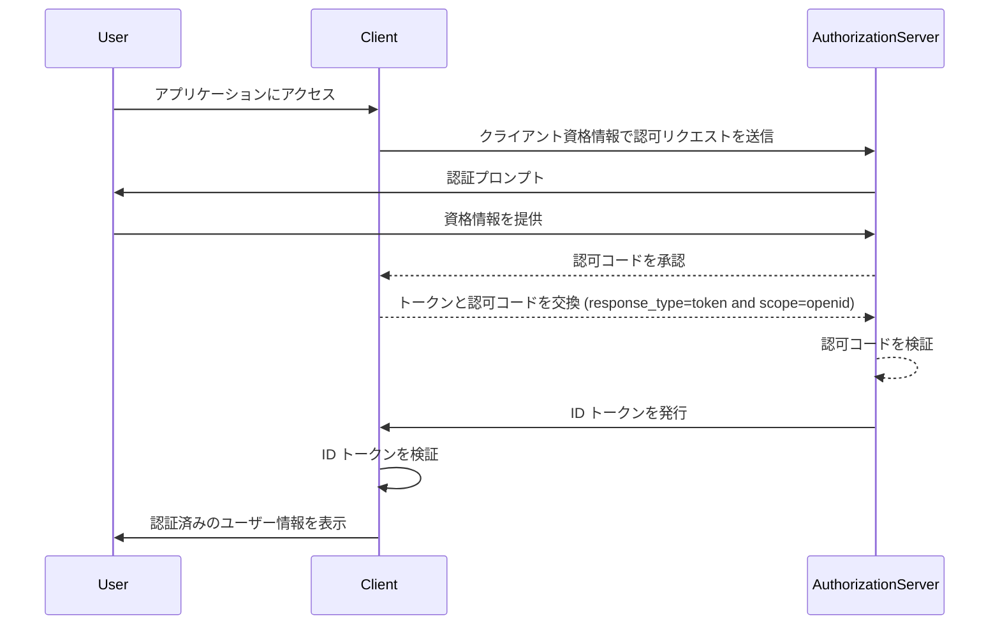

## ID トークンとは何ですか？

ID トークンは、認証されたユーザーに関する情報を含む特定の種類のセキュリティトークンであり、認証 (<Ref slug="authentication" />) に成功した後にクライアントアプリケーションに配信されます。ID トークンは、<Ref slug="openid-connect" /> を <Ref slug="oauth-2.0" /> から区別する主要な特徴です。OAuth 2.0 が認可のみに焦点を当てているのに対し、OIDC は ID トークンを導入することでユーザー認証を追加しています。

OIDC 認証プロセスでは、クライアントアプリケーション (依存パーティ) がユーザーを認可サーバーにリダイレクトして認証を開始します。成功した認証の後、サーバーは <Ref slug="access-token" /> のような他のトークンと共に ID トークンを返します。ID トークンは通常 <Ref slug="jwt" /> としてエンコードされ、ユーザーの識別子 (sub)、発行者 (issuer)、audience (aud) およびその他のユーザー固有の情報のような主要なクレームを含みます。

ID トークンの主な機能は、ユーザーのアイデンティティを確認し、この情報をクライアントアプリケーションに伝達することです。これにより、アプリケーションは資格情報を直接扱うことなくユーザーを認証できます。クライアントはユーザーが認可サーバーによって認証された後にのみ ID トークンを受け取るため、ID トークンを安全な方法でユーザーのアイデンティティを確認するために使用できます。

## ID トークンはどのように動作しますか？

クライアントアプリケーションは、ユーザーを認可サーバーにリダイレクトすることで認証プロセスを開始します。ユーザーはサーバーで認証され、その後、ID トークンとアクセス トークンのような他のトークンが発行されます。ID トークンはクライアントアプリケーションに戻され、クライアントアプリケーションはそれを使用してユーザーのアイデンティティを確認できます。

OIDC は広く普及している標準化されたプロトコルであるため、多くのライブラリやフレームワークが ID トークンを扱うための組み込みサポートを提供しています。これにより、ID トークンをクライアントアプリケーションに簡単に統合でき、<Ref slug="single-sign-on" /> やフェデレーテッド アイデンティティ シナリオで広く使用されています。

## ID トークンのクレーム

ID トークンは、認証されたユーザーに関する一連の <Ref slug="claim" /> を含む JWT です。これらのクレームには、[JWT 仕様書](https://datatracker.ietf.org/doc/html/rfc7519#section-4) で定義された標準 JWT クレームと、ユーザーアイデンティティ情報を伝達するために使用される OIDC 固有のクレームが含まれています。

JWT 標準トークンクレーム:

- **iss (Issuer)**: 必須。ID トークンの発行者クレームは、そのトークンを発行した認可サーバーの URL であることが一般的です。
- **sub (Subject)**: 必須。サブジェクトクレームは、ID トークンに関連するユーザーを識別します。通常はユーザーの一意の識別子です。
- **aud (Audience)**: 必須。オーディエンスクレームは ID トークンの<Ref slug="audience" /> を識別します。これは通常、トークンをリクエストしたクライアントアプリケーションです。
- **exp (Expiration time)**: 必須。有効期限クレームは、トークンが期限切れになる時間を識別します。この時間を過ぎると、トークンは処理のために受け入れられてはなりません。
- **iat (Issued at)**: 必須。発行日時クレームは、トークンが発行された時間を識別します。
- **auth_time (Authentication time)**: 任意。認証時間クレームは、ユーザーが認証された時間を識別します。このクレームは、ユーザーが現在のセッション中に認証された場合にのみ存在します。
- **nonce**: 任意。nonce クレームは、クライアントセッションを ID トークンと関連付けるために使用されます。リプレイ攻撃を防ぐために使用されます。

OIDC 標準ユーザー情報クレーム:

- **name**: ユーザーのフルネーム。
- **given_name**: ユーザーの名前。
- **family_name**: ユーザーの姓。
- **middle_name**: ユーザーのミドルネーム。
- **nickname**: ユーザーのニックネームまたは別名。
- **preferred_username**: ユーザーの希望するユーザー名。
- **profile**: ユーザーのプロフィールページへの URL。
- **picture**: ユーザーのプロフィール写真への URL。
- **website**: ユーザーのウェブサイトへの URL。
- **email**: ユーザーのメールアドレス。
- **email_verified**: ユーザーのメールアドレスが確認されているかを示すブール値。
- **gender**: ユーザーの性別。
- **birthdate**: ユーザーの生年月日。YYYY-MM-DD の形式で文字列で表現。
- **zoneinfo**: ユーザーのタイムゾーン。 [IANA Time Zone Database](https://www.iana.org/time-zones) の文字列。
- **locale**: ユーザーのロケール。日付、時刻、数字のフォーマットにおけるユーザーの好みの言語と地域を表します。
- **phone_number**: ユーザーの電話番号。
- **phone_number_verified**: ユーザーの電話番号が確認されているかを示すブール値。
- **address**: ユーザーの郵送先住所。ユーザーの住所情報を含む JSON オブジェクト。
- **updated_at**: ユーザー情報が最後に更新された時間。

これらのクレームは、ID トークン内でユーザーアイデンティティ情報を伝達するための標準化された方法を提供します。仕様では標準クレームのセットのみが定義されていますが、必要に応じて追加のユーザー固有情報を伝達するためにカスタムクレームも ID トークンに含めることができます。

## ID トークンの検証

クライアントアプリケーションが ID トークンを受け取った場合、その信頼性と整合性を確保するためにトークンを検証する必要があります。検証プロセスには通常、次のステップが含まれます:

1. **署名の確認**: クライアントは、認可サーバーの公開鍵を使用して ID トークンの署名を確認する必要があります。これにより、トークンが改ざんされず、期待されたパーティーによって発行されたことが確認されます。
2. **発行者の確認**: クライアントは、ID トークン内の `iss` クレームがトークンを発行した認可サーバーの URL と一致することを確認する必要があります。これにより、トークン置換攻撃を防ぎます。
3. **オーディエンスの確認**: クライアントは、ID トークン内の `aud` クレームがクライアントアプリケーションの `client_id` と一致することを確認する必要があります。これにより、トークンがクライアントアプリケーション向けに発行されたことが確認されます。
4. **有効期限の確認**: クライアントは、ID トークン内の `exp` クレームがまだ過ぎていないことを確認する必要があります。トークンが期限切れの場合、それは受け入れられてはなりません。実装によっては、時計のずれを考慮するための許容範囲が提供されることがあります。
5. **nonce の確認**: クライアントが認証要求に `nonce` パラメータを含めた場合、ID トークン内の `nonce` クレームが `nonce` パラメータの値と一致することを確認する必要があります。これにより、リプレイ攻撃を防ぎます。

## ID トークンとアクセストークンの比較

ID トークンとアクセストークンの両方が OIDC で広く使用されていますが、目的が異なり、特性も異なります:

|              | ID トークン                                                                               | アクセストークン                                                                                                                 |
| ------------ | -------------------------------------------------------------------------------------- | ---------------------------------------------------------------------------------------------------------------------------- |
| **目的**  | ユーザーのアイデンティティを確認し、クライアントアプリケーションにユーザー情報を伝達します。 | ユーザーに代わって保護されたリソースへのアクセスを提供します。                                                              |
| **形式**   | 通常はユーザーアイデンティティクレームを含む JWT です。                                    | JWT または <Ref slug="opaque-token" /> のいずれかです。                                                                        |
| **オーディエンス** | トークンをリクエストしたクライアントアプリケーションに向けられています。                          | 保護されたリソースをホストするリソースサーバーに向けられています。                                                          |
| **有効期間** | 通常数分間有効な短命トークン。一回限りの使用。        | 有効期間の長いトークン。例: 数時間。期限内であれば何度も再利用可能です。                                       |
| **内容** | 名前、メールアドレス、その他のユーザー固有データなどのユーザーアイデンティティ情報が含まれています。  | 特定のリソースに対するユーザーの権限 (scope) に関する情報が含まれています。                                            |

## ID トークンの利用におけるベストプラクティス

OIDC で ID トークンを使用する際には、認証プロセスのセキュリティと整合性を確保するためにベストプラクティスに従うことが重要です。いくつかの重要なベストプラクティスには以下が含まれます:

1. **ID トークンを検証する**: 常に認可サーバーから受け取った ID トークンを検証し、その信頼性と整合性を確認することで、トークン置換攻撃や不正アクセスを防ぎます。
2. **安全なチャネルを使用する**: ID トークンをインターセプトや改ざんから防ぐために、HTTPS のような安全なチャネルを介して送信することを確認します。
3. **機密情報を保護する**: JWT は通常、エンコードされているが暗号化されていないため、内容が透明です。トークン漏洩の場合に機密情報が露出するのを防ぐために、ID トークンペイロードに機密情報を含めないようにします。
4. **認可には使用しない**: ID トークンはユーザー認証のためであり、認可の目的には使用しないでください。保護されたリソースにアクセスするためにはアクセストークンを使用してください。
5. **一回の利用のみ**: ID トークンは一般的に一度の使用を意図しています。クライアントアプリケーションが ID トークンを検証した後、それを後続のリクエストやセッション状態の維持には再使用すべきではありません。ユーザー セッション状態を維持するために、クライアント アプリケーションは <Ref slug="refresh-token" /> やトークン交換リクエストといったメカニズムを採用すべきです (リフレッシュ トークンは、期限切れの際に新しいアクセストークンと ID トークンを得るために使用できる長期間有効な不透明トークンです)。

<SeeAlso slugs={["openid-connect", "jwt", "signing-key", "access-token"]} />
