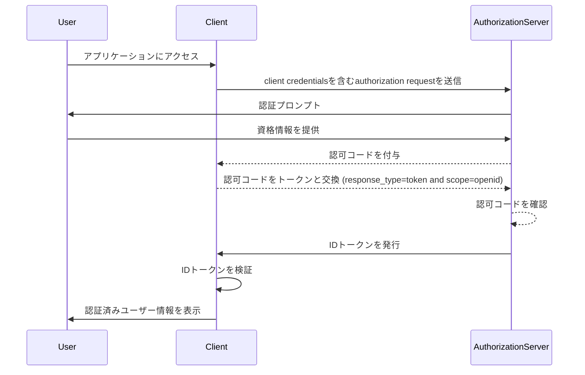

## IDトークン (ID token) とは？

IDトークン (ID token) は、認証されたユーザーに関する情報を含む特定の種類のセキュリティトークンで、成功した認証の後にクライアントアプリケーションに配信されます。IDトークンは、OpenID Connect (OIDC) をOAuth 2.0と区別するキー機能です。OAuth 2.0が認可のみに焦点を当てるのに対し、OIDCはIDトークンを導入することでユーザー認証を追加します。

OIDC認証プロセスでは、クライアントアプリケーション（リライングパーティ）がユーザーを認可サーバーにリダイレクトすることで認証を開始します。認証が成功した後、サーバーはaccess tokenなどのトークンとともにIDトークンを返します。IDトークンは通常、JWT (JSON Web Token) としてエンコードされており、ユーザーの識別子 (sub)、issuer、audience などの主要なクレームを含んでいます。

IDトークンの主な機能はユーザーのアイデンティティを確認し、この情報をクライアントアプリケーションに伝達することです。クライアントは直接資格情報を処理することなく、ユーザーを認証することが可能になります。クライアントはauthorization serverがユーザーを認証した後でのみIDトークンを受け取るため、IDトークンはユーザーのアイデンティティを確認するための安全な方法として使用できます。

## IDトークン (ID token) はどのように機能しますか？

クライアントアプリケーションはユーザーをauthorization serverにリダイレクトすることで認証プロセスを開始します。ユーザーはサーバーで認証を行い、その後IDトークンと他のトークン（例えばaccess token）が発行されます。IDトークンはクライアントアプリケーションに返され、そこでユーザーのアイデンティティを確認するために使用されます。

OIDCは人気があり標準化されたプロトコルなので、多くのライブラリとフレームワークがIDトークンの処理をサポートする組み込み機能を提供しています。これにより、IDトークンはクライアントアプリケーションに簡単に統合でき、single sign-on (SSO)やフェデレーテッドアイデンティティシナリオで広く使用されています。

## IDトークン (ID token) のクレーム

IDトークン (ID token) は、認証されたユーザーに関するクレームのセットを含むJWT (JSON Web Token) です。これらのクレームには、[JWT仕様](https://datatracker.ietf.org/doc/html/rfc7519#section-4)で定義された標準JWTクレームと、ユーザーのアイデンティティ情報を伝えるために使用されるOIDC特定クレームの両方が含まれています。

JWT標準トークンクレーム:

- **iss (Issuer)**: 必須。IDトークンを発行したissuerを特定します。通常、トークンを発行したauthorization serverのURLです。
- **sub (Subject)**: 必須。IDトークンに関するユーザーを特定します。通常、ユーザーのユニークな識別子です。
- **aud (Audience)**: 必須。IDトークンのaudienceを特定します。通常、トークンを要求したクライアントアプリケーションです。
- **exp (Expiration time)**: 必須。トークンが有効期限切れとなる時間を特定します。この時間を過ぎると、トークンは処理のために受け入れられるべきではありません。
- **iat (Issued at)**: 必須。トークンが発行された時間を特定します。
- **auth_time (Authentication time)**: 任意。ユーザーが認証された時間を特定します。このクレームは、ユーザーが現在のセッション中に認証された場合にのみ存在します。
- **nonce**: 任意。IDトークンにクライアントセッションを関連付けるために使用されます。リプレイ攻撃を防ぐために通常使用されます。

OIDC標準ユーザー情報クレーム:

- **name**: ユーザーのフルネーム。
- **given_name**: ユーザーの名。
- **family_name**: ユーザーの姓。
- **middle_name**: ユーザーのミドルネーム。
- **nickname**: ユーザーのニックネームまたは他の短い名前。
- **preferred_username**: ユーザーの希望のユーザー名。
- **profile**: ユーザーのプロフィールページを指すURL。
- **picture**: ユーザーのプロフィール画像を指すURL。
- **website**: ユーザーのウェブサイトを指すURL。
- **email**: ユーザーのメールアドレス。
- **email_verified**: ユーザーのメールアドレスが確認されたかどうかを示すブール値。
- **gender**: ユーザーの性別。
- **birthdate**: ユーザーの生年月日。YYYY-MM-DD形式の文字列で表されます。
- **zoneinfo**: ユーザーのタイムゾーン。[IANA Time Zone Database](https://www.iana.org/time-zones)の文字列。
- **locale**: ユーザーのロケール。日付、時間、数値をフォーマットするためのユーザーの希望の言語と地域を表します。
- **phone_number**: ユーザーの電話番号。
- **phone_number_verified**: ユーザーの電話番号が確認されたかどうかを示すブール値。
- **address**: ユーザーの郵便住所。ユーザーの住所情報を含むJSONオブジェクトです。
- **updated_at**: ユーザー情報が最後に更新された時間。

これらのクレームは、IDトークン内でユーザーのアイデンティティ情報を伝えるための標準化された方法を提供します。仕様は標準クレームのセットのみを定義していますが、必要に応じて追加のユーザー固有情報を伝えるカスタムクレームもIDトークンに含めることができます。

## IDトークン (ID token) の検証

クライアントアプリケーションがIDトークン (ID token) を受け取ると、その認証と整合性を確認するためにトークンを検証する必要があります。検証プロセスには通常、次の手順が含まれます：

1. **署名の確認**: クライアントはauthorization serverの公開鍵を使用してIDトークンの署名を確認する必要があります。これにより、トークンが改ざんされておらず、期待される発行者によって発行されたことが保証されます。
2. **issuerの確認**: クライアントは、IDトークン内の`iss`クレームがトークンを発行したauthorization serverのURLと一致することを確認する必要があります。これにより、トークン置換攻撃の防止に役立ちます。
3. **audienceの確認**: クライアントは、IDトークン内の`aud`クレームがクライアントアプリケーションの`client_id`と一致することを確認する必要があります。これにより、トークンがクライアントアプリケーション向けに発行されたことが保証されます。
4. **有効期限の確認**: クライアントは、IDトークン内の`exp`クレームがまだ過ぎていないことを確認する必要があります。トークンが期限切れの場合、それを受け入れるべきではありません。実装では時計のずれを考慮して猶予を設ける場合もあります。
5. **nonceの確認**: クライアントが認証要求で`nonce`パラメータを含めた場合、IDトークン内の`nonce`クレームが`nonce`パラメータの値と一致することを確認する必要があります。これにより、リプレイ攻撃の防止に役立ちます。

## IDトークン (ID token) とaccess tokenの違い

IDトークンとaccess tokenはOIDCで広く使用されていますが、それぞれ異なる目的を持ち、特性も異なっています：

|              | IDトークン (ID token)                                                                               | Access token                                                                                                                 |
| ------------ | -------------------------------------------------------------------------------------- | ---------------------------------------------------------------------------------------------------------------------------- |
| **目的**  | ユーザーのアイデンティティを確認し、ユーザー情報をクライアントアプリケーションに伝達します。 | ユーザーに代わって保護されたリソースへのアクセスを提供します。                                                              |
| **フォーマット**   | ユーザーのアイデンティティに関するクレームを含むJWTであることが一般的です。                                    | JWTまたは不透明なトークン（ランダムな文字列）のいずれかであることがあります。                                                                      |
| **audience** | トークンを要求したクライアントアプリケーションを対象としています。                          | 保護されたリソースをホスティングするリソースサーバーを対象としています。                                                         |
| **有効期間** | 数分程度の有効期間を持つ短命トークンです。一度だけ使用されます。        | より長い期間（例：数時間）有効な長命トークンです。有効期間内に複数回再利用できます。 |
| **内容** | 名前、メールアドレス、その他のユーザー固有データなどのユーザーのアイデンティティ情報を含みます。  | 特定のリソースへのユーザーの権限（スコープ）に関する情報を含みます。                                            |

## IDトークン (ID token) を使用する際のベストプラクティス

OIDCでIDトークンを使用する場合、認証プロセスのセキュリティと整合性を確保するためにベストプラクティスに従うことが重要です。重要なベストプラクティスには以下のものがあります：

1. **IDトークンの検証**: 常にauthorization serverから受け取ったIDトークンを検証し、その認証と整合性を確認してください。これにより、トークンの置換攻撃や不正アクセスを防ぐことができます。
2. **安全なチャネルを使用**: インターセプトや改ざんを防ぐために、IDトークンは安全なチャネル（例：HTTPS）で送信することを検証してください。
3. **機密情報の保護**: JWTは通常エンコードされますが、暗号化されていないため内容は透明です。トークン漏洩時に機密データの露出を防ぐため、IDトークンのペイロードに機密情報を含めないでください。
4. **認可目的での使用は無効**: IDトークンはユーザー認証用として設計されています。認可目的で使用せず、保護されたリソースへアクセスするための認可にはaccess tokenを使用してください。
5. **単一利用**: IDトークンは一般に一度の使用のために意図されています。クライアントアプリケーションがIDトークンを検証した後、後続のリクエストやセッション状態の保持のために再利用すべきではありません。ユーザーセッションの状態を維持するには、クライアントアプリケーションはrefresh tokenとトークン交換のリクエストのようなメカニズムを使用すべきです。（Refresh tokenは長命の不透明トークンで、有効期限が切れた後に新しいaccess tokenとIDトークンを取得するために使用できます。）

<SeeAlso slugs={["openid-connect", "jwt", "signing-key", "access-token"]} />